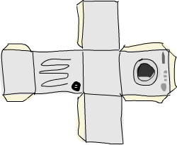

Yüksek dereceli fonksiyonlar
============================

Haskell fonksiyonları, fonksiyonları parametre olarak alabilir ve fonksiyonları dönüş değerleri olarak döndürebilir. 
Bunlardan herhangi birini yapan bir fonksiyona yüksek dereceli fonksiyon denir. Yüksek dereceli fonksiyonlar sadece Haskell deneyiminin bir parçası değil,
hemen hemen Haskell deneyimidir. Bir durumu değiştiren ve belki onları döngüye sokan adımları tanımlamak yerine,
hangi şeyin ne olduğunu tanımlayarak hesaplamaları tanımlamak istiyorsanız, yüksek dereceli fonksiyonlar vazgeçilmezdir.
Sorunları çözmenin ve programlar hakkında düşünmenin gerçekten güçlü bir yoludur.

Curried fonksiyonlar
--------------------

Haskell'deki her fonksioyn resmi olarak yalnızca bir parametre alır. Öyleyse, şu ana kadar birden fazla parametre alan birkaç fonksiyonu tanımlayıp
kullanmamız nasıl mümkün olabilir? Bu akıllıca bir numara! Şimdiye kadar *birçok parametreyi* kabul eden tüm fonksiyonlar **curried fonksiyonlardır**. O ne demek?
Bunu en iyi bir örnekte anlayacaksınız. İyi arkadaşımızı, `max` fonksiyonunu alalım. Görünüşe göre iki parametre alıyor ve daha büyük olanı döndürüyor.
`max 4 5` yapmak önce bir parametre alan ve hangisinin daha büyük olduğuna bağlı olarak `4` veya bu parametreyi döndüren bir fonksiyon oluşturur.
Daha sonra bu fonksiyona `5` uygulanır ve bu fonksiyon istediğimiz sonucu verir. Bu biraz ağız dolusu gibi geliyor ama aslında gerçekten harika bir konsept.
Aşağıdaki iki çağrı eşdeğerdir:

~~~~ {.haskell: .ghci name="code"}
ghci> max 4 5  
5  
ghci> (max 4) 5  
5  
~~~~

İki şey arasına boşluk koymak basitçe **fonksiyon uygulamasıdır**. Alan bir tür operatör gibidir ve en yüksek önceliğe sahiptir.
`max` fonksiyonunu kendimiz yapalım. `max :: (Ord a) => a -> a -> a` Bu aynı zamanda şu şekilde de yazılabilir:
`max :: (Ord a) => a -> (a -> a)`. Bu şöyle okunabilir: `max` bir `a` alır ve döndürür (bu `->`) bir `a` alan ve bir `a` döndüren bir fonksiyon.
Bu nedenle, dönüş türü ve fonksiyonların parametrelerinin tümü oklarla ayrılmıştır.

Peki bu bizim için ne kadar faydalı? Basitçe söylemek gerekirse, çok az parametresi olan bir fonksiyonu çağırırsak, **kısmen uygulanan** bir fonksiyonu geri alırız,
bu, bıraktığımız kadar çok parametre alan bir fonksiyon anlamına gelir. Kısmi uygulamayı kullanmak (isterseniz, çok az parametresi olan fonksiyonları çağırmak),
fonksiyonları anında oluşturmanın düzgün bir yoludur, böylece onları başka bir fonksiyona aktarabilir veya bazı verilerle tohumlayabiliriz.

Bu saldırgan basit fonksiyona bir göz atın:

~~~~ {.haskell: .ghci name="code"}
multThree :: (Num a) => a -> a -> a -> a  
multThree x y z = x * y * z  
~~~~

`multThree 3 5 9` veya `((multThree 3) 5) 9` yaptığımızda gerçekten ne olur? İlk olarak, `3`, bir boşlukla ayrıldıkları için `multThree`'ye uygulanır.
Bu, bir parametre alan ve bir fonksiyon döndüren bir fonksiyon oluşturur. Sonra buna `5` uygulanır, bu da bir parametreyi alıp 15 ile çarpan bir fonksiyon oluşturur.
Bu fonksiyona `9` uygulanır ve sonuç 135 veya başka bir şeydir. Bu fonksiyonun türünün `multThree :: (Num a) => a -> (a -> (a -> a))` olarak da yazılabileceğini unutmayın.
`->` işaretinden önceki şey, bir fonksiyonun aldığı parametredir ve ondan sonraki şey, döndüğü şeydir. Yani fonksiyonumuz bir `a` alır ve
`(Num a) => a -> (a -> a)` türünde bir fonksiyon döndürür. Benzer şekilde, bu fonksiyon bir `a` alır ve `(Num a) => a -> a` türünde bir fonksiyon döndürür.
Ve bu fonksiyon, nihayet, sadece bir `a` alır ve bir `a` döndürür. Şuna bir bak:

~~~~ {.haskell: .ghci name="code"}
ghci> let multTwoWithNine = multThree 9  
ghci> multTwoWithNine 2 3  
54  
ghci> let multWithEighteen = multTwoWithNine 2  
ghci> multWithEighteen 10  
180  
~~~~

Çok az parametresi olan fonksiyonları çağırarak, tabiri caizse, anında yeni fonksiyonlar yaratıyoruz. 
Ya bir sayıyı alan ve onu `100` ile karşılaştıran bir fonksiyon yaratmak istersek? Bunun gibi bir şey yapabiliriz:

~~~~ {.haskell: .ghci name="code"}
compareWithHundred :: (Num a, Ord a) => a -> Ordering  
compareWithHundred x = compare 100 x  
~~~~

`99` ile çağırırsak, bir `GT` döndürür. Basit şeyler. Denklemin her iki tarafında da `x`'in sağ tarafta olduğuna dikkat edin. Şimdi `compare 100`'ün ne döndürdüğünü düşünelim.
Bir sayıyı alan ve onu '100' ile karşılaştıran bir fonksiyon döndürür. Vaov! İstediğimiz fonksiyon bu değil mi? Bunu şu şekilde yeniden yazabiliriz:

~~~~ {.haskell: .ghci name="code"}
compareWithHundred :: (Num a, Ord a) => a -> Ordering  
compareWithHundred = compare 100  
~~~~

Tür bildirimi aynı kalır, çünkü `compare 100` bir fonksiyon döndürür. Karşılaştırma `(Ord a) => a -> (a -> Ordering)` türüne sahiptir ve bunu `100` ile
çağırmak bir `(Num a, Ord a) => a -> Ordering` döndürür. `100` aynı zamanda `Num` tür sınıfının bir parçası olduğu için ek sınıf kısıtlaması gizlice oraya gelir.

**Yo!** Curried fonksiyonların ve kısmi uygulamanın nasıl çalıştığını gerçekten anladığınızdan emin olun çünkü bunlar gerçekten önemlidir!

Infix fonksiyonları, bölümler kullanılarak kısmen de uygulanabilir. Bir infix fonksiyonunu bölümlemek için, onu parantez içine alın ve
yalnızca bir tarafta bir parametre girin. Bu, bir parametre alan ve ardından bunu bir işlenenin eksik olduğu tarafa uygulayan bir fonksiyon oluşturur.
Aşağılayıcı derecede önemsiz bir fonksiyon:

~~~~ {.haskell: .ghci name="code"}
divideByTen :: (Floating a) => a -> a  
divideByTen = (/10)  
~~~~

`divideByTen 200` çağrısı yapmak, `(/10) 200` yapmak gibi `200/10` yapmaya eşdeğerdir. Kendisine sağlanan bir karakterin büyük harf olup olmadığını kontrol eden bir fonksiyon:

~~~~ {.haskell: .ghci name="code"}
isUpperAlphanum :: Char -> Bool  
isUpperAlphanum = (`elem` ['A'..'Z'])  
~~~~

Bölümlerle ilgili tek özel şey `-` kullanmaktır. Bölümlerin tanımından `(-4)`, bir sayı alan ve ondan 4 çıkaran bir fonksiyonla sonuçlanır.
Bununla birlikte, kolaylık sağlamak için `(-4)` eksi dört anlamına gelir. Dolayısıyla, parametre olarak aldığı sayıdan 4 çıkaran bir fonksiyon yapmak istiyorsanız,
`subtract` fonksiyonunu kısmen uygulayın: `(subtract 4)`.

GHCI'da onu bir let ile bir isme bağlamak veya başka bir fonksiyona geçirmek yerine sadece `multThree 3 4` yapmaya çalışırsak ne olur?

~~~~ {.haskell: .ghci name="code"}
ghci> multThree 3 4  
<interactive>:1:0:  
    No instance for (Show (t -> t))  
      arising from a use of `print' at <interactive>:1:0-12  
    Possible fix: add an instance declaration for (Show (t -> t))  
    In the expression: print it  
    In a 'do' expression: print it  
~~~~

GHCI bize ifadenin `a -> a` türünde bir fonksiyon ürettiğini, ancak bunu ekrana nasıl yazdıracağını bilmediğini söylüyor.
Fonksiyonlar, `Show` tür sınıfının instance'ları değildir, bu yüzden bir fonksiyonun düzgün bir string temsilini alamayız. GHCI isteminde `1 + 1` yaptığımızda,
önce bunu `2` olarak hesaplar ve ardından bu sayının metinsel bir temsilini almak için `2`'de `show`'u çağırır. Ve `2`'nin metinsel temsili sadece `"2"` string'idir ve
daha sonra ekranımıza yazdırılır.

Bazı yüksek sıralılık sıralamalarda
-----------------------------------

Fonksiyonlar, fonksiyonları parametre olarak alabilir ve ayrıca Fonksiyonlar döndürebilir.
Bunu açıklamak için, bir Fonksiyon alan ve sonra onu bir şeye iki kez uygulayan bir Fonksiyon yapacağız!

~~~~ {.haskell: .ghci name="code"}
applyTwice :: (a -> a) -> a -> a  
applyTwice f x = f (f x)  
~~~~

Herşeyden önce tür bildirimine dikkat edin. Daha önce parantezlere ihtiyacımız yoktu çünkü `->` doğal olarak sağa ilişkilidir. Ancak burada zorunludurlar.
İlk parametrenin bir şeyi alan ve aynı şeyi döndüren bir fonksiyon olduğunu belirtirler.
İkinci parametre de bu türde bir şeydir ve dönüş değeri de aynı türdedir. İlk parametre bir fonksiyondur (tür `a -> a`) ve ikincisi de aynı `a`.
Fonksiyon ayrıca `Int -> Int` veya `String -> String` veya her neyse olabilir. Ancak ikinci parametrenin de bu türde olması gerekir.

**Not**: Şu andan itibaren, her fonksiyon aslında yalnızca bir parametre alıp, solid bir değer döndüren bir fonksiyona ulaşana kadar kısmen 
uygulanan fonksiyonlar döndürmesine rağmen, fonksiyonların birkaç parametre aldığını söyleyeceğiz.
Bu yüzden, basitlik uğruna, örtünün altında gerçekte neler olduğunu bilsek bile `a -> a -> a`'nın iki parametre aldığını söyleyeceğiz.

Sadece `f` parametresini bir fonksiyon olarak kullanıyoruz, ona `x`'i bir boşlukla ayırarak ve sonra sonucu tekrar `f`'ye uygulayarak.
Örnekle gösterelim:

~~~~ {.haskell: .ghci name="code"}
ghci> applyTwice (+3) 10  
16  
ghci> applyTwice (++ " HAHA") "HEY"  
"HEY HAHA HAHA"  
ghci> applyTwice ("HAHA " ++) "HEY"  
"HAHA HAHA HEY"  
ghci> applyTwice (multThree 2 2) 9  
144  
ghci> applyTwice (3:) [1]  
[3,3,1]  
~~~~

Kısmi uygulamanın mükemmelliği ve faydası ortadadır. Fonksiyonumuzun sadece bir parametre alan bir fonksiyonu iletmemizi gerektiriyorsa,
sadece bir parametreyi aldığı noktaya bir fonksiyonu kısmen uygulayabilir ve sonra onu iletebiliriz.

Şimdi, standart kitaplıkta bulunan gerçekten yararlı bir fonksiyonu uygulamak için yüksek dereceli programlama kullanacağız.
Bu da `zipWith`. Parametre olarak bir fonksiyon ve iki listeyi alır ve ardından fonksiyona karşılık gelen öğeler arasına uygulayarak iki listeyi birleştirir.
İşte bunu nasıl uygulayacağız:

~~~~ {.haskell: .ghci name="code"}
zipWith' :: (a -> b -> c) -> [a] -> [b] -> [c]  
zipWith' _ [] _ = []  
zipWith' _ _ [] = []  
zipWith' f (x:xs) (y:ys) = f x y : zipWith' f xs ys  
~~~~

Tür bildirimine bakın. İlk parametre, iki şeyi alan ve üçüncü bir şey üreten bir fonksiyondur. Aynı türden olmak zorunda değiller ama yapabilirler.
İkinci ve üçüncü parametre listelerdir. Sonuç aynı zamanda bir listedir. Birincisi `a`'ların listesi olmalıdır, çünkü birleştirme fonksiyonu `a`'yı ilk argüman olarak alır.
İkincisi, `b`'lerin bir listesi olmalıdır, çünkü birleştirme fonksiyonunun ikinci parametresi `b` türündedir. Sonuç bir `c` listesidir.
Bir fonksiyonun tür bildirimi parametre olarak bir `a -> b -> c` fonksiyonunu kabul ettiğini söylüyorsa, aynı zamanda bir `a -> a -> a` fonksiyonunu da kabul eder,
ancak tersi olmaz!! Unutmayın, özellikle yüksek dereceli fonksiyonlar oluştururken ve türünden emin değilseniz, tür bildirimini çıkarmayı deneyebilir ve 
ardından Haskell'in `:t` kullanarak ne olduğunu kontrol edebilirsiniz.

Fonksiyondaki eylem, normal zip'e oldukça benzer. Uç koşullar aynıdır, yalnızca fazladan bir argüman, birleştirme Fonksiyon vardır, 
ancak bu argüman uç koşullarda önemli değildir, bu yüzden onun için sadece bir `_` kullanıyoruz. Ve son kalıptaki fonksiyon gövdesi de `zip`'e benzer,
yalnızca `(x, y)` değil, `f x y` yapar. Yeterince genel ise, çok sayıda farklı görev için tek bir üst düzey fonksiyon kullanılabilir.
`zipWith'` fonksiyonumuzun yapabileceği tüm farklı şeylerin küçük bir gösterimi:

~~~~ {.haskell: .ghci name="code"}
ghci> zipWith' (+) [4,2,5,6] [2,6,2,3]  
[6,8,7,9]  
ghci> zipWith' max [6,3,2,1] [7,3,1,5]  
[7,3,2,5]  
ghci> zipWith' (++) ["foo ", "bar ", "baz "] ["fighters", "hoppers", "aldrin"]  
["foo fighters","bar hoppers","baz aldrin"]  
ghci> zipWith' (*) (replicate 5 2) [1..]  
[2,4,6,8,10]  
ghci> zipWith' (zipWith' (*)) [[1,2,3],[3,5,6],[2,3,4]] [[3,2,2],[3,4,5],[5,4,3]]  
[[3,4,6],[9,20,30],[10,12,12]]  
~~~~

Gördüğünüz gibi, tek bir yüksek dereceli foksiyon çok yönlü şekillerde kullanılabilir. Zorunlu programlama genellikle döngü, whele döngüsü,
bir değişkene bir şey ayarlama, durumunu kontrol etme vb. gibi şeyler kullanır. Bazı davranışları elde etmek ve 
sonra onu bir fonksiyon gibi bir arayüzün etrafına sarmak için. Fonksiyonel programlama, iki listeyi çiftler halinde incelemek ve
bu çiftlerle bir şeyler yapmak veya bir dizi çözüm elde etmek ve ihtiyacınız olmayanları ortadan kaldırmak gibi ortak kalıpları soyutlamak için
yüksek dereceli fonksiyonlar kullanır.

Halihazırda standart kitaplıkta bulunan, `flip` adı verilen başka bir fonksiyonu uygulayacağız. Flip basitçe bir fonksiyonu alır ve 
orijinal fonksiyonumuza benzer bir fonksiyonu döndürür, yalnızca ilk iki argüman ters çevrilir. Bunu şu şekilde uygulayabiliriz:

~~~~ {.haskell: .ghci name="code"}
flip' :: (a -> b -> c) -> (b -> a -> c)  
flip' f = g  
    where g x y = f y x    
~~~~

Tür bildirimini okurken, `a` ve `b` alan ve `b` ve `a` alan bir fonksiyonu döndüren bir fonksiyon aldığını söylüyoruz.
Ancak fonksiyonlar varsayılan olarak curried olduğundan, ikinci parantez çifti gerçekten gereksizdir, çünkü `->` varsayılan olarak doğru ilişkilidir.
`(a -> b -> c) -> (b -> a -> c)`, `(a -> b -> c) -> b -> a -> c` ile aynı olan `(a -> b -> c) -> (b -> (a -> c))` ile aynıdır.
`g x y = f y x` olduğunu yazdık. Bu doğruysa, o zaman `f y x = g x y` de geçerli olmalı, değil mi?
Bunu akılda tutarak, bu fonksiyonu daha da basit bir şekilde tanımlayabiliriz.

~~~~ {.haskell: .ghci name="code"}
flip' :: (a -> b -> c) -> b -> a -> c  
flip' f y x = f x y   
~~~~

Burada, fonksiyonların curried olması gerçeğinden yararlanıyoruz. `y` ve `x` parametreleri olmadan `flip' f` olarak adlandırdığımızda,
bu iki parametreyi alan ama onları ters yüz olarak çağıran bir `f` döndürür.
Tersine çevrilmiş fonksiyonlar genellikle diğer fonksiyonlara aktarılsa da, ileriyi düşünerek ve tam olarak çağrıldıklarında nihai sonuçlarının
ne olacağını yazarak yüksek dereceli fonksiyonlar yaparken currying'den faydalanabiliriz.

~~~~ {.haskell: .ghci name="code"}
ghci> flip' zip [1,2,3,4,5] "hello"  
[('h',1),('e',2),('l',3),('l',4),('o',5)]  
ghci> zipWith (flip' div) [2,2..] [10,8,6,4,2]  
[5,4,3,2,1]     
~~~~

Maps ve filters
---------------

`map` bir fonksiyonu ve bir listeyi alır ve bu fonksiyonu listedeki her öğeye uygulayarak yeni bir liste oluşturur. Tür imzasının ne olduğunu ve nasıl tanımlandığını görelim.

~~~~ {.haskell: .ghci name="code"}
map :: (a -> b) -> [a] -> [b]  
map _ [] = []  
map f (x:xs) = f x : map f xs    
~~~~

Tür imzası `a` ve `b` alan, bir `a` listesi ve bir `b` listesi döndüren bir fonksiyonu aldığını söyler.
İlginçtir ki, sadece bir fonksiyonun tür imzasına bakarak bazen ne işe yaradığını anlayabilirsiniz.
`map`, milyonlarca farklı şekilde kullanılabilen, gerçekten çok yönlü yüksek dereceli fonksiyonlardan biridir. İşte eylemde:

~~~~ {.haskell: .ghci name="code"}
ghci> map (+3) [1,5,3,1,6]  
[4,8,6,4,9]  
ghci> map (++ "!") ["BIFF", "BANG", "POW"]  
["BIFF!","BANG!","POW!"]  
ghci> map (replicate 3) [3..6]  
[[3,3,3],[4,4,4],[5,5,5],[6,6,6]]  
ghci> map (map (^2)) [[1,2],[3,4,5,6],[7,8]]  
[[1,4],[9,16,25,36],[49,64]]  
ghci> map fst [(1,2),(3,5),(6,3),(2,6),(2,5)]  
[1,3,6,2,2]    
~~~~

Muhtemelen bunların her birine bir liste anlayışıyla ulaşılabileceğini fark etmişsinizdir. `map' (+3) [1,5,3,1,6]` ile bunu yazmak `[x+3 | x <- [1,5,3,1,6]]` aynıdır.
Bununla birlikte, `map` kullanmak, bir listenin öğelerine yalnızca bazı fonksiyonlar uyguladığınız durumlarda çok daha okunabilirdir,
özellikle map'lerin map'leriyle uğraşırken ve daha sonra birçok parantez içeren her şey biraz dağınık hale gelebilir.

`filter`, bir predicate'i alan bir fonksiyondur (bir predicate bir şeyin doğru olup olmadığını söyleyen bir fonksiyondur, yani bizim durumumuzda,
bir boolean değeri döndüren bir fonksiyon) ve bir liste ve ardından predicate'i karşılayan öğelerin listesini döndürür.
Tür imzası ve uygulama şu şekildedir:

~~~~ {.haskell: .ghci name="code"}
filter :: (a -> Bool) -> [a] -> [a]  
filter _ [] = []  
filter p (x:xs)   
    | p x       = x : filter p xs  
    | otherwise = filter p xs  
~~~~

Oldukça basit şeyler. `p x` `True` olarak değerlendirilirse, eleman yeni listeye dahil edilir. Olmazsa, dışarıda kalır. Bazı kullanım örnekleri:

~~~~ {.haskell: .ghci name="code"}
ghci> filter (>3) [1,5,3,2,1,6,4,3,2,1]  
[5,6,4]  
ghci> filter (==3) [1,2,3,4,5]  
[3]  
ghci> filter even [1..10]  
[2,4,6,8,10]  
ghci> let notNull x = not (null x) in filter notNull [[1,2,3],[],[3,4,5],[2,2],[],[],[]]  
[[1,2,3],[3,4,5],[2,2]]  
ghci> filter (`elem` ['a'..'z']) "u LaUgH aT mE BeCaUsE I aM diFfeRent"  
"uagameasadifeent"  
ghci> filter (`elem` ['A'..'Z']) "i lauGh At You BecAuse u r aLL the Same"  
"GAYBALLS"  
~~~~

Tüm bunlar, predicate'lerin kullanılmasıyla liste anlayışlarıyla da elde edilebilir. Liste anlamanın yerine `map` ve `filter`'ın ne zaman kullanılacağına dair
belirlenmiş bir kural yoktur, sadece koda ve bağlama bağlı olarak neyin daha okunabilir olduğuna karar vermeniz gerekir.
Bir liste anlayışında birkaç predicate'in uygulanmasının `filter` eşdeğeri, ya bir şeyi birkaç kez filtrelemek ya da tahminleri mantıksal `&&` fonksiyonu ile birleştirmektir.

Önceki bölümdeki quicksort(hızlı sıralama) fonksiyonumuzu [hatırlıyor musunuz](/tr/05-recursion.md)? Özetten daha küçük (veya eşit) ve daha büyük olan liste öğelerini filtrelemek için
liste anlamalarını kullandık. Aynı işlevselliği filter kullanarak daha okunaklı bir şekilde elde edebiliriz:

~~~~ {.haskell: .ghci name="code"}
quicksort :: (Ord a) => [a] -> [a]    
quicksort [] = []    
quicksort (x:xs) =     
    let smallerSorted = quicksort (filter (<=x) xs)  
        biggerSorted = quicksort (filter (>x) xs)   
    in  smallerSorted ++ [x] ++ biggerSorted  
~~~~

Mapping ve filtering her yazılımcının toolbox'ında bulunur. Uh. Bunu `map` ve `filter` fonksiyonları veya liste anlayışlarıyla yapmanız önemli değil.
Belirli bir çevreye sahip dik üçgen bulma sorununu nasıl çözdüğümüzü hatırlayın. zorunlu programlamayla üç döngüyü iç içe geçirerek ve ardından
mevcut kombinasyonun bir dik üçgeni karşılayıp karşılamadığını ve doğru çevreye sahip olup olmadığını test ederek bunu çözebilirdik.
Eğer durum buysa, bunu ekrana falan basardık. Fonksiyonel programlamada, bu model haritalama ve filtreleme ile elde edilir.
Bir değer alan ve sonuç üreten bir fonksiyon yaparsınız. Bu fonksiyonu bir değerler listesi üzerinde eşleriz ve ardından, 
aramamızı karşılayan sonuçlar için ortaya çıkan listeyi filtreleriz. Haskell'in tembelliği sayesinde, 
bir listeyi birkaç kez eşleştirseniz ve birkaç kez süzseniz bile, listeden yalnızca bir kez geçer.

**3829'a bölünebilen 100.000'in altındaki en büyük sayıyı bulalım**. Bunu yapmak için, çözümün yattığını bildiğimiz bir dizi olasılığı filtreleyeceğiz.

~~~~ {.haskell: .ghci name="code"}
largestDivisible :: (Integral a) => a  
largestDivisible = head (filter p [100000,99999..])  
    where p x = x `mod` 3829 == 0  
~~~~

Önce 100.000'den küçük tüm sayıların azalan bir listesini yaparız. Sonra onu predicate'e göre filtreliyoruz ve sayılar azalan bir şekilde sıralandığından,
predicate'i karşılayan en büyük sayı filtrelenmiş listenin ilk öğesidir. Başlangıç kümemiz için sonlu bir liste kullanmamıza bile gerek yoktu.
Bu yine bir tembelliktir. Sonunda filtrelenmiş listenin başını kullandığımız için, filtrelenmiş listenin sonlu veya sonsuz olması önemli değildir.
İlk uygun çözüm bulunduğunda değerlendirme durur.

Sonra, **10.000'den küçük olan tüm tek karelerin toplamını bulacağız**. Ama önce, onu çözümümüzde kullanacağımız için, `takeWhile` fonksiyonunu tanıtacağız.
Bir predicate ve bir liste alır ve sonra listenin başından gider ve predicate doğruyken öğelerini döndürür.
Predicate'in tutmadığı bir öğe bulunduğunda durur. `"Filler nasıl parti yapılacağını bilir"` dizesinin ilk kelimesini almak isteseydik,
`takeWhile (/=' ') "elephants know how to party"` yapabilir ve `"elephants"` olarak geri dönerdi. Tamam. 10.000'den küçük olan tüm tek karelerin toplamı.
İlk olarak, `(^2)` fonksiyonunu sonsuz liste `[1..]` ile eşleyerek başlayacağız. Sonra onları filtreliyoruz, böylece sadece tuhaf olanları elde ederiz.
Ve sonra, bu listeden 10.000'den küçük olan öğeleri alacağız. Son olarak, bu listenin toplamını alacağız. 
Bunun için bir fonksiyon tanımlamamıza bile gerek yok, bunu GHCI'da tek satırda yapabiliriz:

~~~~ {.haskell: .ghci name="code"}
ghci> sum (takeWhile (<10000) (filter odd (map (^2) [1..])))  
166650 
~~~~

Bazı ilk verilerle (tüm doğal sayıların sonsuz listesi) başlıyoruz ve sonra onu eşleştiriyoruz, 
filtreliyoruz ve ihtiyaçlarımıza uyana kadar kesiyoruz ve sonra sadece sum ile topluyoruz. Bunu liste anlayışı kullanarak da yazabilirdik:

~~~~ {.haskell: .ghci name="code"}
ghci> sum (takeWhile (<10000) [n^2 | n <- [1..], odd (n^2)])  
166650 
~~~~

Hangisini daha güzel bulduğunuza dair bir zevk meselesi. Yine Haskell'in tembellik özelliği, bunu mümkün kılan şeydir.
Sonsuz bir listeyi eşleştirebilir ve filtreleyebiliriz, çünkü bu listeyi hemen eşleştirip filtrelemeyecek, bu eylemleri geciktirecektir.
Yalnızca Haskell'i bize `sum` göstermeye zorladığımızda, toplam fonksiyonu `takeWhile` fonksiyonuna bu sayılara ihtiyacı olduğunu söyler.
`takeWhile`, filtrelemeyi ve eşlemeyi gerçekleşmeye zorlar, ancak yalnızca 10.000'den büyük veya ona eşit bir sayı ile karşılaşılıncaya kadar.

Bir sonraki sorunumuz için Collatz dizileri ile ilgileneceğiz. Doğal sayıları alacağız. Bu sayı çift ise, onu ikiye böleriz. Eğer tek ise,
3 ile çarpıyoruz ve sonra buna 1 ekliyoruz. Ortaya çıkan sayıyı alır ve aynı şeyi ona uygularız, bu da yeni bir sayı üretir vb.
Aslında, bir sayı zinciri elde ederiz. Tüm başlangıç numaraları için zincirlerin 1 numarasında bittiği düşünülmektedir.
Yani 13 numaralı başlangıç numarasını alırsak şu diziyi elde ederiz: 13, 40, 20, 10, 5, 16, 8, 4, 2, 1. 13 * 3 + 1 eşittir 40.
40 bölü 2, 20'dir. Zincirin 10 terim olduğunu görüyoruz.

Şimdi bilmek istediğimiz şudur: **1 ile 100 arasındaki tüm başlangıç sayıları için, kaç zincir 15'ten büyük uzunluğa sahiptir?**
Öncelikle, bir zincir oluşturan bir fonksiyon yazacağız:

~~~~ {.haskell: .ghci name="code"}
chain :: (Integral a) => a -> [a]  
chain 1 = [1]  
chain n  
    | even n =  n:chain (n `div` 2)  
    | odd n  =  n:chain (n*3 + 1)   
~~~~

Zincirler 1'de bittiği için, bu uç durumdur. Bu oldukça standart bir özyinelemeli fonksiyondur.

~~~~ {.haskell: .ghci name="code"}
ghci> chain 10  
[10,5,16,8,4,2,1]  
ghci> chain 1  
[1]  
ghci> chain 30  
[30,15,46,23,70,35,106,53,160,80,40,20,10,5,16,8,4,2,1]  
~~~~

Doğru çalışıyor gibi görünüyor. Ve şimdi, sorumuzun cevabını bize söyleyen fonksiyon:

~~~~ {.haskell: .ghci name="code"}
numLongChains :: Int  
numLongChains = length (filter isLong (map chain [1..100]))  
    where isLong xs = length xs > 15  
~~~~

Kendileri liste olarak temsil edilen zincirlerin bir listesini elde etmek için `chain` fonksiyonunu `[1..100]` ile eşleştiriyoruz.
Ardından, onları bir listenin uzunluğunun 15'ten uzun olup olmadığını kontrol eden bir predicate filtreliyoruz.
Filtrelemeyi yaptıktan sonra, ortaya çıkan listede kaç zincir kaldığını görüyoruz.

**Not**: Bu fonksiyonun bir `numLongChains :: Int` türü vardır, çünkü `length`, tarihsel nedenlerden dolayı `Num a` yerine bir `Int` döndürür.
Daha genel bir `Num a` döndürmek isteseydik, ortaya çıkan uzunlukta `fromIntegral` kullanabilirdik.

`map` kullanarak, `map (*) [0..]` gibi şeyler de yapabiliriz, başka herhangi bir sebepten ötürü olmasa da, currying'in nasıl çalıştığını ve
(kısmen uygulandığında) fonksiyonların diğerlerine aktarabileceğiniz gerçek değerler olduğunu göstermekten başka fonksiyonlar veya
listelere koyma (bunları string'lere dönüştüremiyorsunuz). Şimdiye kadar, `(Num a) => [a]` türünün bir listesini almak için `map (*2) [0..]` gibi yalnızca 
bir parametre alan fonksiyonları eşledik, ancak ayrıca sorunsuz bir şekilde `map (*) [0..]` yapın.
Burada olan şey, listedeki sayının `(Num a) => a -> a -> a` türüne sahip `*` fonksiyonuna uygulanmasıdır.
İki parametre alan bir fonksiyona yalnızca bir parametrenin uygulanması, bir parametre alan bir fonksiyon döndürür.
`[0..]` listesi üzerinde * eşlersek, yalnızca bir parametre alan fonksiyonların bir listesini geri alıyoruz, yani `(Num a) => [a -> a]`.
`map (*) [0..]`, yazarak elde edeceğimiz gibi bir liste oluşturur `[(0*),(1*),(2*),(3*),(4*),(5*)..`.

~~~~ {.haskell: .ghci name="code"}
ghci> let listOfFuns = map (*) [0..]  
ghci> (listOfFuns !! 4) 5  
20  
~~~~

Listeden index'i `4` olan sayıyı alırız. `(4*)` ile eşdeğer bir fonksiyon döndürür. Ve sonra buna `5` uygularız. Yani bu `(4*) 5` veya sadece `4 * 5` yazmak gibi.

Lambdalar
---------

Lambdalar temelde kullanılan anonim fonksiyonlardır çünkü bazı fonksiyonlarda yalnızca bir kez ihtiyacımız vardır.
Normalde, tek amacı onu daha yüksek dereceli bir fonksiyona geçirmek olan bir lambda yaparız.
Lambda yapmak için bir `\` yazıyoruz (çünkü yeterince gözlerinizi kısarsan yunanca lambda harfine benziyor) ve sonra parametreleri boşluklarla ayırarak yazıyoruz.
Bundan sonra a `->` ve ardından fonksiyonun gövdesi gelir. Genellikle bunları parantez içine alırız, çünkü aksi halde sağa doğru uzanırlar.
Yaklaşık 5 inç yukarıya bakarsanız, numLongChains fonksiyonumuzda bir where bağlama kullandığımızı görürsünüz, 
isLong fonksiyonunu sadece filter'a geçirmek amacıyla yapmak için. Bunu yapmak yerine bir lambda kullanabiliriz:

Yaklaşık 5 inç yukarıya bakarsanız, `numLongChains` fonksiyonumuzda `isLong` fonksiyonunu sadece `filter`'a geçirmek amacıyla
bir *where* bağlama kullandığımızı göreceksiniz. Bunu yapmak yerine bir lambda kullanabiliriz:

~~~~ {.haskell: .ghci name="code"}
numLongChains :: Int  
numLongChains = length (filter (\xs -> length xs > 15) (map chain [1..100]))  
~~~~

Lambdalar ifadelerdir, bu yüzden onları böyle geçirebiliriz. `(\xs -> length xs > 15)` ifadesi, kendisine iletilen listenin uzunluğunun 
15'ten büyük olup olmadığını bize söyleyen bir fonksiyon döndürür.

Currying ve kısmi uygulamanın nasıl çalıştığını iyi bilmeyen insanlar genellikle ihtiyaç duymadıkları yerlerde lambdaları kullanırlar. 
Örneğin, `map (+3) [1,6,3,2]` ve `map (\x -> x + 3) [1,6,3,2]` ifadeleri, her ikisi de `(+3) ve (\ x -> x + 3)` bir sayıyı alıp ona 3 ekleyen fonksiyonlardır. 
Söylemeye gerek yok, bu durumda bir lambda yapmak aptalca çünkü kısmi uygulamayı kullanmak çok daha okunabilir.

Normal fonksiyonlar gibi, lambdalar da herhangi bir sayıda parametre alabilir:

~~~~ {.haskell: .ghci name="code"}
ghci> zipWith (\a b -> (a * 30 + 3) / b) [5,4,3,2,1] [1,2,3,4,5]  
[153.0,61.5,31.0,15.75,6.6]  
~~~~

Ve normal fonksiyonlar gibi, lambdalarda desen eşlemesi yapabilirsiniz. Tek fark, aynı parametre için bir `[]` ve bir `(x:xs)` kalıbı oluşturmak ve
ardından değerlerin düşmesini sağlamak gibi bir parametre için birkaç kalıp tanımlayamamanızdır. Bir lambdada desen eşleştirme başarısız olursa,
bir çalışma zamanı hatası oluşur, bu nedenle lambdalarda desen eşleştirirken dikkatli olun!

~~~~ {.haskell: .ghci name="code"}
ghci> map (\(a,b) -> a + b) [(1,2),(3,5),(6,3),(2,6),(2,5)]  
[3,8,9,8,7]  
~~~~

Lambdalar, sağa doğru uzanmalarını istemediğimiz sürece normalde parantez içine alınır.
Burada ilginç bir şey var: Fonksiyonların varsayılan olarak curry olma şekli nedeniyle, bu ikisi eşdeğerdir:

~~~~ {.haskell: .ghci name="code"}
addThree :: (Num a) => a -> a -> a -> a  
addThree x y z = x + y + z  
~~~~

~~~~ {.haskell: .ghci name="code"}
addThree :: (Num a) => a -> a -> a -> a  
addThree = \x -> \y -> \z -> x + y + z  
~~~~

Böyle bir fonksiyonu tanımlarsak, tür bildiriminin neden olduğu açıktır. Hem tür bildiriminde hem de denklemde üç `->` vardır.
Ancak elbette, fonksiyonları yazmanın ilk yolu çok daha okunaklı, ikincisi ise currying'i örneklemek için bir numara.

Ancak, bu gösterimi kullanmanın harika olduğu zamanlar vardır. `flip` fonksiyonu şu şekilde tanımlandığında en okunaklı olanıdır:

~~~~ {.haskell: .ghci name="code"}
flip' :: (a -> b -> c) -> b -> a -> c  
flip' f = \x y -> f y x  
~~~~

Bu `flip' f x y = f y x` yazmakla aynı olsa da, bunun çoğu zaman yeni bir fonksiyon üretmek için kullanılacağını açıkça belirtiyoruz.
`flip` ile en yaygın kullanım durumu, onu sadece fonksiyon parametresiyle çağırmak ve ardından ortaya çıkan fonksiyonu bir map veya filter'dan geçirmektir.
Bu nedenle, fonksiyonunuza esas olarak kısmen uygulanmak ve bir fonksiyona bir parametre olarak aktarılmak üzere
tasarlandığını açıkça belirtmek istediğinizde lambdaları bu şekilde kullanın.

Sadece fold'lar ve atlar
------------------------

Özyineleme ile uğraşırken, listelerde çalışan özyinelemeli fonksiyonların çoğunda bir tema fark ettik. Genellikle boş liste için bir uç durumumuz olur.
`x:xs` modelini tanıttık ve sonra tek bir öğeyi ve listenin geri kalanını içeren bazı eylemler yapardık.
Görünüşe göre bu çok yaygın bir desen, bu yüzden onu kapsüllemek için çok yararlı birkaç fonksiyon tanıtıldı.
Bu fonksiyonlara fold denir. `map` fonksiyonuna benziyorlar, sadece listeyi tek bir değere indiriyorlar.

Bir fold, binary(ikili) bir fonksiyonu, bir başlangıç değerini (buna toplayıcı diyorum) ve fold'lanacak bir listeyi alır.
Binary fonksiyonun kendisi iki parametre alır. Binary fonksiyon, toplayıcı ve ilk (veya son) eleman ile çağrılır ve yeni bir toplayıcı üretir.
Daha sonra binary fonksiyon, yeni toplayıcı ve şimdi yeni olan ilk (veya son) eleman ile tekrar çağrılır ve bu böyle devam eder. 
Tüm listenin üzerinden geçtikten sonra, geriye yalnızca toplayıcı kalır, bu da listeyi indirdiğimiz şeydir.

Öncelikle sol fold(kat) olarak da adlandırılan `foldl` fonksiyonuna bir göz atalım. Listeyi sol taraftan yukarı fold'lar.
Binary fonksiyon, başlangıç değeri ile listenin başı arasına uygulanır.
Bu, yeni bir toplayıcı değeri üretir ve binary fonksiyon, bu değer ve sonraki öğe vb. ile çağrılır.

`sum`'ı tekrar uygulayalım, sadece bu sefer açık özyineleme yerine bir fold kullanacağız.

~~~~ {.haskell: .ghci name="code"}
sum' :: (Num a) => [a] -> a  
sum' xs = foldl (\acc x -> acc + x) 0 xs  
~~~~

Test, bir iki üç:

~~~~ {.haskell: .ghci name="code"}
ghci> sum' [3,5,2,1]  
11   
~~~~

Bu fold'ların nasıl gerçekleştiğine derinlemesine bakalım. `\acc x -> acc + x`, binary fonksiyondur.
`0` başlangıç değeridir ve `xs` fold olacak listedir. Şimdi ilk önce, binary fonksiyon `acc` parametresi olarak `0` kullanılır ve
`x` (veya mevcut eleman) parametresi olarak `3` kullanılır. `0 + 3` bir `3` üretir ve tabiri caizse yeni toplayıcı değeri olur.
Daha sonra, `3` toplayıcı değeri olarak ve `5` mevcut eleman olarak kullanılır ve `8` yeni toplayıcı değeri olur.
İleriye gidersek, `8` toplayıcı değeri, `2` mevcut eleman, yeni toplayıcı değeri `10`'dur.
Son olarak, bu `10` toplayıcı değeri olarak ve `1` mevcut öğe olarak kullanılır ve `11` üretir. Tebrikler, bir fold yaptınız!

Soldaki bu profesyonel şema, adım adım (gün be gün!) Bir fold'un nasıl gerçekleştiğini göstermektedir.
Yeşilimsi kahverengi sayı, toplayıcı değeridir. Toplayıcı tarafından sol taraftan listenin nasıl tüketildiğini görebilirsiniz.
Om nom nom nom! Fonksiyonların curried olduğunu hesaba katarsak, bu uygulamayı daha kısa ve öz olarak yazabiliriz, şöyle:

~~~~ {.haskell: .ghci name="code"}
sum' :: (Num a) => [a] -> a  
sum' = foldl (+) 0     
~~~~

Lambda fonksiyonu `(\acc x -> acc + x)`, `(+)` ile aynıdır. `xs`'yi parametre olarak atlayabiliriz çünkü `foldl (+) 0`'ı çağırmak liste alan bir fonksiyon döndürür.
Genel olarak, `foo a = bar b a` gibi bir fonksiyonunun varsa, currying nedeniyle onu `foo = bar b` olarak yeniden yazabilirsiniz.

Her neyse, sağ fold'lar geçmeden önce sol fold'lar başka bir fonksiyon uygulayalım. Eminim hepiniz `elem`'in bir değerin bir listenin parçası olup olmadığını
kontrol ettiğini biliyorsunuzdur, bu yüzden buna bir daha girmeyeceğim (hey, sadece yaptım!). elem fonksiyonuna sol fold'u uygulayalım:

~~~~ {.haskell: .ghci name="code"}
elem' :: (Eq a) => a -> [a] -> Bool  
elem' y ys = foldl (\acc x -> if x == y then True else acc) False ys      
~~~~

Burada ne oluyor? Burada başlangıç değeri ve toplayıcı bir boolean değerdir. Toplayıcı değerinin türü ve nihai sonuç, fold'larla uğraşırken her zaman aynıdır.
Başlangıç değeri olarak neyi kullanacağınızı bilmiyorsanız, size bir fikir vereceğini unutmayın. `False` ile başlıyoruz.
`False`'ı başlangıç değeri olarak kullanmak mantıklı. Orada olmadığını varsayıyoruz. Ayrıca, boş bir listede bir fold çağırırsak, sonuç sadece başlangıç değeri olacaktır.
Ardından aradığımız unsurun mevcut element olup olmadığını kontrol ederiz. Eğer öyleyse, toplayıcıyı `True` olarak ayarlarız.
Değilse, toplayıcıyı değiştirmeden bırakırız. Daha önce `False` ise, bu şekilde kalır çünkü bu mevcut öğe o değildir. `True` ise onu orada bırakıyoruz.

Sağ fold, `foldr` sol fold'a benzer şekilde çalışır, sadece toplayıcı sağdan değerleri alır.
Ayrıca, sol fold'un binary fonksiyonunda toplayıcı birinci parametre ve mevcut değer ikinci parametre olarak (yani `\acc x -> ...`),
sağ fold binary fonksiyonu ilk parametre olarak mevcut değeri ve toplayıcı ikinci (yani `\x acc -> ...`) olarak.
Sağ fold'un sağ tarafta toplayıcıya sahip olması mantıklı geliyor çünkü sağ taraftan fold'lanıyor.

Bir fold'ın toplayıcı değeri (ve dolayısıyla sonucu) herhangi bir türde olabilir. Bir number, boolean değer veya hatta yeni bir list olabilir.
map fonksiyonuna sağ fold uygulayacağız. Toplayıcı bir liste olacak, eşlenen liste elemanını elemanlara göre biriktireceğiz.
Bundan, başlangıç öğesinin boş bir liste olacağı açıktır.

~~~~ {.haskell: .ghci name="code"}
map' :: (a -> b) -> [a] -> [b]  
map' f xs = foldr (\x acc -> f x : acc) [] xs  
~~~~

`(+3)` ile `[1,2,3]`'ü eşleştiriyorsak, listeye sağ taraftan yaklaşırız. Son element olan `3`'ü alıyoruz ve ona fonksiyonu uyguluyoruz, bu da `6` oluyor.
Ardından, `[]` olan toplayıcıya ekleriz. `6:[]` `[6]` ve bu artık toplayıcıdır. 
`(+3)`'ü `2`'ye uygularız, bu `5`'dir ve bunu toplayıcıya ekleriz (`:`), yani toplayıcı şimdi `[5,6]`'dır.
`1`'e `(+3)` uygularız ve bunu toplayıcıya ekleriz ve böylece son değer `[4,5,6]` olur.

Elbette bu fonksiyonu bir sol fold'la da uygulayabilirdik. Bu, `map' f xs = foldl (\acc x -> acc ++ [fx]) [] xs` olurdu, 
ancak `++` fonksiyonu `:` fonksiyonundan çok daha pahalıdır, bu nedenle bir listeden yeni listeler oluştururken genellikle sağ fold'ları kullanırız.

Bir listeyi tersine çevirirseniz, sola fold yaptığınız gibi sağdan fold'ta yapabilirsiniz ve bunun tersi de geçerlidir.
Bazen bunu yapmak zorunda bile değilsin. `sum` fonksiyonu, sol ve sağ fold ile hemen hemen aynı şekilde uygulanabilir.
En büyük farklardan biri, sağ fold'ların sonsuz listelerde çalışması, solların ise çalışmamasıdır!
Açıkça söylemek gerekirse, bir noktada sonsuz bir liste alırsanız ve onu sağdan fold'larsanız, sonunda listenin başına ulaşırsınız.

**Fold'lar, bir listeyi bir kez, öğe öğe gezdiğiniz ve ardından buna dayalı bir şey döndürdüğünüz herhangi bir fonksiyonu uygulamak için kullanılabilir.
Bir şeyi geri getirmek için bir listeyi dolaşmak istediğinizde, muhtemelen bir fold istersiniz.**
Bu nedenle fold'lar, map ve filter'larla birlikte, fonksiyonel programlamada en kullanışlı fonksiyon türlerinden biridir.

`foldl1` ve `foldr1` fonksiyonları daha çok `foldl` ve `foldr` gibi çalışır, sadece onlara açık bir başlangıç değeri sağlamanız gerekmez.
Listenin ilk (veya son) öğesinin başlangıç değeri olduğunu varsayarlar ve ardından yanındaki öğeyle fold'lamayı başlatırlar. Bunu akılda tutarak, 
`sum` fonksiyonunu şu şekilde uygulanabilir: `sum = foldl1 (+)`. En az bir elemanla katladıkları listelere bağlı olduklarından,
boş listelerle çağrıldıklarında çalışma zamanı hatalarına neden olurlar. `foldl` ve `foldr` ise boş listelerde iyi çalışır.
Fold yaparken boş bir liste üzerinde nasıl davrandığını düşünün. Fonksiyonu boş bir liste verildiğinde bir anlam ifade etmiyorsa,
onu uygulamak için muhtemelen bir `foldl1` veya `foldr1` kullanabilirsiniz.

Sadece fold'ların ne kadar güçlü olduğunu göstermek için, fold kullanarak bir dizi standart kütüphane fonksiyonu uygulayacağız:

~~~~ {.haskell: .ghci name="code"}
maximum' :: (Ord a) => [a] -> a  
maximum' = foldr1 (\x acc -> if x > acc then x else acc)  
  
reverse' :: [a] -> [a]  
reverse' = foldl (\acc x -> x : acc) []  
  
product' :: (Num a) => [a] -> a  
product' = foldr1 (*)  
  
filter' :: (a -> Bool) -> [a] -> [a]  
filter' p = foldr (\x acc -> if p x then x : acc else acc) []  
  
head' :: [a] -> a  
head' = foldr1 (\x _ -> x)  
  
last' :: [a] -> a  
last' = foldl1 (\_ x -> x)  
~~~~

`head` desen eşleştirme kullanarak daha iyi uygulanır, ancak bu sadece göstermek için yaptık, yine de fold'ları kullanarak bunu başarabilirsiniz.
`reverse'` tanımımız bence oldukça zekice. Boş bir listenin başlangıç değerini alıyoruz ve sonra soldan listemize yaklaşıyoruz ve sadece toplayıcımızın başına ekliyoruz.
Sonunda, tersine çevrilmiş bir liste oluşturuyoruz. `\acc x -> x : acc` türü : fonksiyonuna benzer, yalnızca parametreler çevrilir.
Bu yüzden tersimizi de `foldl (flip (:)) []` olarak yazabilirdik.

Sağ ve sol fold'ları resmetmenin başka bir yolu da şudur: diyelim ki bir sağ fold'umuz var ve binary fonksiyon `f` ve başlangıç değeri `z`.
`[3,4,5,6]` listesinin üzerine doğru fold'larsak, esasen şunu yapıyoruz: `f 3 (f 4 (f 5 (f 6 z)))`.
`f` listedeki son eleman ve toplayıcı ile çağrılır, bu değer sondan sonraki değere toplayıcı olarak verilir ve bu böyle devam eder.
`f`'yi `+` ve başlangıç toplayıcı değerini `0` alırsak, bu `3 + (4 + (5 + (6 + 0)))` olur. Veya bir prefix fonksiyonu olarak `+` yazarsak, bu `(+) 3 ((+) 4 ((+) 5 ((+) 6 0)))` olur.
Benzer şekilde, binary fonksiyon olarak `g` ve toplayıcı olarak `z` ile bu liste üzerinde bir sol fold yapmak, `g (g (g (g z 3) 4) 5) 6` ile eşdeğerdir.
Binary fonksiyon olarak `flip (:)` ve toplayıcı olarak `[]` kullanırsak (bu yüzden listeyi ters çeviriyoruz), 
o zaman bu `flip (:) (flip (:) (flip (:) (flip (:) [] 3) 4) 5) 6` ile eşdeğerdir. Ve tabii ki, bu ifadeyi değerlendirirseniz, `[6,5,4,3]` elde edersiniz.

`scanl` ve `scanr`, `foldl` ve `foldr` gibidir, sadece tüm ara toplayıcı durumlarını bir liste şeklinde rapor ederler.
Ayrıca `foldl1` ve `foldr1`'e benzer olan `scanl1` ve `scanr1` de vardır.

~~~~ {.haskell: .ghci name="code"}
ghci> scanl (+) 0 [3,5,2,1]  
[0,3,8,10,11]  
ghci> scanr (+) 0 [3,5,2,1]  
[11,8,3,1,0]  
ghci> scanl1 (\acc x -> if x > acc then x else acc) [3,4,5,3,7,9,2,1]  
[3,4,5,5,7,9,9,9]  
ghci> scanl (flip (:)) [] [3,2,1]  
[[],[3],[2,3],[1,2,3]]  
~~~~

Bir `scanl` kullanırken, nihai sonuç sonuç listesinin son öğesinde olurken, bir `scanr` sonucu başa yerleştirir.

scans, fold olarak uygulanabilen bir fonksiyonun ilerlemesini izlemek için kullanılır.
Kendimize şu soruyu cevaplayalım: **Tüm doğal sayıların köklerinin toplamının 1000'i aşması için kaç eleman gerekir?**
Tüm doğal sayıların karelerini elde etmek için, sadece `map sqrt [1..]` yaparız.
Şimdi, toplamı elde etmek için bir fold yapabiliriz, ancak toplamın nasıl ilerlediğiyle ilgilendiğimiz için bir tarama yapacağız.
Taramayı yaptıktan sonra, toplamları 1000'in altında olduğunu görüyoruz.
Tarama listesindeki ilk toplam normalde 1 olacaktır. İkincisi 1 artı 2'nin karekökü olacaktır.
Üçüncüsü bu artı 3'ün karekökü olacaktır. 1000'in altında X toplamları varsa, toplamın 1000'i aşması için X+1 eleman gerekir.

~~~~ {.haskell: .ghci name="code"}
sqrtSums :: Int  
sqrtSums = length (takeWhile (<1000) (scanl1 (+) (map sqrt [1..]))) + 1  
~~~~

~~~~ {.haskell: .ghci name="code"}
ghci> sqrtSums  
131  
ghci> sum (map sqrt [1..131])  
1005.0942035344083  
ghci> sum (map sqrt [1..130])  
993.6486803921487  
~~~~

Burada filter yerine `takeWhile` kullanıyoruz çünkü `filter` sonsuz listelerde çalışmıyor. Listenin ascending olduğunu bilsek bile, 
`filter` bunu yapamaz, bu nedenle 1000'den büyük bir toplamın ilk oluşumundan scanlist'i kesmek için `takeWhile`'ı kullanırız.

$ ile fonksiyon uygulaması
--------------------------

Pekala, şimdi, *fonksiyon uygulaması* olarak da adlandırılan `$` fonksiyonuna bir göz atacağız. Her şeyden önce, nasıl tanımlandığına bakalım:

~~~~ {.haskell: .ghci name="code"}
($) :: (a -> b) -> a -> b  
f $ x = f x  
~~~~

Bu da ne? Bu işe yaramaz operatör nedir? Bu sadece fonksiyon uygulaması! Neredeyse, ama tam olarak değil!
Normal fonksiyon uygulaması (iki şey arasına boşluk koymak) gerçekten yüksek önceliğe sahipken, `$` fonksiyonu en düşük önceliğe sahiptir.
Boşluklu fonksiyon uygulaması sola ilişkilidir (bu nedenle `f a b c` `((f a) b) c)` ile aynıdır), `$` ile fonksiyon uygulaması sağa ilişkilidir.

Hepsi çok iyi, ama bu bize nasıl yardımcı olur? Çoğu zaman, çok fazla parantez yazmak zorunda kalmamamız için bir kolaylık fonksiyonu.
`sum (map sqrt [1..130])` ifadesini düşünün, `$` Bu kadar düşük bir önceliğe sahip olduğundan, bu ifadeyi `sum $ map sqrt [1..130]` toplamı olarak yeniden yazabilir ve
kendimizi aşırı tuş vuruşlarını kurtarabiliriz! Bir `$` ile karşılaşıldığında, sağındaki ifade, solundaki fonksiyona parametre olarak uygulanır.
`sqrt 3 + 4 + 9` nasıl olur? Bu 9, 4 ve 3'ün karekökünü toplar. 3 + 4 + 9'un karekökünü elde etmek istiyorsak, `sqrt (3 + 4 + 9)` yazmamız gerekir veya 
`$` kullanırsak yazabiliriz. `sqrt $ 3 + 4 + 9` olarak, çünkü `$` herhangi bir operatörün en düşük önceliğine sahiptir.
Bu nedenle, bir `$`'ın, bir açılış parantez yazıp sonra ifadenin en sağ tarafına bir kapanış parantezi yazmaya eşdeğer olduğunu hayal edebilirsiniz.

`sum (filter (> 10) (map (* 2) [2..10]))` nasıl olur? `$` Sağa doğru ilişkilendirildiği için, `f (g (z x))`, `f $ g $ z x`'e eşittir.
Ve böylece, `sum (filter (> 10) (map (*2) [2..10]))`'yi `sum $ filter (> 10) $ map (*2) [2..10]` olarak yeniden yazabiliriz.

Ancak parantezlerden kurtulmanın yanı sıra, `$` fonksiyon uygulamasının başka bir fonksiyon gibi ele alınabileceği anlamına gelir.
Bu şekilde, örneğin, fonksiyon uygulamasını bir fonksiyon listesi üzerinden eşleyebiliriz.

~~~~ {.haskell: .ghci name="code"}
ghci> map ($ 3) [(4+), (10*), (^2), sqrt]  
[7.0,30.0,9.0,1.7320508075688772] 
~~~~

Fonksiyon bileşimi
------------------

Matematikte, fonksiyon bileşimi şu şekilde tanımlanır: , bu, iki fonksiyonun oluşturulmasının yeni bir fonksiyon ürettiği anlamına gelir;
örneğin, bir parametre ile çağrıldığında, *x*, *x* parametresiyle *g* çağırmaya eşdeğerdir ve sonra bu sonuçla *f* çağırılır.

Haskell'de de bu oldukça benzerdir. `.` ile fonksiyon bileşimi yapıyoruz. Şu şekilde tanımlıyoruz:

~~~~ {.haskell: .ghci name="code"}
(.) :: (b -> c) -> (a -> b) -> a -> c  
f . g = \x -> f (g x)  
~~~~

Tür bildirimine dikkat edin. `f`, parametresi olarak, `g`'nin dönüş değeriyle aynı türe sahip bir değer almalıdır.
Dolayısıyla, sonuçta ortaya çıkan fonksiyon, `g`'nin aldığı aynı türde bir parametre alır ve `f`'nin döndürdüğü aynı türden bir değer döndürür.
`negate . (* 3)` ifadesi, bir sayıyı alan, onu 3 ile çarpan ve sonra olumsuzlayan bir fonksiyon döndürür.

Fonksiyon bileşimi kullanımlarından biri, fonksiyonların anında diğer fonksiyonlara geçirmek için yapmaktır.
Elbette bunun için lambdalar kullanılabilir, ancak çoğu zaman fonksiyon bileşimi daha net ve daha özlüdür.
Diyelim ki bir sayı listemiz var ve hepsini negatif sayılara dönüştürmek istiyoruz.
Bunu yapmanın bir yolu, her bir sayının mutlak değerini elde etmek ve sonra onu negate etmektir, örneğin:

~~~~ {.haskell: .ghci name="code"}
ghci> map (\x -> negate (abs x)) [5,-3,-6,7,-3,2,-19,24]  
[-5,-3,-6,-7,-3,-2,-19,-24]  
~~~~

Lambda'ya ve result fonksiyon bileşimi gibi nasıl göründüğüne dikkat edin. fonksiyon bileşimi kullanarak bunu şu şekilde yeniden yazabiliriz:

~~~~ {.haskell: .ghci name="code"}
ghci> map (negate . abs) [5,-3,-6,7,-3,2,-19,24]  
[-5,-3,-6,-7,-3,-2,-19,-24]  
~~~~

Harika! Fonksiyon bileşimi sağ ilişkilidir, bu nedenle aynı anda birçok fonksiyon oluşturabiliriz
`f (g (z x))` ifadesi `(f . g . z) x` ile eşdeğerdir. Bunu aklımızda tutarak dönebiliriz.

~~~~ {.haskell: .ghci name="code"}
ghci> map (\xs -> negate (sum (tail xs))) [[1..5],[3..6],[1..7]]  
[-14,-15,-27]  
~~~~

içine

~~~~ {.haskell: .ghci name="code"}
ghci> map (negate . sum . tail) [[1..5],[3..6],[1..7]]  
[-14,-15,-27]  
~~~~

Peki ya birkaç parametre alan fonksiyonlar? Pekala, eğer onları fonksiyon bileşimi kullanmak istiyorsak, genellikle onları kısmen uygulamamız gerekir ki,
her fonksiyon sadece bir parametre alır. `sum (replicate 5 (max 6.7 8.9))`, `(sum . replicate 5 . max 6.7) 8.9` ya da `sum . replicate 5 . max 6.7 $ 8.9`
olarak yeniden yazılabilir. Burada devam eden şey şudur: `max 6.7` alan ve ona `replicate 5` uygulayan bir fonksiyon oluşturulur.
Daha sonra, bunun sonucunu alan ve toplamını yapan bir fonksiyon oluşturulur. Son olarak, bu fonksiyon `8.9` ile çağrılır.
Ama normalde, bunu şu şekilde okursunuz: `8.9`'u `max 6.7`'ye uygulayın, sonra buna `replicate 5` uygulayın ve sonra `sum` uygulayın.
fonksiyon bileşimi kullanarak çok fazla parantez içeren bir ifadeyi yeniden yazmak istiyorsanız, en içteki fonksiyonun son parametresini `$`'dan sonra yazıp 
diğer tüm fonksiyon çağrılarını oluşturarak, son parametreleri olmadan yazıp aralarında noktalar koyun.
`replicate 100 (product (map (*3) (zipWith max [1,2,3,4,5] [4,5,6,7,8])))` varsa bunu
`replicate 100 . product . map (*3) . zipWith max [1,2,3,4,5] $ [4,5,6,7,8]` olarak ta yazabilirsiniz.
İfade üç parantezle bitiyorsa, bunu fonksiyon bileşimine çevirirseniz, üç kompozisyon operatörüne sahip olma ihtimali yüksektir.

Fonksiyon bileşiminin diğer bir yaygın kullanımı, fonksiyonları noktasız stilde (anlamsız stil olarak da adlandırılır) tanımlamaktır.
Örneğin daha önce yazdığımız bu fonksiyonu ele alalım:

~~~~ {.haskell: .ghci name="code"}
sum' :: (Num a) => [a] -> a     
sum' xs = foldl (+) 0 xs     
~~~~

`xs` her iki sağ tarafta da ortaya çıkar. Curry nedeniyle, her iki taraftaki `xs`'yi atlayabiliriz, çünkü `foldl (+) 0`'ı çağırmak bir liste alan bir fonksiyon yaratır.
fonksiyonu `sum' = foldl (+) 0` olarak yazmaya, onu noktasız tarzda yazma denir. Bunu nokta serbest stilde nasıl yazabiliriz?

~~~~ {.haskell: .ghci name="code"}
fn x = ceiling (negate (tan (cos (max 50 x))))  
~~~~

Her iki sağ taraftaki `x`'ten kurtulamayız. fonksiyon gövdesindeki `x`'in arkasında parantez vardır. `cos (max 50)` mantıklı olmaz.
Bir fonksiyonun kosinüsünü alamazsınız. Yapabileceğimiz şey, `fn`'yi bir fonksiyon bileşimi olarak ifade etmektir. 

~~~~ {.haskell: .ghci name="code"}
fn = ceiling . negate . tan . cos . max 50  
~~~~

Mükemmel! Çoğu zaman, noktasız stil daha okunabilir ve özlüdür, çünkü verileri ve bunların nasıl karıştırıldığını düşünmek yerine, 
fonksiyonları ve bunları oluşturan ne tür fonksiyonların sonuçlandığını düşünmenizi sağlar.
Daha karmaşık fonksiyonlar oluşturmak için basit fonksiyonları alabilir ve bileşimi yapıştırıcı olarak kullanabilirsiniz.
Bununla birlikte, çoğu zaman noktasız stilde bir fonksiyon yazmak, bir fonksiyon çok karmaşıksa daha az okunabilir olabilir.
Bu nedenle, bazen çok bileşimden memnun olduğum için suçlu olduğumu iddia etsem de, uzun fonksiyon bileşimi zincirleri oluşturmaktan vazgeçiliyor.
Tercih edilen stil, ara sonuçlara etiket vermek veya sorunu alt problemlere ayırmak için let bağlamaları kullanmak ve daha sonra fonksiyonun, 
sadece büyük bir bileşim zinciri yapmak yerine onu okuyan biri için anlamlı olması için onu bir araya getirmektir.

Eşlemeler ve filtreler hakkındaki bölümde, 10.000'den küçük olan tüm tek karelerin toplamını bulma sorununu çözdük.
İşte bir fonksiyona yerleştirildiğinde çözümün nasıl göründüğü.

~~~~ {.haskell: .ghci name="code"}
oddSquareSum :: Integer  
oddSquareSum = sum (takeWhile (<10000) (filter odd (map (^2) [1..])))     
~~~~

Fonksiyon bileşiminin bu kadar hayranı olarak, muhtemelen şöyle yazardım:

~~~~ {.haskell: .ghci name="code"}
oddSquareSum :: Integer  
oddSquareSum = sum . takeWhile (<10000) . filter odd . map (^2) $ [1..]  
~~~~

Ancak, başka birinin bu kodu okuma şansı olsaydı, şu şekilde yazardım:

~~~~ {.haskell: .ghci name="code"}
oddSquareSum :: Integer  
oddSquareSum =   
    let oddSquares = filter odd $ map (^2) [1..]  
        belowLimit = takeWhile (<10000) oddSquares  
    in  sum belowLimit  
~~~~

Herhangi bir kod golf yarışmasını kazanmaz, ancak fonksiyonu okuyan biri muhtemelen okumayı bir bileşim zincirinden daha kolay bulacaktır.  

