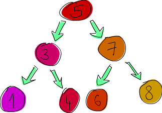

Kendi Türlerimizi ve Tür Sınıflarımızı Yapmak
=============================================

Önceki bölümlerde, bazı mevcut Haskell tür ve tür sınıflarını ele aldık. Bu bölümde, kendimizinkini nasıl yapacağımızı ve onları nasıl çalıştıracağımızı öğreneceğiz!

Cebirsel veri türlerine giriş
-----------------------------

Şimdiye kadar birçok veri türüyle karşılaştık. `Bool`, `Int`, `Char`, `Maybe`, vs. ama nasıl kendimizinkini yapabiliriz? 
Bunun bir yolu, bir tür tanımlamak için **data** keyword'ü kullanmaktır. Standart kütüphanede `Bool` türünün nasıl tanımlandığını görelim.

~~~~ {.haskell: .ghci name="code"}
data bool True | False
~~~~

`data`, yeni bir veri türü tanımladığımız anlamına gelir. `=` Öncesindeki kısım `Bool` olan türü belirtir.
`=` İşaretinden sonraki kısımlar **value constructor'lardır**. Bu türün sahip olabileceği farklı değerleri belirtirler.
`|` veya olarak okunur. Yani bunu şu şekilde okuyabiliriz: `Bool` türü `True` veya `False` değerine sahip olabilir.
Hem tür adı hem de value constructor'lar büyük harfle yazılmalıdır.

Benzer bir şekilde, Int türürünün şu şekilde tanımlandığını düşünebiliriz:

~~~~ {.haskell: .ghci name="code"}
data Int = -2147483648 | -2147483647 | ... | -1 | 0 | 1 | 2 | ... | 2147483647  
~~~~

İlk ve son value constructor'lar, `Int`'in olası minimum ve maksimum değerleridir. Aslında bu şekilde tanımlanmadı, 
elipsler buradadır çünkü bir yığın sayıyı atladık, bu yüzden bu sadece açıklama amaçlıdır.

Şimdi Haskell'de bir şekil nasıl temsil edeceğimizi düşünelim. Bir yol, demet kullanmaktır.
Bir daire `(43.1, 55.0, 10.4)` olarak gösterilebilir, burada birinci ve ikinci alanlar dairenin merkezinin koordinatlarıdır ve üçüncü alan yarıçaptır.
Kulağa hoş geliyor, ancak bunlar bir 3D vektörü veya başka herhangi bir şeyi de temsil edebilir.
Bir şekili temsil etmek için kendi türünüzü yapmak daha iyi bir çözüm olacaktır.
Diyelim ki bir şekil daire veya dikdörtgen olabilir. İşte burada:

~~~~ {.haskell: .ghci name="code"}
data Shape = Circle Float Float Float | Rectangle Float Float Float Float   
~~~~

Şimdi bu nedir? Bunu şöyle düşün. `Circle` value constructor'dan 3 tane float değer alan bir alanı vardır.
Yani bir value contructor yazdığımızda, isteğe bağlı olarak ondan sonra bazı türler ekleyebiliriz ve bu türleri içereceği değerleri tanımlar.
Burada, ilk iki alan merkezinin koordinatları, üçüncüsü ise yarıçapıdır. `Rectangle` value contructor'ının float kabul eden dört alanı vardır.
İlk ikisi, sol üst köşesinin koordinatları ve ikinci ikisi, sağ alt köşesinin koordinatlarıdır.

Şimdi alanlar dediğimde, aslında parametreleri kastediyorum. Value consturctor'lar, aslında bir data türünün değerini nihayetinde döndüren fonksiyonlardır.
Bu iki value constructor için tür imzalarına bir göz atalım.

~~~~ {.haskell: .ghci name="code"}
ghci> :t Circle  
Circle :: Float -> Float -> Float -> Shape  
ghci> :t Rectangle  
Rectangle :: Float -> Float -> Float -> Float -> Shape  
~~~~

Bu nedenle value constructor, her şey gibi fonksiyonlardır. Kimin aklına gelirdi? Bir şekil alıp yüzeyini döndüren bir fonksiyon yapalım.

~~~~ {.haskell: .ghci name="code"}
surface :: Shape -> Float  
surface (Circle _ _ r) = pi * r ^ 2  
surface (Rectangle x1 y1 x2 y2) = (abs $ x2 - x1) * (abs $ y2 - y1)  
~~~~

Buradaki ilk kayda değer şey, tür bildirimidir. Fonksiyonun bir şekil aldığını ve bir float değer döndürdüğünü söylüyor.
`Circle -> Float` için bir tür bildirimi yazamadık çünkü `Circle` bir tür değil, `Shape`'tir.
Tıpkı `True -> Int` tür bildirimi ile bir fonksiyon yazamayacağımız gibi. Burada farkına vardığımız bir sonraki şey,
constructor'lara karşı desen eşleştirme yapabileceğimizdir. `[]` veya `False` veya `5` gibi değerlerle eşleştirdiğimizde daha önce (aslında her zaman)
constructor'larla desen eşleeştirdik, yalnızca bu değerlerde alan yoktu. Sadece bir constructor yazarız ve sonra alanlarını isimlere bağlarız.
Yarıçapla ilgilendiğimiz için, aslında bize dairenin nerede olduğunu söyleyen ilk iki alanı umursamıyoruz.

~~~~ {.haskell: .ghci name="code"}
ghci> surface $ Circle 10 20 10  
314.15927  
ghci> surface $ Rectangle 0 0 100 100  
10000.0  
~~~~

Yaşasın, işe yarıyor! Ancak komut isteminde yalnızca `Circle 10 20 5`'i yazdırmaya çalışırsak, bir hata alırız. 
Bunun nedeni Haskell'in veri türümüzü string(henüz) olarak nasıl görüntüleyeceğini bilmemesidir.
Unutmayın, istemde bir değer yazdırmaya çalıştığımızda, Haskell değerimizin string temsilini almak için önce `show` fonksiyonunu çalıştırır ve sonra bunu terminale yazdırır.
`Shape` türümüzü `Show` tür sınıfınınının bir parçası yapmak için, onu şu şekilde değiştiriyoruz:

~~~~ {.haskell: .ghci name="code"}
data Shape = Circle Float Float Float | Rectangle Float Float Float Float deriving (Show)  
~~~~

Şimdilik çok fazla şey türetmekle(deriving) ilgilenmeyeceğiz. Diyelim ki bir veri bildirimi sonuna `deriving (Show)` eklersek,
Haskell bu türü otomatik olarak `Show` tür sınıfının bir parçası yapar. Şimdi bunu yapabiliriz:

~~~~ {.haskell: .ghci name="code"}
ghci> Circle 10 20 5  
Circle 10.0 20.0 5.0  
ghci> Rectangle 50 230 60 90  
Rectangle 50.0 230.0 60.0 90.0  
~~~~

Value constructor'lar fonksiyonlardır, bu yüzden onları eşleyebilir ve kısmen uygulayabiliriz. Farklı yarıçaplara sahip eşmerkezli dairelerin bir listesini istiyorsak,
bunu yapabiliriz.

~~~~ {.haskell: .ghci name="code"}
ghci> map (Circle 10 20) [4,5,6,6]  
[Circle 10.0 20.0 4.0,Circle 10.0 20.0 5.0,Circle 10.0 20.0 6.0,Circle 10.0 20.0 6.0]  
~~~~

Veri türümüz daha iyi olsa da iyidir. İki boyutlu uzayda bir noktayı tanımlayan bir ara veri türü yapalım.
O zaman şekillerimizi daha anlaşılır hale getirmek için bunu kullanabiliriz.

~~~~ {.haskell: .ghci name="code"}
data Point = Point Float Float deriving (Show)  
data Shape = Circle Point Float | Rectangle Point Point deriving (Show)  
~~~~

Bir noktayı tanımlarken, veri türü ve value constructor için aynı adı kullandığımıza dikkat edin. Bunun özel bir anlamı yoktur,
ancak yalnızca bir value constructor varsa tür olarak aynı adı kullanmak yaygındır. Şimdi `Circle`'ın iki alanı var, biri `Point` türünde, diğeri `Float` türünde.
Bu, neyin ne olduğunu anlamayı kolaylaştırır. rectangle(dikdörtgen) için de aynı şey geçerli. 
`surface` fonksiyonumuzu bu değişiklikleri yansıtacak şekilde ayarlamamız gerekiyor.

~~~~ {.haskell: .ghci name="code"}
surface :: Shape -> Float  
surface (Circle _ r) = pi * r ^ 2  
surface (Rectangle (Point x1 y1) (Point x2 y2)) = (abs $ x2 - x1) * (abs $ y2 - y1)  
~~~~

Değiştirmemiz gereken tek şey kalıplardı. Cirle kalıbındaki Point'i göz ardı ettik. 
Rectangle kalıbında, Point'lerin alanlarını elde etmek için iç içe geçmiş bir desen eşleştirme kullandık.
Point'lerin kendilerine herhangi bir nedenle referans vermek isteseydik, kalıp olarak kullanabilirdik.

~~~~ {.haskell: .ghci name="code"}
ghci> surface (Rectangle (Point 0 0) (Point 100 100))  
10000.0  
ghci> surface (Circle (Point 0 0) 24)  
1809.5574  
~~~~

Bir şekli dürtükleyen bir fonksiyona ne dersiniz? Bir şekli, onu x ekseninde hareket ettirme miktarını ve onu y ekseninde hareket ettirme miktarını alır ve
sonra aynı boyutlara sahip yeni bir şekil döndürür, sadece başka bir yerde bulunur.

~~~~ {.haskell: .ghci name="code"}
nudge :: Shape -> Float -> Float -> Shape  
nudge (Circle (Point x y) r) a b = Circle (Point (x+a) (y+b)) r  
nudge (Rectangle (Point x1 y1) (Point x2 y2)) a b = Rectangle (Point (x1+a) (y1+b)) (Point (x2+a) (y2+b))  
~~~~

Oldukça basit. Dürtme miktarlarını şeklin konumunu gösteren noktalara ekleriz.

~~~~ {.haskell: .ghci name="code"}
ghci> nudge (Circle (Point 34 34) 10) 5 10  
Circle (Point 39.0 44.0) 10.0  
~~~~

Doğrudan noktalarla uğraşmak istemiyorsak, sıfır koordinatlarda belirli büyüklükte şekiller oluşturan ve sonra bunları dürten bazı yardımcı fonksiyonlar yapabiliriz.

~~~~ {.haskell: .ghci name="code"}
baseCircle :: Float -> Shape  
baseCircle r = Circle (Point 0 0) r  
  
baseRect :: Float -> Float -> Shape  
baseRect width height = Rectangle (Point 0 0) (Point width height)  
~~~~

~~~~ {.haskell: .ghci name="code"}
ghci> nudge (baseRect 40 100) 60 23  
Rectangle (Point 60.0 23.0) (Point 100.0 123.0)  
~~~~

Veri türünüzü elbette modüllerinize aktarabilirsiniz. Bunu yapmak için, türünüzü export ettiğiniz fonksiyonlarla birlikte yazın ve ardından bazı parantezler ekleyin ve
bunlarda export etmek istediğiniz value constructor'lara virgülle ayırarak belirtin. Belirli bir tür için tüm value constructor'ları export etmek istiyorsanız,
şunu yazın `".."`.

Burada tanımladığımız fonksiyonları ve türleri bir modülde dışa aktarmak istersek, şu şekilde başlayabiliriz:

~~~~ {.haskell: .ghci name="code"}
module Shapes   
( Point(..)  
, Shape(..)  
, surface  
, nudge  
, baseCircle  
, baseRect  
) where  
~~~~

`Shape (..)` yaparak, Shape için tüm value contructor'larını export ettik, yani modülümüzü import eden kişi 
`Rectangle` ve `Circle` value constructor'larını kullanarak şekiller yapabilir. `Shape (Rectangle, Circle)` yazmakla aynıdır.

Ayrıca, export bildirimine yalnızca `Shape` yazarak `Shape` için herhangi bir value constructor'u export etmeyi tercih edebilirdik.
Bu şekilde, modülümüzü import eden biri, yalnızca `baseCircle` ve `baseRect` yardımcı fonkssiyonlarını kullanarak şekiller oluşturabilir. `Data.Map` bu yaklaşımı kullanır.
`Map.Map [(1,2), (3,4)]` yaparak bir map oluşturamazsınız çünkü bu value constructor'u export etmez.
Ancak, `Map.fromList` gibi yardımcı fonksiyonlardan birini kullanarak bir map'leme yapabilirsiniz.
Unutmayın, value constructor'lar, alanları parametre olarak alan ve sonuç olarak bir türden (`Shape` gibi) bir değer döndüren fonksiyonlardır.
Dolayısıyla, bunları export etmeyi seçtiğimizde, modülümüzü import eden kişinin bu fonksiyonları kullanmasını engelleriz,
ancak export edilen diğer bazı fonksiyonlar bir tür döndürürse, bunları custom veri türlerimizden değerlerini oluşturmak için kullanabiliriz.

Bir veri türünün value constructor'larını export etmek, uygulamalarını gizleyeceğimiz şekilde onları daha soyut hale getirir.
Ayrıca, modülümüzü kullanan kişi, value constructor'lara karşı desen eşleştirme yapamaz.

Sözdizimi kaydı
---------------

Tamam, bir kişiyi tanımlayan bir veri türü oluşturmakla görevlendirildik. Bu kişi hakkında saklamak istediğimiz bilgiler:
first name, last name, age, height, phone number ve favorite ice-cream flavor. Seni bilmiyorum ama bir insan hakkında bilmek istediğim tek şey bu. Hadi bir deneyelim!

~~~~ {.haskell: .ghci name="code"}
data Person = Person String String Int Float String String deriving (Show)   
~~~~

İlk alan first name, ikincisi surname, üçüncüsü age vb. Bir insan yapalım.

~~~~ {.haskell: .ghci name="code"}
ghci> let guy = Person "Buddy" "Finklestein" 43 184.2 "526-2928" "Chocolate"  
ghci> guy  
Person "Buddy" "Finklestein" 43 184.2 "526-2928" "Chocolate"    
~~~~

Biraz okuması zor olsa da bu harika. Bir kişiden ayrı bilgi almak için bir fonksiyon oluşturmak istersek ne olur?
Bir kişinin adını alan bir fonksiyon, bir kişinin soyadını alan bir fonksiyon vb. Onları böyle tanımlamamız gerekirdi.

~~~~ {.haskell: .ghci name="code"}
firstName :: Person -> String  
firstName (Person firstname _ _ _ _ _) = firstname  
  
lastName :: Person -> String  
lastName (Person _ lastname _ _ _ _) = lastname  
  
age :: Person -> Int  
age (Person _ _ age _ _ _) = age  
  
height :: Person -> Float  
height (Person _ _ _ height _ _) = height  
  
phoneNumber :: Person -> String  
phoneNumber (Person _ _ _ _ number _) = number  
  
flavor :: Person -> String  
flavor (Person _ _ _ _ _ flavor) = flavor  
~~~~

Vay canına! Bunu yazmaktan kesinlikle zevk almadım! Yazmak çok zahmetli ve sıkıcı olmasına rağmen, bu yöntem işe yarıyor.

~~~~ {.haskell: .ghci name="code"}
ghci> let guy = Person "Buddy" "Finklestein" 43 184.2 "526-2928" "Chocolate"  
ghci> firstName guy  
"Buddy"  
ghci> height guy  
184.2  
ghci> flavor guy  
"Chocolate"
~~~~

Daha iyi bir yolu olmalı, diyorsun! Hayır, yok, üzgünüm. :(

Şaka yapıyorum, var. Hahaha! Haskell'in yapımcıları çok akıllıydı ve bu senaryoyu öngörmüşlerdi. Veri türlerini yazmak için alternatif bir yol içeriyorlardı.
Kayıt sözdizimi ile yukarıdaki işlevselliği nasıl elde edebileceğimiz aşağıda açıklanmıştır.

~~~~ {.haskell: .ghci name="code"}
data Person = Person { firstName :: String  
                     , lastName :: String  
                     , age :: Int  
                     , height :: Float  
                     , phoneNumber :: String  
                     , flavor :: String  
                     } deriving (Show)   
~~~~

Bu nedenle, alan türlerini sadece birbiri ardına adlandırmak ve boşluklarla ayırmak yerine, küme parantezleri kullanıyoruz.
İlk önce alanın adını yazıyoruz, mesela, `firstName` ve sonra bir çift kolon `::` (Paamayim Nekudotayim, olarak da adlandırılıyor haha) yazıyoruz ve sonra türü belirliyoruz.
Ortaya çıkan veri türü tamamen aynıdır. Bunun ana yararı, veri türündeki alanları arayan fonksiyonlar oluşturmasıdır.
Bu veri türünü oluşturmak için kayıt sözdizimini kullanarak Haskell şu fonksiyonları otomatik olarak yaptı:
`firstName`, `lastName`, `age`, `height`, `phoneNumber` ve `flavor`.

~~~~ {.haskell: .ghci name="code"}
ghci> :t flavor  
flavor :: Person -> String  
ghci> :t firstName  
firstName :: Person -> String   
~~~~

Sözdizimi kaydını kullanmanın başka bir yararı daha var. Tür için `Show` türetdiğimizde, türü tanımlamak ve başlatmak için sözdizimi kaydı kullanırsak,
onu farklı bir şekilde görüntüler. Bir arabayı temsil eden bir türümüz olduğunu varsayalım. Onu yapan firmayı, model adını ve üretim yılını takip etmek istiyoruz. 

~~~~ {.haskell: .ghci name="code"}
data Car = Car String String Int deriving (Show)  
~~~~

~~~~ {.haskell: .ghci name="code"}
ghci> Car "Ford" "Mustang" 1967  
Car "Ford" "Mustang" 1967  
~~~~

Sözdizimi kaydı kullanarak tanımlarsak, bunun gibi yeni bir araba yapabiliriz.

~~~~ {.haskell: .ghci name="code"}
data Car = Car {company :: String, model :: String, year :: Int} deriving (Show)  
~~~~

~~~~ {.haskell: .ghci name="code"}
ghci> Car {company="Ford", model="Mustang", year=1967}  
Car {company = "Ford", model = "Mustang", year = 1967}  
~~~~

Yeni bir araba yaparken, hepsini listelediğimiz sürece alanları doğru sıraya koymamız gerekmez. Ancak sözdizimi kaydını kullanmazsak, bunları sırayla belirtmemiz gerekir.

Bir constructor birkaç alana sahipse ve hangi alanın hangisi olduğu belli olmadığında sözdizimi kaydı kullanın.
data `Vector = Vector Int Int Int` yaparak bir 3D vektör veri türü yaparsak, alanların bir vektörün bileşenleri olduğu oldukça açıktır.
Ancak, `Person` ve `Car` türlerimizde bu çok açık değildi ve sözdizimi kaydını kullanmaktan büyük ölçüde yararlandık.

Tür parametreleri
----------------

Bir value constructor, bazı değer parametrelerini alabilir ve ardından yeni bir değer üretebilir. Örneğin, `Car` constructor'ı üç değer alır ve bir car değeri üretir.
Benzer bir şekilde,** type constructor'lar** yeni türler üretmek için türlerı parametre olarak alabilir.
Bu ilk başta biraz fazla meta gibi gelebilir, ancak o kadar da karmaşık değil. C++'daki şablonlara aşina iseniz, bazı paralellikler göreceksiniz.
Hangi tür parametrelerin eylemde nasıl çalıştığına dair net bir resim elde etmek için, daha önce karşılaştığımız bir türün nasıl uygulandığına bir göz atalım.

~~~~ {.haskell: .ghci name="code"}
data Maybe a = Nothing | Just a  
~~~~

Buradaki `a`, tür parametresidir. Ve işin içinde bir tür parametresi olduğu için, `Maybe` bir type constructor'dır diyoruz.
Bu veri türünün `Nothing` olmadığında neyi tutmasını istediğimize bağlı olarak, bu type constructor bir tür `Maybe Int`, `Maybe Car`, `Maybe String` vb. üretebilir.
Hiçbir değer sadece `Maybe` türünde olamaz, çünkü bu kendi başına bir tür değildir, bir type constructor'dur.
Bunun bir değerin parçası olabileceği gerçek bir tür olması için, tüm tür parametrelerinin doldurulmuş olması gerekir.

Yani eğer `Char`'ı tür parametresi olarak `Maybe`'ye geçirirsek, bir tür `Maybe Char` elde ederiz.
Örneğin, `Just 'a'` değerinin bir türü Maybe Char vardır.

Bilmiyor olabilirsiniz, ancak `Maybe`'yi kullanmadan önce bir tür parametresi olan bir tür kullandık.
Bu tür, list türüdür. Oyunda bir miktar sözdizimsel şeker olsa da, list türü somut bir tür üretmek için bir parametre alır.
Değerler bir `[Int]` türüne, `[Char]` türüne, `[[String]]` türüne sahip olabilir, ancak sadece `[]` türü olan bir değere sahip olamazsınız.

`Maybe` türü ile oynayalım.

~~~~ {.haskell: .ghci name="code"}
ghci> Just "Haha"  
Just "Haha"  
ghci> Just 84  
Just 84  
ghci> :t Just "Haha"  
Just "Haha" :: Maybe [Char]  
ghci> :t Just 84  
Just 84 :: (Num t) => Maybe t  
ghci> :t Nothing  
Nothing :: Maybe a  
ghci> Just 10 :: Maybe Double  
Just 10.0  
~~~~

Tür parametreleri kullanışlıdır çünkü veri türümüzde ne tür türlerin bulunmasını istediğimize bağlı olarak onlarla farklı türler oluşturabiliriz.
`:t Just "Haha"` yaptığımızda, tür çıkarım motoru(type inference engine) bunun `Maybe [Char]` türünde olduğunu anlar, 
çünkü `Just a`'daki a bir string'se, o zaman `Maybe a`'daki `a`'da bir string olmalıdır.

`Nothing` türünün `Maybe a` olduğuna dikkat edin. Türü polimorfiktir. Eğer bir fonksiyon parametre olarak `Maybe Int` gerektiriyorsa,
ona `Nothing` verebiliriz, çünkü `Nothing` zaten bir değer içermez ve bu yüzden önemi yoktur. `Maybe a` türü, mecbur kalırsa `Maybe Int` gibi davranabilir,
tıpkı `5`'in bir `Int` veya `Double` gibi davranabileceği gibi. Benzer şekilde, boş listenin türü `[a]`'dır.
Boş bir liste, herhangi bir şeyin listesi gibi davranabilir. Bu yüzden `[1,2,3] ++ []` ve `["ha", "ha", "ha"] ++ []` yapabiliriz.

Tür parametrelerini kullanmak çok faydalıdır, ancak yalnızca bunları kullanırken mantıklıdır.
Genellikle bunları, `Maybe a` türünde olduğu gibi, veri türünün daha sonra içinde tuttuğu değerin türüne bakılmaksızın çalışacağı zaman kullanırız. 
Türümüzün bir tür kutu gibi davranıyorsa, onları kullanmak iyidir. `Car` veri türümüzü buradan değiştirebiliriz:

~~~~ {.haskell: .ghci name="code"}
data Car = Car { company :: String  
               , model :: String  
               , year :: Int  
               } deriving (Show)  
~~~~

Buna:

~~~~ {.haskell: .ghci name="code"}
data Car a b c = Car { company :: a  
                     , model :: b  
                     , year :: c   
                     } deriving (Show)  
~~~~

Ama gerçekten faydalanır mıyız? Cevap şudur: Muhtemelen hayır, çünkü sonunda sadece `Car String String Int` türünde çalışan fonksiyonları tanımlayacağız.
Örneğin, ilk `Car` tanımımız göz önüne alındığında, arabanın özelliklerini güzel küçük bir metinle gösteren bir fonksiyon yapabiliriz.

~~~~ {.haskell: .ghci name="code"}
tellCar :: Car -> String  
tellCar (Car {company = c, model = m, year = y}) = "This " ++ c ++ " " ++ m ++ " was made in " ++ show y  
~~~~

~~~~ {.haskell: .ghci name="code"}
ghci> let stang = Car {company="Ford", model="Mustang", year=1967}  
ghci> tellCar stang  
"This Ford Mustang was made in 1967" 
~~~~

Sevimli küçük bir fonksiyon! tür bildirimi sevimli ve güzel çalışıyor. Peki ya `Car` `Car a b c` olsaydı?

~~~~ {.haskell: .ghci name="code"}
tellCar :: (Show a) => Car String String a -> String  
tellCar (Car {company = c, model = m, year = y}) = "This " ++ c ++ " " ++ m ++ " was made in " ++ show y  
~~~~

Bu fonksiyonu, `Car` türü `(Show a) => Car String String a` almaya zorlamamız gerekir. Tür imzasının daha karmaşık olduğunu ve gerçekten elde edeceğimiz tek yararın,
`c` türü olarak `Show` tür sınıfının bir instance'ı olan herhangi bir tür kullanabilmemiz olduğunu görebilirsiniz.

~~~~ {.haskell: .ghci name="code"}
ghci> tellCar (Car "Ford" "Mustang" 1967)  
"This Ford Mustang was made in 1967"  
ghci> tellCar (Car "Ford" "Mustang" "nineteen sixty seven")  
"This Ford Mustang was made in \"nineteen sixty seven\""  
ghci> :t Car "Ford" "Mustang" 1967  
Car "Ford" "Mustang" 1967 :: (Num t) => Car [Char] [Char] t  
ghci> :t Car "Ford" "Mustang" "nineteen sixty seven"  
Car "Ford" "Mustang" "nineteen sixty seven" :: Car [Char] [Char] [Char]
~~~~

Yine de gerçek hayatta, çoğu zaman `Car String Int`'i kullanırdık ve bu yüzden `Car` türünün parametreleştirmenin(parameterized) gerçekten buna değmeyeceği anlaşılıyor.
Veri türünün çeşitli value constructor'lar içinde bulunan tür, türün çalışması için gerçekten önemli olmadığında genellikle tür parametrelerini kullanırız.
Bir şeyler listesi, bir şeylerin listesidir ve ne tür bir şey olduğu önemli değildir, yine de işe yarayabilir. Bir sayı listesi toplamak istiyorsak,
daha sonra toplama fonksiyonunda özellikle bir sayı listesi istediğimizi belirtebiliriz. 
Aynısı `Maybe` için de geçerli. `Maybe` hiçbir şeye sahip olmama veya bir şeye sahip olma seçeneğini temsil eder. Bunun ne türü'ı olduğu önemli değil.

Daha önce tanıştığımız parametreleştirilmiş bir türe başka bir örnek, `Data.Map`'ten `Map k v`'dir.
`k`, bir map'deki key'lerin türüdür ve `v`, value'ların türüdür. Bu, tür parametrelerinin çok kullanışlı olduğu iyi bir örnektir. 
map'lerin parametreleştirilmiş olması, key'lerin türü `Ord` tür sınıfının bir parçası olduğu sürece, herhangi bir türden diğer türlere eşlemeler yapmamızı sağlar.
Bir eşleme türü tanımlıyor olsaydık, veri bildirimine bir tür sınıfı kısıtlaması ekleyebilirdik:

~~~~ {.haskell: .ghci name="code"}
data (Ord k) => Map k v = ...  
~~~~

Bununla birlikte, Haskell'de **veri bildirimlerine asla tür sınıfı kısıtlamalarının eklenmemesi** çok güçlü bir kuraldır.
Neden? Pekala, çünkü pek fayda sağlamıyoruz, ancak ihtiyacımız olmasa bile daha fazla sınıf kısıtlaması yazıyoruz.
`Ord k` kısıtlamasını `Map k v` için veri bildirimi koyarsak veya koymazsak, kısıtlamayı bir map'teki key'lerin sıralanabileceğini varsayan fonksiyonlara koymamız gerekir.
Ancak veri bildirimine kısıtlama koymazsak, key'lerin sıralanıp sıralanmayacağına aldırış etmeyen fonksiyonların tür bildirimlerine `(Ord k) =>` koymamız gerekmez.
Böyle bir fonksiyonun bir instance'ı, sadece bir map alan ve onu bir ilişkilendirmeli listeye dönüştüren `toList`'tir.
Tür imzası `toList :: Map k a -> [(k, a)]` şeklindedir. `Map k v` veri bildiriminde bir tür kısıtlamasına sahipse,
fonksiyon anahtarları sırayla karşılaştırmasa bile toList türünün `toList :: (Ord k) => Map k a -> [(k, a)]` olması gerekir.

Bu nedenle, mantıklı görünse bile veri bildirimine tür kısıtlamaları koymayın, çünkü bunları her iki şekilde de fonksiyon tür bildiriminelerine eklemeniz gerekir.

Bir 3D vektör türü uygulayalım ve bunun için bazı işlemler ekleyelim.
Parametreli bir tür kullanacağız çünkü genellikle sayısal türler içerse de, yine de birkaçını destekleyecektir.

~~~~ {.haskell: .ghci name="code"}
data Vector a = Vector a a a deriving (Show)  
  
vplus :: (Num t) => Vector t -> Vector t -> Vector t  
(Vector i j k) `vplus` (Vector l m n) = Vector (i+l) (j+m) (k+n)  
  
vectMult :: (Num t) => Vector t -> t -> Vector t  
(Vector i j k) `vectMult` m = Vector (i*m) (j*m) (k*m)  
  
scalarMult :: (Num t) => Vector t -> Vector t -> t  
(Vector i j k) `scalarMult` (Vector l m n) = i*l + j*m + k*n   
~~~~

`vplus`, iki vektörü birbirine eklemek içindir. Yalnızca karşılık gelen bileşenleri eklenerek iki vektör eklenir. `scalarMult`, iki vektörün skaler çarpımı içindir ve
`vectMult`, bir vektörü skaler ile çarpmak içindir. Bu fonksiyonlar `Vector Int, Vector Integer, Vector Float` türlerinde, ne olursa olsun, `Vector a`'dan gelen `a`, 
`Num` tür sınıfından olduğu sürece çalışabilir. Ayrıca, bu fonksiyonlar için tür bildirimini incelerseniz,
yalnızca aynı türdeki vektörler üzerinde çalışabileceklerini ve ilgili sayıların da vektörlerde bulunan türden olması gerektiğini göreceksiniz.
veri bildirimine `Num` class kısıtlaması koymadığımıza dikkat edin, çünkü bunu yine de fonksiyonlarda tekrar etmemiz gerekir.

Bir kez daha, type constructor ile value constructor birbirinden ayırmak çok önemlidir. Bir veri türü bildirirken,
`=`'den önceki kısım type constructor'dur ve ondan sonraki constructor'lar (muhtemelen |'ler ile ayrılırlar) value constructor'lardır.
Bir fonksiyona bir tür `Vektor t t t -> Vektor t t t -> t` vermek yanlış olur, çünkü tür bildirimine türleri koymamız gerekir ve 
vektör **type** constructor'u yalnızca bir parametre alır, oysa value constructor'u üç alır. Vektörlerimizle oynayalım.

~~~~ {.haskell: .ghci name="code"}
ghci> Vector 3 5 8 `vplus` Vector 9 2 8  
Vector 12 7 16  
ghci> Vector 3 5 8 `vplus` Vector 9 2 8 `vplus` Vector 0 2 3  
Vector 12 9 19  
ghci> Vector 3 9 7 `vectMult` 10  
Vector 30 90 70  
ghci> Vector 4 9 5 `scalarMult` Vector 9.0 2.0 4.0  
74.0  
ghci> Vector 2 9 3 `vectMult` (Vector 4 9 5 `scalarMult` Vector 9 2 4)  
Vector 148 666 222   
~~~~

Türetilmiş instance'lar
-----------------------

[Tür sınıfları 101 bölümünde](../tr/03-types-and-typeclasses.md#tür-sınıfları-101) tür sınıfların temellerini açıkladık. Bir tür sınıfının bazı davranışları tanımlayan bir tür arayüz(type interface) olduğunu açıkladık.
Bir tür, bu davranışı destekliyorsa, bir tür sınıfının bir **instance'ı** yapılabilir. Örnek: `Int` türü, `Eq` tür sınıfının bir instance'ıdır, çünkü `Eq` tür sınıfı, 
eşitlenebilen şeyler için davranışı tanımlar. Ve tamsayılar eşitlenebildiği için, `Int`, `Eq` tür sınıfının bir parçasıdır.
Gerçek kullanışlılık, Denklem için arayüz görevi gören `==` ve `/=` fonksiyonlarıyla birlikte gelir. Bir tür, `Eq` tür sınıfıının bir parçasıysa,
o türdeki değerlerle `==` fonksiyonlarını kullanabiliriz. Bu nedenle `4 == 4` ve `"foo" /= "bar"` tür kontrolü gibi ifadeler.

Ayrıca Java, Python, C++ ve benzeri dillerdeki sınıflarla genellikle karıştırıldıklarından bahsettik, bu da birçok insanı şaşırttı.
Bu dillerde, sınıflar, daha sonra durum içeren ve bazı eylemler yapabilen nesneler oluşturduğumuz bir plandır. Tür sınıfları daha çok arayüz gibidir.
Tür sınıflarından veri üretmiyoruz. Bunun yerine, önce veri türümüzü yaparız ve sonra nasıl davranabileceğini düşünürüz.
Eşitlenebilecek bir şey gibi hareket edebiliyorsa, onu `Eq` tür sınıfının bir instance'ı yaparız. Sıralanabilecek edilebilecek bir şey gibi hareket edebiliyorsa,
onu `Ord` tür sınıfının bir instance'ı yaparız.

Bir sonraki bölümde, tür sınıfları tarafından tanımlanan fonksiyonları uygulayarak tür sınıflarımızı manuel olarak nasıl yapabileceğimize bir göz atacağız.
Ama şimdi, Haskell'in yazımımızı aşağıdaki tür sınıflarından herhangi birinin bir instaance'ını nasıl otomatik olarak yapabildiğini görelim:
`Eq`, `Ord`, `Enum`, `Bounded`, `Show`, `Read`. Haskell, veri türümüzü oluştururken deriving keyword'ünü kullanırsak, türlerimizin davranışını bu bağlamlarda türetebiliriz.

Bu veri türünü düşünün:

~~~~ {.haskell: .ghci name="code"}
data Person = Person { firstName :: String  
                     , lastName :: String  
                     , age :: Int  
                     } 
~~~~

Bir kişiyi tanımlar. İki kişinin aynı name, surname ve age kombinasyonuna sahip olmadığını varsayalım. Şimdi, iki kişi için kayıtlarımız varsa,
aynı kişiyi temsil edip etmediklerini görmek mantıklı mı? Elbette öyle. Onları eşitlemeye çalışabilir ve eşit olup olmadıklarını görebiliriz. 
Bu nedenle, bu türün `Eq` tür sınıfının bir parçası olması mantıklı olacaktır. Instance'ı türeteceğiz.

~~~~ {.haskell: .ghci name="code"}
data Person = Person { firstName :: String  
                     , lastName :: String  
                     , age :: Int  
                     } deriving (Eq)  
~~~~

Bir tür için `Eq` instance'ını türetip daha sonra bu türden iki değeri `==` veya `/=` ile karşılaştırmaya çalıştığımızda, Haskell value constructor'larının 
eşleşip eşleşmediğini görecek (burada sadece bir value constructor var) ve sonra tüm her alan çiftini `==` ile test ederek verileri eşleştirmeye çalışır.
Yine de tek bir yakalama var, tüm alanların türlerinin de `Eq` tür sınıfının bir parçası olmalı. Ama hem `String` hem de `Int` olduğu için, biz iyiyiz. 
`Eq` instance'ımızı test edelim.

~~~~ {.haskell: .ghci name="code"}
ghci> let mikeD = Person {firstName = "Michael", lastName = "Diamond", age = 43}  
ghci> let adRock = Person {firstName = "Adam", lastName = "Horovitz", age = 41}  
ghci> let mca = Person {firstName = "Adam", lastName = "Yauch", age = 44}  
ghci> mca == adRock  
False  
ghci> mikeD == adRock  
False  
ghci> mikeD == mikeD  
True  
ghci> mikeD == Person {firstName = "Michael", lastName = "Diamond", age = 43}  
True  
~~~~

Elbette, `Person` artık `Eq` içinde olduğundan, `elem` gibi, tür imzasında `Eq a` sınıf kısıtlaması olan tüm fonksiyonlar için onu `a` olarak kullanabiliriz.

~~~~ {.haskell: .ghci name="code"}
ghci> let beastieBoys = [mca, adRock, mikeD]  
ghci> mikeD `elem` beastieBoys  
True  
~~~~

`Show` ve `Read` tür sınıfları sırasıyla string'lere veya string'lerden dönüştürülebilen şeyler içindir. `Eq`'da olduğu gibi, bir type constructor'larının alanları varsa,
türümüzü bunların bir instance'ı yapmak istiyorsak, türlerinin Show veya Read'in bir parçası olması gerekir.
`Person` veri türümüzü de `Show` ve `Read`'in bir parçası yapalım.

~~~~ {.haskell: .ghci name="code"}
data Person = Person { firstName :: String  
                     , lastName :: String  
                     , age :: Int  
                     } deriving (Eq, Show, Read)    
~~~~

Artık terminale bir kişiyi yazdırabiliriz.

~~~~ {.haskell: .ghci name="code"}
ghci> let mikeD = Person {firstName = "Michael", lastName = "Diamond", age = 43}  
ghci> mikeD  
Person {firstName = "Michael", lastName = "Diamond", age = 43}  
ghci> "mikeD is: " ++ show mikeD  
"mikeD is: Person {firstName = \"Michael\", lastName = \"Diamond\", age = 43}"    
~~~~

`Person` veri türünün `Show`'un bir parçası yapmadan önce terminalde bir kişiyi yazdırmaya çalışsaydık,
Haskell, bir kişiyi string olarak nasıl temsil edeceğini bilmediğini iddia ederek bize şikayet ederdi.
Ama artık bunun için bir `Show` instance'ı oluşturduğumuza göre, bunu biliyor.

`read`, `Show`'un ters tür sınıfıdır. `Show`, türümüzün değerlerini string'e dönüştürmek içindir, `Read` string'i türümüzün değerlerine dönüştürmek içindir.
Yine de `Read` fonksiyonunu kullandığımızda Haskell'e sonuç olarak hangi türü elde etmek istediğimizi söylemek için
açık bir tür ek açıklaması kullanmamız gerektiğini unutmayın. Sonuç olarak istediğimiz türü açık hale getirmezsek Haskell hangi türü istediğimizi bilmez.

~~~~ {.haskell: .ghci name="code"}
ghci> read "Person {firstName =\"Michael\", lastName =\"Diamond\", age = 43}" :: Person  
Person {firstName = "Michael", lastName = "Diamond", age = 43}  
~~~~

`read`'in sonucunu daha sonra Haskell'in bunu bir kişi olarak okuması gerektiği sonucuna varacak şekilde kullanırsak, tür ek açıklamasını kullanmak zorunda değiliz.

~~~~ {.haskell: .ghci name="code"}
ghci> read "Person {firstName =\"Michael\", lastName =\"Diamond\", age = 43}" == mikeD  
True  
~~~~

Parametreli türleri de okuyabiliriz, ancak tür parametrelerini doldurmamız gerekir.
Yani bunu `read "Just 't'" :: Maybe a` yazarak okuyamayız, ama bunu `read "Just 't'" :: Maybe Char` yazarak okuyabiliriz.

Sıralanabilen değerlere sahip türler için `Ord` tür sınıfı için instance'lar türetebiliriz.
Farklı constructor'lar kullanılarak yapılmış aynı türden iki değeri karşılaştırırsak, ilk önce tanımlanan bir constructor ile yapılan değer daha küçük kabul edilir.
Örneğin, `False` veya `True` değerine sahip olabilen `Bool` türünü düşünün. Karşılaştırıldığında nasıl davrandığını görmek amacıyla, şu şekilde uygulandığını düşünebiliriz:

~~~~ {.haskell: .ghci name="code"}
data Bool = False | True deriving (Ord)  
~~~~

İlk olarak `False` value constructor'u belirtildiğinden ve `True` value constructor'u ondan sonra belirtildiğinden, `True` değerini `False`'dan daha büyük olarak kabul edebiliriz.

~~~~ {.haskell: .ghci name="code"}
ghci> True `compare` False  
GT  
ghci> True > False  
True  
ghci> True < False  
False  
~~~~

`Maybe a` veri türünde, `Nothing` value constructor'u `Just` value constructor'ndan önce belirtilir, bu nedenle `Nothing` değeri, bir şey eksi bir milyar trilyon olsa bile,
her zaman `Just somethings` değerinden daha küçüktür. Ama iki `Just` değeri karşılaştırırsak, içlerindeki değerleri karşılaştırmaya gider.

~~~~ {.haskell: .ghci name="code"}
ghci> Nothing < Just 100  
True  
ghci> Nothing > Just (-49999)  
False  
ghci> Just 3 `compare` Just 2  
GT  
ghci> Just 100 > Just 50  
True  
~~~~

Ancak `Just (*3)> Just (*2)` gibi bir şey yapamayız, çünkü `(*3)` ve `(*2)` fonksiyonlardır Ord'nin instance'ları değillerdir.

Numaralandırma yapmak için cebirsel(algebraic) veri türleri kolayca kullanabiliriz ve `Enum` ve `Bounded` tür sınıfları bu konuda bize yardımcı olur.
Aşağıdaki veri türünü düşünün:

~~~~ {.haskell: .ghci name="code"}
data Day = Monday | Tuesday | Wednesday | Thursday | Friday | Saturday | Sunday  
~~~~

Tüm value constructor'ları sıfır olduğundan (yani hiçbir parametre almaz örneğin alanlar), onu `Enum` tür sınıfının bir parçası yapabiliriz.
`Enum` tür sınıfı, öncel(predecessors) ve ardıl(successors) olan şeyler içindir. Ayrıca, mümkün olan en düşük değere ve mümkün olan en yüksek değere sahip şeyler için
olan `Bounded` tür sınıfının bir parçası da yapabiliriz. Ve biz oradayken, onu diğer tüm türetilebilir tür sınıflarının bir instance'ı yapalım ve onunla neler
yapabileceğimize bakalım.

~~~~ {.haskell: .ghci name="code"}
data Day = Monday | Tuesday | Wednesday | Thursday | Friday | Saturday | Sunday   
           deriving (Eq, Ord, Show, Read, Bounded, Enum)  
~~~~

`Show` ve `Read` tür sınıflarının bir parçası olduğu için, bu türdeki değerleri string'lere ve string'lerden dönüştürebiliriz.

~~~~ {.haskell: .ghci name="code"}
ghci> Wednesday  
Wednesday  
ghci> show Wednesday  
"Wednesday"  
ghci> read "Saturday" :: Day  
Saturday   
~~~~

`Eq` ve `Ord` tür sınıflarının bir parçası olduğu için günleri karşılaştırabilir veya eşitleyebiliriz.

~~~~ {.haskell: .ghci name="code"}
ghci> Saturday == Sunday  
False  
ghci> Saturday == Saturday  
True  
ghci> Saturday > Friday  
True  
ghci> Monday `compare` Wednesday  
LT  
~~~~

Aynı zamanda `Bounded`'ın bir parçası, böylece en düşük ve en yüksek günü elde edebiliriz.

~~~~ {.haskell: .ghci name="code"}
ghci> minBound :: Day  
Monday  
ghci> maxBound :: Day  
Sunday  
~~~~

Aynı zamanda bir `Enum` instance'ıdır. Günlerin öncel ve ardılları alabiliriz ve onlardan liste aralığı yapabiliriz!

~~~~ {.haskell: .ghci name="code"}
ghci> succ Monday  
Tuesday  
ghci> pred Saturday  
Friday  
ghci> [Thursday .. Sunday]  
[Thursday,Friday,Saturday,Sunday]  
ghci> [minBound .. maxBound] :: [Day]  
[Monday,Tuesday,Wednesday,Thursday,Friday,Saturday,Sunday]  
~~~~

Bu oldukça harika.

Tür eşanlamlıları
-----------------

Daha önce, türleri yazarken `[Char]` ve `String` türlerini eşdeğer ve değiştirilebilir olduğundan bahsetmiştik. Bu **tür eşanlamlıyla** ile uygulanır.
Tür eşanlamlılar gerçekten hiçbir şey yapmaz, sadece bazı türlere farklı adlar vermekle ilgilidir, böylece kodumuzu ve belgelerimizi okuyan birine daha anlamlı gelsinler.
Standart kitaplığın `String`'i `[Char]` ile eşanlamlı olarak nasıl tanımladığı aşağıda açıklanmıştır.

~~~~ {.haskell: .ghci name="code"}
type String = [Char]  
~~~~

*type* keyword'ünü tanıttık. Keyword'lerin bazıları için yanıltıcı olabilir, çünkü aslında yeni bir şey yapmıyoruz (bunu data keyword'ü ile yaptık), 
ancak zaten mevcut bir türle eşanlamlılar yapıyoruz.

Bir string'i büyük harfe dönüştüren ve ona `toUpperString` veya başka bir şey diyen bir fonksiyon yaparsak, 
ona `toUpperString :: [Char] -> [Char]` veya `toUpperString :: String -> String` tür bildirimi verebiliriz.
Bunların ikisi de esasen aynıdır, sadece ikincisi okunması daha hoştur.

`Data.Map` modülüyle uğraşırken, map'e dönüştürmeden önce bir ilişkilendirme listesiyle bir telefon rehberini temsil ettik.
Daha önce öğrendiğimiz gibi, bir ilişkilendirme listesi, key-value çiftlerinin bir listesidir. Elimizdeki telefon rehberine bakalım.

~~~~ {.haskell: .ghci name="code"}
phoneBook :: [(String,String)]  
phoneBook =      
    [("betty","555-2938")     
    ,("bonnie","452-2928")     
    ,("patsy","493-2928")     
    ,("lucille","205-2928")     
    ,("wendy","939-8282")     
    ,("penny","853-2492")     
    ]  
~~~~

`phoneBook` türünün `[(String, String)]` olduğunu görüyoruz. Bu bize string'lerden string'lere eşlenen bir ilişkilendirme listesi olduğunu söyler, ancak başka bir şey değil.
tür bildiriminde biraz daha bilgi iletmek için bir tür eşanlamlısı yapalım.

~~~~ {.haskell: .ghci name="code"}
type PhoneBook = [(String,String)]  
~~~~

Artık telefon rehberimiz için tür bildirimi `phoneBook :: PhoneBook` olabilir. `String` için de bir tür eşlanlısı yapalım.

~~~~ {.haskell: .ghci name="code"}
type PhoneNumber = String  
type Name = String  
type PhoneBook = [(Name,PhoneNumber)]  
~~~~

`String` tür eşanlamlıları vermek, Haskell programcılarının fonksiyonlarındaki hangi string'lerin ne olarak kullanılması gerektiği ve neyi temsil ettikleri hakkında
daha fazla bilgi iletmek istediklerinde yaptıkları bir şeydir. 

Şimdi, bir isim ve bir numara alan ve bu isim ve numara kombinasyonunun telefon rehberimizde olup olmadığını gören bir fonksiyonu uyguladığımızda,
ona çok güzel ve açıklayıcı bir tür bildirimi verebiliriz.

~~~~ {.haskell: .ghci name="code"}
inPhoneBook :: Name -> PhoneNumber -> PhoneBook -> Bool  
inPhoneBook name pnumber pbook = (name,pnumber) `elem` pbook    
~~~~

Tür eşanlamlılarını kullanmamaya karar verirsek, fonksiyonumuz bir `String -> String -> [(String,String)] -> Bool` türüne sahip olacaktır.
Bu durumda, tür eşanlamlılardan yararlanan tür bildiriminin anlaşılması daha kolaydır.
Ancak, onlarla denize girmemelisiniz. Tür eşanlamlılarını, fonksiyonlarımızda bazı mevcut türlerin neyi temsil ettiğini açıklamak için 
(ve böylece tür bildirimleri daha iyi dokümantasyon haline gelir) veya çokça tekrarlanan (`[(String, String)]` gibi) ancak temsil eden uzun 
bir türe sahip olduğunda sunuyoruz. fonksiyonlarımız bağlamında daha spesifik bir şey.

Tür eşanlamlıları da parametreleştirilebilir. İlişkilendirme listesi türünü temsil eden bir tür istiyorsak, ancak yine de genel olmasını istiyorsak,
böylece key'ler ve value'lar olarak herhangi bir türü kullanabiliriz, bunu yapabiliriz:

~~~~~~~~ {.haskell: .ghci name="code"}
type AssocList k v = [(k,v)]  
~~~~~~~~

Şimdi, bir ilişkilendirme listesindeki key'lerle value'ları alan bir fonksiyon `(Eq k) => k -> AssocList k v -> Maybe v` türüne sahip olabilir.
AssocList, örneğin `AssocList Int String` gibi iki tür alan ve somut bir tür üreten bir tpye constructor'dur.

**Fonzie diyor ki:** Aaay! Somut türlerden bahsettiğimde, `Map Int String` gibi tamamen uygulanmış türlerden bahsediyorum veya bunlardan biriyle ilgileniyorsak, 
`[a]` veya `(Ord a) => Maybe a` ve buna benzer şeylerden. Ve bazen ben ve oğlanlar `Maybe`'nin bir tür olduğunu söyleriz, ama bunu kastetmiyoruz,
çünkü her aptal `Maybe`'nin bir type constructor olduğunu bilir. `Maybe`'ye, `Maybe String` gibi fazladan bir tür uyguladığımda, o zaman somut bir türe sahip olurum.
Biliyorsunuz, değerlerin yalnızca somut türler olabilir! Sonuç olarak, hızlı yaşayın, çok sevin ve hiç kimsenin tarağınızı kullanmasına izin vermeyin!

Tıpkı yeni fonksiyonları almak için fonksiyonları kısmen uygulayabildiğimiz gibi, tür parametrelerini kısmen uygulayabilir ve bunlardan yeni type constructor'lar alabiliriz.
Tıpkı yeni bir fonksiyonu geri almak için çok az parametresi olan bir fonksiyonu çağırdığımız gibi, çok az tür parametresi olan bir type contructor belirleyebilir ve
kısmen uygulanan bir type constructor'u geri alabiliriz. Tamsayıdan bir şeye bir map'i (`Data.Map`'ten) temsil eden bir tür isteseydik, şunu yapabilirdik:

~~~~~~~~ {.haskell: .ghci name="code"}
type IntMap v = Map Int v  
~~~~~~~~

Ya da şu şekilde yapabiliriz:

~~~~~~~~ {.haskell: .ghci name="code"}
type IntMap = Map Int  
~~~~~~~~

Her iki durumda da, `IntMap` type constructor'u bir parametre alır ve bu, yam sayıların işaret edeceği türdür.

**Ah evet.** Bunu deneyecek ve uygulayacaksanız, muhtemelen `Data.Map`'in qualified import yapacaksınız.
qualified import yaptığınızda, type constructor'lardan önce bir modül adı da gelmelidir. Yani tür `IntMap = Map.Map` Int yazarsınız.

Type constructor'larla value constructor'lar arasındaki farkı gerçekten anladığınızdan emin olun.
`IntMap` veya `AssocList` adında bir tür eşanlamlısı yaptığımız için, `AssocList [(1,2), (4,5), (7,9)]` gibi şeyler yapabileceğimiz anlamına gelmez.
Tek anlamı, farklı isimler kullanarak türüne başvurabileceğimizdir. İçerideki sayıların bir tür `Int` varsaymasını sağlayacak
`[(1,2),(3,5),(8,9)] :: AssocList Int Int` yapabiliriz, ancak bu listeyi, içinde tamsayı çiftleri olan herhangi bir normal liste gibi kullanabiliriz.
Tür eşanlamlıları (ve genellikle türler) yalnızca Haskell'in tür bölümünde kullanılabilir.
Yeni türler tanımladığımızda (yani veri ve tür bildirimlerinde) :: kullanılır. :: tür bildirimlerinde veya tür ek açıklamalarında da bulunur.

Parametre olarak iki tür alan başka bir harika veri türü, `Either a b` türüdür. Kabaca şu şekilde tanımlanır:

~~~~~~~~ {.haskell: .ghci name="code"}
data Either a b = Left a | Right b deriving (Eq, Ord, Read, Show)  
~~~~~~~~

İki value constructor'a sahiptir. `Left` kullanılırsa, içeriği `a` türündedir ve `Right` kullanılırsa, içeriği `b` türündedir.
Yani bu türü, bir türden bir değeri kapsüllemek için kullanabiliriz ve sonra `Either a b` türden bir değer elde ettiğimizde,
genellikle hem `Left` hem de `Right` için desen eşleştirme  yaparız ve hangisinin olduğuna bağlı olarak farklı şeyler yaparız.

~~~~~~~~ {.haskell: .ghci name="code"}
ghci> Right 20  
Right 20  
ghci> Left "w00t"  
Left "w00t"  
ghci> :t Right 'a'  
Right 'a' :: Either a Char  
ghci> :t Left True  
Left True :: Either Bool b   
~~~~~~~~

Şimdiye kadar, `Maybe a`'nın çoğunlukla başarısız olabilecek veya başarısız olabilecek hesaplamaların sonuçlarını temsil etmek için kullanıldığını gördük.
Ama bazen, `Maybe a` yeterince iyi değildir çünkü `Nothing`, bir şeyin başarısız olmasından başka pek fazla bilgi aktarmaz.
Bu, yalnızca bir şekilde başarısız olabilecek fonksiyonlar için veya nasıl ve neden başarısız olduklarıyla ilgilenmiyorsak harika.
Bir `Data.Map` araması, yalnızca aradığımız key map'de değilse başarısız olur, bu yüzden tam olarak ne olduğunu biliyoruz.
Bununla birlikte, bir fonksiyonun nasıl veya neden başarısız olduğuyla ilgilendiğimizde, genellikle `Either a b` sonuç türünü kullanırız;
burada `a`, bize olası hata hakkında bir şeyler söyleyebilecek bir türdür ve `b`, başarılı bir hesaplama türüdür.
Bu nedenle, sonuçlar `Right` kullanırken hatalar `Left` value constructor'ı kullanır.

Bir örnek: bir lisede kilitli dolaplar vardır, böylece öğrenciler Guns'n'Roses posterlerini koyabilecekleri bir yere sahip olurlar.
Her dolabın bir kod kombinasyonu vardır. Bir öğrenci yeni bir dolap istediğinde, dolap amirine hangi dolap numarasını istediğini söyler ve ona kodu verir.
Ancak, birisi zaten bu dolabı kullanıyorsa, onlara dolabın kodunu söyleyemez ve farklı bir tane seçmeleri gerekir.
Dolapları temsil etmek için `Data.Map`'ten bir map kullanacağız. Dolap numaralarından, dolabın kullanımda olup olmadığı ve dolap kodu ile eşlenir.

~~~~~~~~ {.haskell: .ghci name="code"}
import qualified Data.Map as Map  
  
data LockerState = Taken | Free deriving (Show, Eq)  
  
type Code = String  
  
type LockerMap = Map.Map Int (LockerState, Code)   
~~~~~~~~

Basit şeyler. Bir dolabın alınıp alınmadığını veya ücretsiz olup olmadığını göstermek için yeni bir veri türü sunuyoruz ve dolap kodu ile eşanlamlı bir tür oluşturuyoruz.
Ayrıca tamsayılardan kilitli dolap durumu ve kod çiftlerine eşlenen tür için bir tür eşanlamlıları yaparız. 
Ve şimdi, bir kilitli dolap map'nde kodu arayan bir fonksiyon yapacağız. Sonucumuzu temsil etmek için bir `Either String Code` türü kullanacağız,
çünkü aramamız iki şekilde başarısız olabilir - dolap alınabilir, bu durumda kodu söyleyemeyiz veya kilitli dolap numarası hiç olmayabilir.
Arama başarısız olursa, ne olduğunu anlatmak için bir `String` kullanacağız.

~~~~~~~~ {.haskell: .ghci name="code"}
lockerLookup :: Int -> LockerMap -> Either String Code  
lockerLookup lockerNumber map =   
    case Map.lookup lockerNumber map of   
        Nothing -> Left $ "Locker number " ++ show lockerNumber ++ " doesn't exist!"  
        Just (state, code) -> if state /= Taken   
                                then Right code  
                                else Left $ "Locker " ++ show lockerNumber ++ " is already taken!"    
~~~~~~~~

Haritada normal bir arama yapıyoruz. Bir `Nothing` alırsak, dolabın hiç olmadığını söyleyerek `Left String` türünde bir değer döndürürüz.
Bulursak, dolabın alınıp alınmadığını görmek için ek bir kontrol yaparız. Eğer öyleyse, zaten alınmış olduğunu söyleyen bir `Left` dönün.
Değilse, öğrenciye dolabın doğru kodunu verdiğimiz `Right Code` türünde bir değer döndürün.
Bu aslında bir `Right String`, ancak bu tür eşanlamlısını tür bildirimine bazı ek belgeler eklemek için ekledik. İşte örnek bir harita:

~~~~~~~~ {.haskell: .ghci name="code"}
lockers :: LockerMap  
lockers = Map.fromList   
    [(100,(Taken,"ZD39I"))  
    ,(101,(Free,"JAH3I"))  
    ,(103,(Free,"IQSA9"))  
    ,(105,(Free,"QOTSA"))  
    ,(109,(Taken,"893JJ"))  
    ,(110,(Taken,"99292"))  
    ]  
~~~~~~~~

Şimdi bazı dolap kodlarına bakalım.

~~~~~~~~ {.haskell: .ghci name="code"}
ghci> lockerLookup 101 lockers  
Right "JAH3I"  
ghci> lockerLookup 100 lockers  
Left "Locker 100 is already taken!"  
ghci> lockerLookup 102 lockers  
Left "Locker number 102 doesn't exist!"  
ghci> lockerLookup 110 lockers  
Left "Locker 110 is already taken!"  
ghci> lockerLookup 105 lockers  
Right "QOTSA"   
~~~~~~~~

Sonucu temsil etmek için `Maybe a` kullanabilirdik, ancak o zaman kodu neden alamadığımızı anlayamayız. Ama artık sonuç türümüzdeki başarısızlık hakkında bilgimiz var.

Özyinelemeli veri yapıları
---------------------------

Gördüğümüz gibi, bir cebirsel(algebraic) veri türündeki bir constructor birkaç alana sahip olabilir (veya hiç olmayabilir) ve her alan belirli bir somut türde olmalıdır.
Bunu akılda tutarak, constructor'ları aynı türden alanlara sahip olan türler yapabiliriz! Bunu kullanarak,
bir türden bir değerin o türden değerleri içerdiği ve daha sonra aynı türden daha fazla değeri içeren özyinelemeli veri türler oluşturabiliriz.

Bu listeyi düşünün: `[5]`. Bu sadece `5:[]` sözdizimsel şeker için. `:` işaretinin sol tarafında bir değer ve sağ tarafında bir liste var.
Ve bu durumda, liste boş. Şimdi bu listeye ne dersin `[4,5]`? Pekala, bu `4:(5:[])` şekline dönüşüyor.
Birinci `:`'ye baktığımızda, sol tarafında bir eleman ve sağ tarafında da bir liste `(5:[])` olduğunu görürüz.
Aynı şey `3:(4:(5:6:[]))` gibi bir liste için de geçerli, ya bu şekilde ya da `3:4:5:6:[]` gibi yazılabilir (çünkü `:` doğru ilişkilidir) veya `[3,4,5,6]`.

Bir listenin boş bir liste olabileceğini veya başka bir liste ile bir `:` ile birleştirilen bir öğe olabileceğini söyleyebiliriz (bu, boş liste olabilir veya olmayabilir).

O halde kendi listemizi uygulamak için cebirsel veri yapıları kullanalım!

~~~~~~~~ {.haskell: .ghci name="code"}
data List a = Empty | Cons a (List a) deriving (Show, Read, Eq, Ord)   
~~~~~~~~

Bu, önceki paragraflardan birindeki liste tanımımız gibi okur. Ya boş bir liste ya da bir değeri olan bir başlık ve bir liste kombinasyonu.
Bu konuda kafanız karıştıysa, sözdizimi kaydını anlamayı daha kolay bulabilirsiniz.

~~~~~~~~ {.haskell: .ghci name="code"}
data List a = Empty | Cons { listHead :: a, listTail :: List a} deriving (Show, Read, Eq, Ord)  
~~~~~~~~

Ayrıca burada `Cons` constructor'u hakkında kafanız karışabilir. cons, `:` için başka bir kelimedir. Görüyorsunuz, listelerde, `:` aslında bir değer ve 
başka bir liste alıp bir liste döndüren bir constructor'dır. Yeni liste türümüzü şimdiden kullanabiliriz! Başka bir deyişle, 
iki alanı vardır. Bir alan `a` türündendir ve diğeri `[a]` türündendir.

~~~~~~~~ {.haskell: .ghci name="code"}
ghci> Empty  
Empty  
ghci> 5 `Cons` Empty  
Cons 5 Empty  
ghci> 4 `Cons` (5 `Cons` Empty)  
Cons 4 (Cons 5 Empty)  
ghci> 3 `Cons` (4 `Cons` (5 `Cons` Empty))  
Cons 3 (Cons 4 (Cons 5 Empty))  
~~~~~~~~

`Cons` constructor'umuzu infix tarzında çağırdık, böylece nasıl `:` gibi olduğunu görebilirsiniz. `Empty` `[]` gibidir ve ``4 `Cons` (5 `Cons` Empty)`` `4:(5:[])` gibidir.

Otomatik olarak eklenecek fonksiyonları sadece özel karakterlerden oluşturarak tanımlayabiliriz. Aynı şeyi constructor'lar için de yapabiliriz,
çünkü bunlar sadece bir veri türü döndüren fonksiyonlardır. Bu yüzden şuna bir bakın.

~~~~~~~~ {.haskell: .ghci name="code"}
infixr 5 :-:  
data List a = Empty | a :-: (List a) deriving (Show, Read, Eq, Ord)  
~~~~~~~~

İlk olarak, yeni bir syntatic construct (sözdizimsel yapı), fixity declarations(sabitlik bildirimleri) gördük.
fonksiyonları operatörler olarak tanımladığımızda, bunu onlara bir fixity vermek için kullanabiliriz (ama buna mecbur değiliz).
Bir fixity, operatörün ne kadar sıkı bağlandığını ve left-associative(sol-ilişkisel) mi yoksa right-associative(sağ-ilişkisel) mi olduğunu belirtir.
Örneğin, `*`'nin fixity'si `infixl 7 *` ve `+`'nın fixity'liği `infixl 6`'dır. Bu, her ikisinin de left-associative olduğu anlamına gelir
`(4 * 3 * 2`,  `(4 * 3) * 2)`'dir ancak `*` sembolü `+`'dan daha sıkı bağlanır, çünkü daha büyük bir fixity'e sahiptir, bu nedenle `5 * 4 + 3`, `(5 * 4) + 3`'tür.

Aksi takdirde, `Cons a (List a)` yerine `a :-: (List a)` yazdık. Şimdi listemizdeki listeleri şöyle yazabiliriz:

~~~~~~~~ {.haskell: .ghci name="code"}
ghci> 3 :-: 4 :-: 5 :-: Empty  
(:-:) 3 ((:-:) 4 ((:-:) 5 Empty))  
ghci> let a = 3 :-: 4 :-: 5 :-: Empty  
ghci> 100 :-: a  
(:-:) 100 ((:-:) 3 ((:-:) 4 ((:-:) 5 Empty)))  
~~~~~~~~

Türümüz için `Show`'u türetirken, Haskell bunu constructor bir prefix fonksiyonuymuş gibi göstermeye devam edecektir,
dolayısıyla operatörün etrafındaki parantezler (unutmayın, `4 + 3`, `(+) 4 3`'tür).

Listemizden ikisini birbirine ekleyen bir fonksiyon yapalım. Normal listeler için `++` bu şekilde tanımlanır:

~~~~~~~~ {.haskell: .ghci name="code"}
infixr 5  ++ 
(++) :: [a] -> [a] -> [a]  
[]     ++ ys = ys  
(x:xs) ++ ys = x : (xs ++ ys)  
~~~~~~~~

Bu yüzden bunu kendi listemiz için çalacağız. fonksiyona `.++` adını vereceğiz.

~~~~~~~~ {.haskell: .ghci name="code"}
infixr 5  .++  
(.++) :: List a -> List a -> List a   
Empty .++ ys = ys  
(x :-: xs) .++ ys = x :-: (xs .++ ys)  
~~~~~~~~

 Ve işe yarayıp yaramadığını görelim ...

~~~~~~~~ {.haskell: .ghci name="code"}
ghci> let a = 3 :-: 4 :-: 5 :-: Empty  
ghci> let b = 6 :-: 7 :-: Empty  
ghci> a .++ b  
(:-:) 3 ((:-:) 4 ((:-:) 5 ((:-:) 6 ((:-:) 7 Empty))))  
~~~~~~~~

Güzel. Güzel. İstersek, listeler üzerinde çalışan tüm fonksiyonları kendi liste türümüzde uygulayabilirdik.

`(x :-: xs)` ile nasıl eşleştiğimize dikkat edin. Bu işe yarar çünkü desen eşleştirme aslında eşleştirme constructor'yla ilgilidir.
`:-:` ile eşleşebiliriz çünkü bu kendi liste türümüz için bir constructor'dur ve ayrıca `:` ile de eşleşebiliriz çünkü yerleşik liste türü için bir constructor'dur.
Aynı şey `[]` için de geçerli. Desen eşleştirme (yalnızca) constructor'lar üzerinde çalıştığından, bunun gibi şeyler,
normal prefix constructor'ları veya temelde sayısal ve karakter türleri için temelde constructor'lar olan `8` veya `'a'` gibi şeyler için eşleştirebiliriz.

Şimdi, bir **binary search tree** uygulayacağız. C gibi dillerdeki binary search tree'lerine aşina değilseniz, işte bunlar:
bir öğe, biri solunda ve diğeri sağında olmak üzere iki öğeyi işaret eder. Soldaki öğe daha küçük, sağdaki öğe daha büyük. 
Bu öğelerin her biri ayrıca iki öğeyi (veya birini veya hiçbirini) işaret edebilir.
Gerçekte, her elemanın en fazla iki alt ağacı vardır. Ve binary search tree'lerle ilgili harika bir şey,
diyelim ki 5'in sol alt ağacındaki tüm öğelerin 5'ten küçük olacağını bilmemizdir. Sağ alt ağacındaki öğeler daha büyük olacak.
Yani, ağacımızda 8 olup olmadığını bulmamız gerekirse, 5 ile başlarız ve sonra 8, 5'ten büyük olduğu için sağa gideriz.
Şimdi 7'deyiz ve 8, 7'den büyük olduğu için tekrar sağa gidiyoruz. Ve elementimizi üç atlamada bulduk!
Şimdi, eğer bu normal bir liste olsaydı (veya bir ağaç, ama gerçekten dengesiz), orada 8'in olup olmadığını görmek üç yerine yedi atlama alırdı.

`Data.Set` ve `Data.Map`'teki kümeler ve haritalar, ağaçlar kullanılarak uygulanır, yalnızca normal binary search tree'leri yerine,
her zaman dengeli olan dengeli binary search tree'leri kullanırlar. Ancak şu anda, normal binary search tree'lerini uygulayacağız.

İşte söyleyeceğimiz şey: bir ağaç ya boş bir ağaçtır ya da bir değer ve iki ağaç içeren bir öğedir.
Cebirsel bir veri türü için mükemmel bir uyum gibi görünüyor!

~~~~~~~~ {.haskell: .ghci name="code"}
data Tree a = EmptyTree | Node a (Tree a) (Tree a) deriving (Show, Read, Eq)  
~~~~~~~~

Tamam, güzel, bu güzel. Bir ağacı elle inşa etmek yerine, bir ağacı ve bir öğeyi alıp bir öğe ekleyen bir fonksiyon yapacağız.
Bunu, eklemek istediğimiz değeri kök node'a karşılaştırarak yapıyoruz ve daha küçükse sola, daha büyükse sağa gidiyoruz.
Boş bir ağaca ulaşana kadar sonraki her node için aynısını yapıyoruz. Boş bir ağaca ulaştığımızda, boş ağaç yerine bu değere sahip bir node ekleriz.

C gibi dillerde, bunu tree'nin içindeki pointer'ları ve değerleri değiştirerek yapardık.
Haskell'de ağacımızı gerçekten değiştiremeyiz, bu yüzden sola veya sağa gitmeye her karar verdiğimizde yeni bir alt ağaç(sub-tree) yapmalıyız ve
sonunda ekleme fonksiyonu tamamen yeni bir ağaç döndürür çünkü Haskell gerçekten bir pointer kavramı var, sadece değerler.
Dolayısıyla, ekleme fonksiyonumuzun türü `a -> Tree a - > Tree a` gibi bir şey olacaktır.
Bir öğeyi ve bir ağacı alır ve içinde bu öğenin bulunduğu yeni bir ağaç döndürür. Bu verimsiz gibi görünebilir, ancak tembellik(laziness) bu sorunu halleder.

Yani, işte iki fonksiyon. Biri, tekil ağaç (sadece bir node'u olan bir ağaç) yapmak için bir yardımcı fonksiyon ve bir ağaca bir eleman eklemek için bir fonksiyondur.

~~~~~~~~ {.haskell: .ghci name="code"}
singleton :: a -> Tree a  
singleton x = Node x EmptyTree EmptyTree  
  
treeInsert :: (Ord a) => a -> Tree a -> Tree a  
treeInsert x EmptyTree = singleton x  
treeInsert x (Node a left right)   
    | x == a = Node x left right  
    | x < a  = Node a (treeInsert x left) right  
    | x > a  = Node a left (treeInsert x right)  
~~~~~~~~

`singleton` fonksiyonu, bir şeye sahip bir node ve ardından iki boş alt ağaç yapmak için bir kısayoldur.
Ekleme fonksiyonunda, ilk önce bir kalıp olarak uç koşuluna sahibiz. Boş bir alt ağaca ulaşırsak, bu, istediğimiz yerdeyiz demektir ve
boş ağaç yerine, elementimizle birlikte tek ağaçlı bir ağaç koyarız. Boş bir ağaca yerleştirmiyorsak, bazı şeyleri kontrol etmemiz gerekir.
Öncelikle, eklediğimiz öğe root öğeye eşitse, aynı olan bir ağaç döndürmeniz yeterlidir. Daha küçükse, aynı root değerine, aynı sağ alt ağaca sahip bir ağaç döndürün,
ancak sol alt ağacı yerine, değerimizin içine eklendiği bir ağaç koyun. Aynı (ancak tam tersi), değerimiz kök öğeden daha büyükse geçerlidir.

Ardından, ağaçta bazı öğelerin olup olmadığını kontrol eden bir fonksiyon yapacağız. İlk önce uç koşulu tanımlayalım. Boş bir ağaçta bir öğe arıyorsak,
o zaman kesinlikle orada değil. Tamam. Listelerde öğe ararken bunun uç koşuluyla nasıl aynı olduğuna dikkat edin
Boş bir listede bir öğe arıyorsak, orada değil. Her neyse, boş bir ağaçta bir öğe aramıyorsak, bazı şeyleri kontrol ederiz.
Kök node'ndaki öğe aradığımız şeyse, harika! Değilse ne olacak? Peki, tüm sol elemanların kök node'dan daha küçük olduğunu bilmekten faydalanabiliriz.
Yani aradığımız öğe kök node'ndan daha küçükse, sol alt ağaçta olup olmadığını kontrol edin. Daha büyükse, sağ alt ağaçta olup olmadığını kontrol edin.

~~~~~~~~ {.haskell: .ghci name="code"}
treeElem :: (Ord a) => a -> Tree a -> Bool  
treeElem x EmptyTree = False  
treeElem x (Node a left right)  
    | x == a = True  
    | x < a  = treeElem x left  
    | x > a  = treeElem x right  
~~~~~~~~

Tek yapmamız gereken önceki paragrafı kodlu olarak yazmaktı. Ağaçlarımızla biraz eğlenelim! Manuel bir tane oluşturmak yerine (yapabilsek de),
listeden bir ağaç oluşturmak için bir fold kullanacağız. Unutmayın, bir listeyi teker teker dolanan ve sonra bir tür değer döndüren
hemen hemen her şey bir fold ile uygulanabilir! Boş ağaçla başlayacağız ve sonra sağdan bir listeye yaklaşacağız toplayıcı ağacımıza
elemandan sonra elemanımızı ekleyeceğiz.

~~~~~~~~ {.haskell: .ghci name="code"}
ghci> let nums = [8,6,4,1,7,3,5]  
ghci> let numsTree = foldr treeInsert EmptyTree nums  
ghci> numsTree  
Node 5 (Node 3 (Node 1 EmptyTree EmptyTree) (Node 4 EmptyTree EmptyTree)) (Node 7 (Node 6 EmptyTree EmptyTree) (Node 8 EmptyTree EmptyTree))  
~~~~~~~~

`foldr`, `treeInsert`'nin fold fonksiyonuydu'ydı (bir ağaç ve bir liste öğesi alır ve yeni bir ağaç oluşturur) ve `EmptyTree` başlangıç toplayıcısıydı.
elbette `nums` fold'ladığımız listeydi. 

Ağacımızı konsola yazdırdığımızda çok okunabilir değil ama denersek yapısını çıkarabiliriz. Kök node'un 5 olduğunu ve ardından birinin kök node'u 3,
diğeri ise 7 gibi iki alt ağaca sahip olduğunu görüyoruz.

~~~~~~~~ {.haskell: .ghci name="code"}
ghci> 8 `treeElem` numsTree  
True  
ghci> 100 `treeElem` numsTree  
False  
ghci> 1 `treeElem` numsTree  
True  
ghci> 10 `treeElem` numsTree  
False  
~~~~~~~~

Üyeliği kontrol etmek de güzel çalışıyor. Güzel. 

Gördüğünüz gibi, cebirsen data structure'lar Haskell'de gerçekten harika ve güçlü bir kavram. 
Boole değerlerinden ve hafta içi numaralandırmalardan binary search tree'lerden ve daha fazlasına kadar her şeyi yapmak için bunları kullanabiliriz!

Tür sınıfları 102
-----------------

Şimdiye kadar, standart Haskell tür sınıflarından bazılarını öğrendik ve bunların içinde hangi türlerin olduğunu gördük.
Haskell'den instance'ları bizim için türetmesini isteyerek standart tür sınıflarının kendi tür instance'larını otomatik olarak nasıl oluşturacağımızı da öğrendik.
Bu bölümde, kendi tür sınıflarımızı nasıl yapacağımızı ve elle tür instance'larını nasıl yapacağımızı öğreneceğiz.

Tür sınıfları hakkında hızlı bir özet: Tür sınıfları arayüzler(interface) gibidir. Bir tür sınıfı, bazı davranışları tanımlar (eşitlik(equality) için karşılaştırma,
sıralandırma(ordering) için karşılaştırma, enumeration gibi) ve sonra bu şekilde davranabilen türler, bu tür sınıflarının instance'ları haline gelir.
Tür sınıflarının davranışı, daha sonra uyguladığımız fonksiyonları veya sadece tür bildirimlerini tanımlayarak elde edilir.
Dolayısıyla, bir türün bir tür sınıfının bir instance'ı olduğunu söylediğimizde, tür sınıfının bu türle tanımladığı fonksiyonları kullanabileceğimizi kastediyoruz.

Tür sınıfının Java veya Python gibi dillerdeki sınıflarla hemen hemen hiçbir ilgisi yoktur. Bu birçok insanın kafasını karıştırır,
bu yüzden şu anda zorunlu(imperative) dillerdeki dersler hakkında bildiğiniz her şeyi unutmanızı istiyorum.

Örneğin, `Eq` tür sınıfı eşitlenebilecek şeyler içindir. `==` ve `/=` fonksiyonlarını tanımlar. Bir türe sahipsek (örneğin, `Car`) ve iki arabayı `==` eşitlik fonksiyonu ile
karşılaştırmak mantıklıysa, o zaman `Car`'ın bir `Eq` instance'ı olması mantıklıdır.

`Eq` sınıfı standart başlangıçta şu şekilde tanımlanır:

~~~~~~~~ {.haskell: .ghci name="code"}
class Eq a where  
    (==) :: a -> a -> Bool  
    (/=) :: a -> a -> Bool  
    x == y = not (x /= y)  
    x /= y = not (x == y)  
~~~~~~~~

Woah, woah, woah! Bazı yeni garip sözdizimi ve keyword'ler var! Merak etmeyin, her şey bir saniyede netleşecek.
Öncelikle, burada `Eq a` sınıfını yazdığımızda, bu yeni bir tür sınıfı tanımladığımız anlamına gelir ve buna `Eq` denir.
`a`, tür değişkenidir ve bu, `a`'nın yakında `Eq`'in bir instance'ını yapacağımız türün rolünü oynayacağı anlamına gelir.
`a` olarak adlandırılması gerekmez, tek harf olması gerekmez, sadece küçük harf olması gerekir.
Ardından birkaç fonksiyon tanımlarız. Fonksiyon gövdelerini kendileri uygulamak zorunlu değildir, sadece fonksiyonlar için tür bildirimlerini belirtmemiz gerekir.

Bazı insanlar, `class Eq equatable where` yazıp sonra `(==) :: equatable -> equatable -> Bool` gibi tür bildirimlerini belirtirsek bunu daha iyi anlayabilir.

Her neyse, `Eq`'nin tanımladığı fonksiyonlar için fonksiyon gövdelerini uyguladık, sadece karşılıklı özyineleme(mutual recursion) açısından tanımladık.
`Eq`'nin iki instance'ının farklı değillerse eşit, eşit değillerse farklı olduklarını söyledik. Bunu gerçekten yapmak zorunda değildik, 
ama yaptık ve bunun bize nasıl yardımcı olacağını yakında göreceğiz.

Eğer `class Eq a where` dersek ve o sınıf içinde `(==) :: a -> -a -> Bool` gibi bir tür bildirimi tanımlarsak, daha sonra bu fonksiyonun türünü incelediğimizde,
`(Eq a) => a -> a -> Bool` türüne sahip olacaktır.

Öyleyse bir sınıfımız olduğunda onunla ne yapabiliriz? Çok fazla değil, gerçekten. 
Ancak bu sınıfın tür instance'larını yapmaya başladığımızda, bazı güzel fonksiyonlar edinmeye başlarız. Öyleyse bu türe bakın:

~~~~~~~~ {.haskell: .ghci name="code"}
data TrafficLight = Red | Yellow | Green  
~~~~~~~~

Bir trafik ışığının durumlarını tanımlar. Bunun için herhangi bir sınıf instance'ı nasıl türetmediğimize dikkat edin.
Bunun nedeni, onları `Eq` ve `Show` gibi türler için türetebilsek bile, bazı instance'ları elle yazacağımız içindir. İşte onu bir `Eq` instance'ı haline getirme şeklimiz.

~~~~~~~~ {.haskell: .ghci name="code"}
instance Eq TrafficLight where  
    Red == Red = True  
    Green == Green = True  
    Yellow == Yellow = True  
    _ == _ = False  
~~~~~~~~

instance keyword'ü kullanarak yaptık. Yani sınıf, yeni tür sınıflarını tanımlamak içindir ve instance, bizim türlerimizi tür sınıflarının instance'larını yapmak içindir.
`Eq` tanımlarken `class Eq a where` yazdık ve daha sonra hangi tür olursa olsun `a` rolünü oynayacak dedik.
Bunu burada açıkça görebiliriz, çünkü bir instance oluşturduğumuzda, `instance Eq TrafficLight where` yazarız. `a`'yı gerçek türle değiştiriyoruz.

`==` `/=` cinsinden tanımlandığından ve bunun tersi sınıf bildiriminde tanımlandığından, instance bildiriminde bunlardan yalnızca birinin üzerine yazmak zorunda kaldık.
Buna tür sınıfının minimal tam tanımı denir - türümüzün sınıfın ilen ettiği gibi davranabilmesi için uygulamamız gereken minimum fonksiyonlar.
`Eq` için minimum tam tanımı yerine getirmek için, `==` veya `/=` seçeneklerinden birinin üzerine yazmalıyız. `Eq` basitçe şu şekilde tanımlandıysa:

~~~~~~~~ {.haskell: .ghci name="code"}
class Eq a where  
    (==) :: a -> a -> Bool  
    (/=) :: a -> a -> Bool  
~~~~~~~~

Bir türü bir instance'ı oluştururken bu iki fonksiyonu da uygulamamız gerekir, çünkü Haskell bu iki fonksiyonun nasıl ilişkili olduğunu bilemez.
Bu durumda minimum tam tanım şudur: hem `==` hem de `/=`.

Sadece desen eşleştirme yaparak `==` uyguladığımızı görebilirsiniz. İki ışığın eşit olmadığı daha birçok durum olduğu için, eşit olanları belirledik ve
ardından önceki kombinasyonlardan hiçbiri değilse, iki ışığın eşit olmadığını söyleyen bir tümünü yakalama modeli yaptık.

Bunu da bir `Show` instance'ı yapalım. `Show` için minimum tam tanımı tatmin etmek için, sadece bir değer alan ve onu bir string'e dönüştüren `show` fonksiyonu uygulamalıyız.

~~~~~~~~ {.haskell: .ghci name="code"}
instance Show TrafficLight where  
    show Red = "Red light"  
    show Yellow = "Yellow light"  
    show Green = "Green light"  
~~~~~~~~

Bir kez daha, hedeflerimize ulaşmak için desen eşleştirmeyi kullandık. Nasıl çalıştığını görelim:

~~~~~~~~ {.haskell: .ghci name="code"}
ghci> Red == Red  
True  
ghci> Red == Yellow  
False  
ghci> Red `elem` [Red, Yellow, Green]  
True  
ghci> [Red, Yellow, Green]  
[Red light,Yellow light,Green light]  
~~~~~~~~

Güzel. Sadece `Eq`'yu türetebilirdik ve aynı etkiye sahip olabilirdi (ama eğitim amaçlı yapmadık). Bununla birlikte, `Show`'u türetmek,
value constructor'larını doğrudan string'e çevirirdi. Ancak ışıkların `"Red light"` gibi görünmesini istiyorsak, instance bildirimini elle yapmalıyız.

Ayrıca diğer tür sınıflarının als sınıfları olan tür sınıfları da yapabilirsiniz. `Num` için sınıf bildirimi biraz uzun, ancak işte ilk bölüm:

~~~~~~~~ {.haskell: .ghci name="code"}
class (Eq a) => Num a where  
   ...    
~~~~~~~~

Daha önce de bahsettiğimiz gibi, sınıf kısıtlamaları içinde sıkışabileceğimiz pek çok yer var. Yani bu aynı `class Num a where` yazmak gibi,
sadece bizim `a` türümüzün bir `Eq` instance'ı olması gerektiğini belirtiyoruz. Esasen, `Num`'ı bir instance haline getirmeden
önce bir türü yani `Eq` türünü bir instance haline getirmemiz gerektiğini söylüyoruz. Bir tür bir sayı olarak kabul edilmeden önce,
bu türden değerlerin eşitlenip eşitlenemeyeceğini belirleyebilmemiz mantıklıdır. Alt sınıflandırma için gereken tek şey bu,
bir sınıf bildiriminde yalnızca bir sınıf kısıtlaması! Sınıf bildiriminde fonksiyon gövdelerini tanımlarken veya bunları instance bildirimlerinde tanımlarken,
`a`'nın `Eq`'nun bir parçası olduğunu varsayabiliriz ve bu nedenle bu türdeki değerlerde == kullanabiliriz.

Ama `Maybe` ya da liste türleriyle, tür sınıflarının instance'ları olarak nasıl yapılır? 
`Maybe`'yi örneğin `TrafficLight`'tan farklı kılan şey, `Maybe`'nin kendi başına somut bir tür olmamasıdır,
somut bir tür (`Maybe Char` gibi) üretmek için bir tür parametresi (`Char` veya başka bir şey gibi) alan bir type constructor'dur.
`Eq` tür sınıfına tekrar bir göz atalım:

~~~~~~~~ {.haskell: .ghci name="code"}
class Eq a where  
    (==) :: a -> a -> Bool  
    (/=) :: a -> a -> Bool  
    x == y = not (x /= y)  
    x /= y = not (x == y)    
~~~~~~~~

Tür bildirimlerinden, `a`'nın somut bir tür olarak kullanıldığını görüyoruz çünkü fonksiyonlarlardaki tüm türlerın somut olması gerekir
(unutmayın, `a -> Maybe` türünde bir fonksiyona sahip olamazsınız, ancak `a -> Maybe a` veya `Maybe Int -> Maybe String` fonksiyona sahiptir).
Bu yüzden böyle bir şey yapamayız

~~~~~~~~ {.haskell: .ghci name="code"}
instance Eq (Maybe m) where  
    Just x == Just y = x == y  
    Nothing == Nothing = True  
    _ == _ = False  
    
~~~~~~~~

Çünkü gördüğümüz gibi, `a` somut bir tür olmalı ama `Maybe` somut bir tür değildir. Bir parametre alan ve daha sonra somut bir tür üreten bir type constructor.
Ayrıca şimdiye kadarki her tür için `instance Eq (Maybe Int) where`, `instance Eq (Maybe Char) where` vb. Yazmak sıkıcı olacaktır. Böylece bunu şöyle yazabiliriz:

~~~~~~~~ {.haskell: .ghci name="code"}
instance Eq Maybe where  
    ...    
~~~~~~~~

Bu, her tür formun `Maybe something` `Eq`'nin bir instance'ı olmasını istediğimizi söylemek gibidir. Aslında yazabilirdik `(Maybe something)`,
ancak genellikle tek harflerin Haskell stiline sadık olmasını tercih ederiz. Buradaki `(Maybe m)`, `class Eq a where`'den `a` rolünü oynar.
`Maybe` somut bir tür olmasa da, `Maybe m` öyledir. Bir tür parametresi belirterek (küçük harfli `m`), `Maybe m` biçimindeki tüm türlerin, burada `m` herhangi bir tür olduğunda, `Eq`'nun bir instance'ı olmasını istediğimizi söyledik.

Yine de bununla ilgili bir sorun var. Fark edebiliyor musun? `Maybe` içeriğinde `==` kullanıyoruz, 
ancak `Maybe`'nin içerdiğinin `Eq` ile kullanılabileceğine dair hiçbir güvencemiz yok! Bu yüzden instance bildirimi şu şekilde değiştirmeliyiz:

~~~~~~~~ {.haskell: .ghci name="code"}
instance (Eq m) => Eq (Maybe m) where  
    Just x == Just y = x == y  
    Nothing == Nothing = True  
    _ == _ = False  
          
~~~~~~~~

Bir sınıf kısıtlaması eklememiz gerekiyordu! Bu instance bildirimi ile şunu söylüyoruz: `Maybe m` formunun tüm türleri `Eq` tür sınıfının bir parçası olmasını istiyoruz,
ancak yalnızca `m`'nin (`Maybe` içinde bulunanlar) da `Eq`'nun bir parçası olduğu türlerı istiyoruz. Haskell de instance'ı bu şekilde türetecektir.

Çoğu zaman, sınıf bildirimlerindeki sınıf kısıtlamaları, bir tür sınıfı başka bir tür sınıfının alt sınıfı yapmak için kullanılır ve
instance bildirimlerindeki sınıf kısıtlamaları, bazı türlerin içeriğiyle ilgili gereksinimleri ifade etmek için kullanılır.
Örneğin, burada `Maybe` içeriğinin de `Eq` tür sınıfının bir parçası olmasını istedik.

Instance oluştururken, tür bildirimlerinde bir türün somut bir tür olarak kullanıldığını görürseniz (`a -> a -> Bool`'daki `a` gibi),
tür parametreleri sağlamanız ve parantez eklemeniz gerekir, böylece somut bir tür ile sonuçlanır.

Bir instance oluşturmaya çalıştığınız türün, sınıf bildirimindeki parametrenin yerini alacağını göz önünde bulundurun.
Bir instance oluşturduğunuzda `class Eq a where`'den gelen `a` gerçek bir türle değiştirilecektir,
bu nedenle türümüzü zihinsel olarak fonksiyon tür bildirimlerine de eklemeyi deneyin.
`(==) :: Maybe -> Maybe -> Bool` pek mantıklı değil ama `(==) :: (Eq m) => Maybe m -> Maybe m -> Bool` yapar.
Ama bu sadece üzerinde düşünülmesi gereken bir şey çünkü `==`, hangi instance'ları yaparsak yapalım, her zaman `(==) :: (Eq a) => a -> a -> Bool` türüne sahip olacaktır.

Ooh, bir şey daha, şuna bak! Bir tür sınıfının instance'larının ne olduğunu görmek istiyorsanız, GHCI'da yapmanız gereken `:info YourTypeClass`.
Yani `:info Num` yazmak tür sınıfının hangi fonksiyonları tanımladığını gösterecek ve size tür sınıfındaki türlerin bir listesini verecektir.
`:info`, türler ve type constructor'lar için de işe yarar. `:info Maybe` yaparsanız, size `Maybe`'nin bir instance'ı olduğu tüm tür sınıflarını gösterir.
Ayrıca `:info` size bir fonksiyonun tür bildirimini da gösterebilir. Bence bu oldukça havalı.

Evet-hayır tür sınıfı
----------------------

JavaScript'te ve diğer bazı zayıf yazılmış(weakly typed) dillerde, hemen hemen her şeyi bir if ifadesinin içine koyabilirsiniz.
Örneğin, aşağıdakilerin tümünü yapabilirsiniz: 
`if (0) alert("YEAH!") else alert("NO!")`, 
`if ("") alert ("YEAH!") else alert("NO!")`, 
`if (false) alert("YEAH") else alert("NO!)`, vb.
ve bunların tümü `NO!` uyarısı verir. `if ("WHAT") alert ("YEAH") else alert("NO!")` yaparsanız,
`"YEAH!"` alert'i alırsınız çünkü JavaScript, boş olmayan string'leri bir tür gerçek benzeri değer olarak kabul eder.

Boolean semantik için `Bool`'u kesinlikle kullanmak Haskell'de daha iyi çalışsa da, yine de JavaScript benzeri davranışı deneyelim ve uygulayalım.
Eğlence için! Bir sınıf beyanıyla başlayalım.

~~~~~~~~ {.haskell: .ghci name="code"}
class YesNo a where  
    yesno :: a -> Bool        
~~~~~~~~

Oldukça basit. YesNo tür sınıfı tek bir fonksiyon tanımlar. Bu fonksiyon, bir tür doğruluk kavramına sahip olduğu düşünülebilecek bir türün bir değerini alır ve
bize doğru olup olmadığını kesin olarak söyler. fonksiyonda a'yı kullanma şeklimizden, a'nın somut bir tür olması gerektiğine dikkat edin.

Sırada, bazı örnekleri tanımlayalım. Sayılar için, (JavaScript'teki gibi) 0 olmayan herhangi bir sayının true gibi ve 0'ın false gibi olduğunu varsayacağız.

~~~~~~~~ {.haskell: .ghci name="code"}
instance YesNo Int where  
    yesno 0 = False  
    yesno _ = True  
~~~~~~~~

Şimdi bazı instance'lar tanımlayalım. Boş listeler (ve extension'lara göre string'ler) bir hayır benzeri değeriyken, boş olmayan listeler evet benzeri bir değerdir.

~~~~~~~~ {.haskell: .ghci name="code"}
instance YesNo [a] where  
    yesno [] = False  
    yesno _ = True  
~~~~~~~~

Listenin içerdiği tür hakkında herhangi bir varsayımda bulunmasak da, listeyi somut bir tür yapmak için oraya `a` tür parametresini nasıl eklediğimize dikkat edin.
Başka ne var, hmm ... Biliyorum, `Bool`'un kendisi de doğruluk ve yanlışlık içeriyor ve hangisinin olduğu oldukça açık.

~~~~~~~~ {.haskell: .ghci name="code"}
instance YesNo Bool where  
    yesno = id      
~~~~~~~~

Huh? `id` nedir? Bu sadece bir parametreyi alan ve aynı şeyi döndüren standart bir kütüphane fonksiyonudur, ki yine de buraya yazacağımız şey budur.

`Maybe a` için de bir instance yapalım.

~~~~~~~~ {.haskell: .ghci name="code"}
instance YesNo (Maybe a) where  
    yesno (Just _) = True  
    yesno Nothing = False  
~~~~~~~~

`Maybe`'nin içeriği hakkında hiçbir varsayımda bulunmadığımız için bir sınıf kısıtlamasına ihtiyacımız yoktu.
Sadece bir `Just` değer ise true gibi ve bir `Nothing` ise false gibi dedik. `Maybe`'nin yerine `(Maybe a)` yazmak zorundaydık çünkü düşünürseniz,
`Maybe -> Bool` fonksiyonu var olamaz (çünkü `Maybe` somut bir tür değildir), oysa `Maybe a -> Bool` ince ve zarif bir türdür.
Yine de, bu gerçekten harika çünkü artık `Maybe something` şeklindeki herhangi bir türü `YesNo`'nun bir parçasıdır ve `something`'in ne olduğu önemli değildir.

Önceden, binary search tree'yi temsil eden bir `Tree a` türü tanımlamıştık. Boş bir ağacın yanlış olduğunu ve boş olmayan her şeyin doğru olduğunu söyleyebiliriz.

~~~~~~~~ {.haskell: .ghci name="code"}
instance YesNo (Tree a) where  
    yesno EmptyTree = False  
    yesno _ = True  
~~~~~~~~

Trafik ışığı bir evet veya hayır değeri olabilir mi? Elbette. Kırmızıysa, dur. Yeşilse git. Sarıysa?
Eh, adrenalin için yaşadığım için genellikle sarılarda sürerim.

~~~~~~~~ {.haskell: .ghci name="code"}
instance YesNo TrafficLight where  
    yesno Red = False  
    yesno _ = True    
~~~~~~~~

Harika, şimdi bazı örneklerimiz olduğuna göre, gidip oynayalım!

~~~~~~~~ {.haskell: .ghci name="code"}
ghci> yesno $ length []  
False  
ghci> yesno "haha"  
True  
ghci> yesno ""  
False  
ghci> yesno $ Just 0  
True  
ghci> yesno True  
True  
ghci> yesno EmptyTree  
False  
ghci> yesno []  
False  
ghci> yesno [0,0,0]  
True  
ghci> :t yesno  
yesno :: (YesNo a) => a -> Bool  
~~~~~~~~

Doğru, işe yarıyor! İf ifadesini taklit eden ama `YesNo` değerleri ile çalışan bir fonksiyon yapalım.

~~~~~~~~ {.haskell: .ghci name="code"}
yesnoIf :: (YesNo y) => y -> a -> a -> a  
yesnoIf yesnoVal yesResult noResult = if yesno yesnoVal then yesResult else noResult  
~~~~~~~~

Oldukça basit. yes-no benzeri değer ve iki şey gerektirir. Yes-no benzeri değer daha çok evet ise, iki şeyden birincisini döndürür, aksi takdirde ikincisini döndürür.

~~~~~~~~ {.haskell: .ghci name="code"}
ghci> yesnoIf [] "YEAH!" "NO!"  
"NO!"  
ghci> yesnoIf [2,3,4] "YEAH!" "NO!"  
"YEAH!"  
ghci> yesnoIf True "YEAH!" "NO!"  
"YEAH!"  
ghci> yesnoIf (Just 500) "YEAH!" "NO!"  
"YEAH!"  
ghci> yesnoIf Nothing "YEAH!" "NO!"  
"NO!"  
~~~~~~~~

Functor tür sınıfı
------------------

Şimdiye kadar, standart library'de birçok tür sınıfıyla karşılaştık. `Ord` ile düzenlenebilir şeyler için oynadık. Eşitlenebilecek şeyler için olan `Eq` ile etrafı karıştırdık.
Değerleri string'ler olarak görüntülenebilen türler için bir arabirim sunan `Show`'u gördük. Bir string'i bir türden bir değere dönüştürmemiz gerektiğinde,
iyi arkadaşımız `Read` oradadır. Ve şimdi, temelde haritası çıkarılabilen şeyler için olan `Functor` tür sınıfına bir göz atacağız.
Haskell'de listeleri map'lemek çok baskın bir deyim olduğundan, muhtemelen listeleri düşünüyorsunuz. Ve haklısın, liste türü `Functor` tür sınıfının bir parçası.

`Functor` tür sınıfının tanımanın nasıl uygulandığını görmekten daha iyi bir yolu var mı? Bir göz atalım.

~~~~~~~~ {.haskell: .ghci name="code"}
class Functor f where  
    fmap :: (a -> b) -> f a -> f b  
~~~~~~~~

Peki. Bir fonksiyonu, `fmap`'i tanımladığını ve bunun için herhangi bir varsayılan uygulama sağlamadığını görüyoruz. `fmap` türü ilginç.
Şimdiye kadar tür sınıflarının tanımlarında, tür sınıflarındaki türün rolünü oynayan tür değişkeni, `(==) :: (Eq a) => a -> a -> Bool`'daki a gibi somut bir türdü.
Ama şimdi, `f` somut bir tür değil (`Int`, `Bool` veya `Maybe String` gibi bir değerin tutabileceği bir tür), bir tür parametresi alan bir type constructor'dur.
Hızlı bir tazeleme örneği: `Maybe Int` somut bir türdür, ancak `Maybe` parametre olarak bir türü alan bir type constructor'dur.
Her neyse, `fmap`'in bir türden diğerine bir fonksiyonu aldığını ve bir türle uygulanan bir functor'ın başka bir türle
uygulanan bir functor döndürdüğünü görüyoruz.

Bu biraz kafa karıştırıcı geliyorsa endişelenmeyin. Birkaç örneğe baktığımızda hepsi yakında ortaya çıkacak. Hmm, `fmap` için bu tür bildirimi bana bir şeyi hatırlatıyor.
`map`'in tür imzasının ne olduğunu bilmiyorsanız, `map :: (a -> b) -> [a] -> [b]`.

Ah, ilginç! Bir türden diğerine bir fonksiyonu ve
bir türün listesini alır ve başka türden bir liste döndürür. Dostlarım, sanırım bir fonksiyonumuz var!
Aslında `map`, yalnızca listelerde çalışan bir `fmap`'tir. İşte liste, `Functor` tür sınıfının bir instance'ıdır.

~~~~~~~~ {.haskell: .ghci name="code"}
instance Functor [] where  
    fmap = map  
~~~~~~~~

Bu kadar! `instance Functor [a] where` yazmadığımıza dikkat edin, çünkü `fmap :: (a -> b) -> f a -> f b`'den, `f`'nin bir type consturctor'u olması gerektiğini görüyoruz.
Bir tür alır. `[a]` zaten somut bir türdür (içinde herhangi bir türü olan bir listenin), `[]` ise bir tür alan ve `[Int]`, `[String]` veya hatta `[[String]]` gibi türler
üretebilen bir type constructor'dur.

Listeler için `fmap` sadece `map` olduğundan, onları listelerde kullanırken aynı sonuçları alırız.

~~~~~~~~ {.haskell: .ghci name="code"}
map :: (a -> b) -> [a] -> [b]  
ghci> fmap (*2) [1..3]  
[2,4,6]  
ghci> map (*2) [1..3]  
[2,4,6]  
~~~~~~~~

Boş bir listeyi `map`'lediğimizde veya `fmap` yaptığımızda ne olur? Elbette boş bir liste alıyoruz. Sadece `[a]` türü boş bir listeyi `[b]` türü boş bir listeye dönüştürür.

Kutu gibi davranabilen türler birer fonksiyon olabilir. Bir listeyi sonsuz sayıda küçük bölme içeren bir kutu olarak düşünebilirsiniz ve hepsi boş olabilir,
biri dolu, diğerleri boş veya birkaçı dolu olabilir. Peki, kutu gibi olmanın başka ne özellikleri var?
Birincisi, `Maybe a` türü. Bir bakıma, hiçbir şey tutamayan bir kutu gibidir, bu durumda `Nothing` değerine sahiptir veya `"HAHA"` gibi tek bir öğeyi tutabilir,
bu durumda `Just "HAHA"` değerine sahiptir. İşte Maybe nasıl bir functor:

~~~~~~~~ {.haskell: .ghci name="code"}
instance Functor Maybe where  
    fmap f (Just x) = Just (f x)  
    fmap f Nothing = Nothing  
~~~~~~~~

Yine, `Maybe` ve `YesNo` ile uğraşırken yaptığımız gibi, `instance Functor (Maybe m) where` yerine `instance Functor Maybe where` yazdığımıza dikkat edin.
`Functor`, somut bir türü değil tek türü alan bir type constructor ister. Zihinsel olarak `f`'leri `Maybe` ile değiştirirseniz,
`fmap` bu belirli tür için bir `(a -> b) -> Maybe a -> Maybe b` gibi davranır, bu da iyi görünüyor. Ama `f`'yi `(Maybe m)` ile değiştirirseniz, 
o zaman bir `(a -> b) -> Maybe m a -> Maybe m b` gibi davranır ve bu hiç mantıklı gelmez çünkü Maybe sadece bir tür parametresi alır.

Her neyse, `fmap` uygulaması oldukça basit. `Nothing`'in boş bir değeriyse, bir `Nothing` döndürmeniz yeterlidir. Boş bir kutunun map'ini çıkarırsak,
boş bir kutu elde ederiz. Mantıklı. Tıpkı boş bir listeyi eşleştirmemiz gibi, boş bir liste geri alırız. 
Boş bir değer değilse, daha ziyade bir `Just` içinde paketlenmiş tek bir değer ise, o zaman fonksiyonu `Just` içeriğine uygularız.

~~~~~~~~ {.haskell: .ghci name="code"}
ghci> fmap (++ " HEY GUYS IM INSIDE THE JUST") (Just "Something serious.")  
Just "Something serious. HEY GUYS IM INSIDE THE JUST"  
ghci> fmap (++ " HEY GUYS IM INSIDE THE JUST") Nothing  
Nothing  
ghci> fmap (*2) (Just 200)  
Just 400  
ghci> fmap (*2) Nothing  
Nothing   
~~~~~~~~

Üzerinde map'lenebilen ve `Functor` instance'ı haline getirilebilecek başka bir şey de `Tree a` türüdür.
Bir şekilde bir kutu olarak düşünülebilir (birkaç değeri tutar veya hiç tutmaz) ve `Tree` type constructor'u tam olarak bir tür parametresi alır.
`fmap`'e yalnızca `Tree` için yapılmış bir fonksiyonmuş gibi bakarsanız, tür imzası `(a -> b) -> Tree a -> Tree b` gibi görünür. 
Bunun için özyineleme kullanacağız. Boş bir ağacın üzerine eşleme yapmak boş bir ağaç oluşturacaktır.
Boş olmayan bir ağaç üzerinde eşleme, kök değerine uygulanan fonksiyonumuzdan oluşan bir ağaç olacak ve onun sol ve sağ alt ağaçları önceki alt ağaçlar olacak,
sadece bizim fonksiyonumuz bunların üzerine eşlenecek.

~~~~~~~~ {.haskell: .ghci name="code"}
instance Functor Tree where  
    fmap f EmptyTree = EmptyTree  
    fmap f (Node x leftsub rightsub) = Node (f x) (fmap f leftsub) (fmap f rightsub)  
~~~~~~~~

~~~~~~~~ {.haskell: .ghci name="code"}
ghci> fmap (*2) EmptyTree  
EmptyTree  
ghci> fmap (*4) (foldr treeInsert EmptyTree [5,7,3,2,1,7])  
Node 28 (Node 4 EmptyTree (Node 8 EmptyTree (Node 12 EmptyTree (Node 20 EmptyTree EmptyTree)))) EmptyTree  
~~~~~~~~

Güzel! Şimdi `Either a b`'ye ne dersiniz? Bu bir functor yapılabilir mi? `Functor` tür sınıfı,
yalnızca bir tür parametresi alan ancak `Either` iki alan bir type constructor'u ister. Hmmm! 
Biliyorum, boş bir parametreye sahip olması için sadece bir parametre bakacağız ve `Either`'ı kısmen uygulayacağız.
Standart kütüphanede `Either a`'nın bir functor olduğu aşağıda açıklanmıştır:

~~~~~~~~ {.haskell: .ghci name="code"}
instance Functor (Either a) where  
    fmap f (Right x) = Right (f x)  
    fmap f (Left x) = Left x   
~~~~~~~~

Pekala, burada ne yaptık? Sadece `Either` yerine `Either a` instance'ını nasıl yaptığımızı görebilirsiniz. Bunun nedeni,
`Either a` bir parametre alan bir type constructor olması, `Either` ise iki parametre almasıdır. `fmap` özellikle `Either a` için olsaydı,
tür imzası `(b -> c) -> Either a  -> Either a c` olurdu çünkü bu `(b -> c) -> (Either a ) b -> (Either a) c` ile aynıdır.
Uygulamada, `Right` value constructor'un durumunda eşleştirdik, ancak `Left` durumunda yapmadık. Neden? Peki, `Either a` türünün nasıl tanımlandığına bakarsak, şuna benzer:

~~~~~~~~ {.haskell: .ghci name="code"}
data Either a b = Left a | Right b  
~~~~~~~~

Bir fonksiyonu her ikisinin üzerinde eşlemek isteseydik, `a` ve `b`'nin aynı türde olması gerekirdi. Demek istediğim, bir string alan ve bir string döndüren ve
`b` bir string olan ancak `a` bir sayı olan bir fonksiyonu eşlemeye çalışsaydık, bu gerçekten işe yaramazdı. 
Ayrıca, `fmap`'in türünün sadece `Either` değerde çalıştırılması durumunda ne olacağını görmekten, ilk parametrenin aynı kalması gerektiğini,
ikincisinin değişebileceğini ve birinci parametrenin `Left` value constructor tarafından gerçekleştirildiğini görürüz.

`Left` kısmı, yan tarafına yazılan bir hata mesajı neden boş olduğunu söyleyen bir tür boş kutu olarak düşünürsek, kutu benzetmemize de çok yakışır.

`Data.Map`'ten map'lerin, değerleri tuttuklarından (veya tutmadıklarından!) bir functor yapılabilir.
`Map k v` durumunda, `fmap`, `Map k v` türünde bir map üzerinde bir `v -> v'` fonksiyonlarını eşler ve `Map k v'` türünde bir map döndürür.

Değerleri adlandırırken özel bir anlamı olmadığı gibi `'` türlerde de özel bir anlamı olmadığını unutmayın. 
Benzer olan şeyleri belirtmek için kullanılır, sadece biraz değiştirilir.

`Map k`'nin nasıl `Functor` instance'ı haline getirildiğini kendiniz anlamaya çalışın! 

`Functor` tür sınıfıyla, tür sınıflarının oldukça havalı üst düzey kavramları nasıl temsil edebildiğini gördük.
Ayrıca türlerin kısmen uygulama ve instance oluşturma konusunda biraz daha pratik yaptık. Sonraki bölümlerden birinde,
functor'lar için geçerli olan bazı yasalara da bir göz atacağız.

**Sadece bir şey daha!** Functor'lar, güvenebileceğimiz ve çok fazla düşünmeyeceğimiz bazı özelliklere sahip olabilmeleri için bazı yasalara uymalıdır.
`[1,2,3,4]` listesinde `fmap (+1)` kullanırsak, sonucun `[2,3,4,5]` olmasını bekleriz, tersi değil `[5,4,3,2]`. 
Bir liste üzerinde `fmap (\a -> a)` (sadece parametresini döndüren özdeş fonksiyona) kullanırsak, sonuç olarak aynı listeyi geri almayı bekleriz.
Örneğin, `Tree` türümüzü yanlış functor instance'ını verdiysek, bir node'un sol alt ağacının yalnızca node'dan daha küçük öğelere sahip olduğu ve
sağ alt ağacın yalnızca daha büyük node'lara sahip olduğu bir ağaç üzerinde `fmap` kullanarak node'un böyle olmadığı bir ağaç oluşturabileceğinden daha fazla.
Sonraki bölümlerden birinde functor yasalarını daha ayrıntılı olarak inceleyeceğiz.

Türler ve bazı türler
---------------------

Type constructor'ları, sonunda somut türler üretmek için diğer türleri parametre olarak alır. 
Bu tür bana, değerleri üretmek için değerleri parametre olarak alan fonksiyonları hatırlatıyor. Tıpkı fonksiyonların yapabildiği gibi,
type constructor'larının kısmen uygulanabildiğini gördük (`Either String`, bir tür alan ve `Either String Int` gibi somut bir tür üreten bir türdür).
Bunların hepsi gerçekten çok ilginç. Bu bölümde, tür bildirimlerini kullanarak değerlerin fonksiyonlara nasıl uygulandığını resmi olarak tanımlamaya baktığımız gibi,
türlerın type constructor'lara nasıl uygulandığını resmi olarak tanımlamaya bir göz atacağız. 
**Büyülü Haskell görevinize devam etmek için bu bölümü okumak zorunda değilsiniz ve anlamadıysanız endişelenmeyin.**
Bununla birlikte, bunu almak size tür sistemi hakkında çok kapsamlı bir anlayış sağlayacaktır.

Yani, `3`, `"YEAH"` veya `takeWhile` gibi değerler (fonksiyonlar aynı zamanda değerlerdir, çünkü onları geçirebiliriz ve benzeri) her birinin kendi türü vardır.
Türler, değerlerin taşıdığı küçük etiketlerdir, böylece değerler hakkında mantık yürütebiliriz. Ancak türlerin, **kinds** adı verilen kendi küçük etiketleri vardır.
Bir kinds, aşağı yukarı bir tür türüdür. Bu biraz tuhaf ve kafa karıştırıcı gelebilir, ama aslında gerçekten harika bir konsept.

Kind'lar nelerdir ve ne işe yarar? Peki, GHCI'de `:k` komutunu kullanarak bir türü inceleyelim.

~~~~~~~~ {.haskell: .ghci name="code"}
ghci> :k Int  
Int :: *  
~~~~~~~~

Bir yıldız? Ne kadar tuhaf. Bu ne anlama geliyor? Bir `*`, türünün somut bir tür olduğu anlamına gelir. 
Somut bir tür, herhangi bir tür parametresi almayan bir türdür ve değerler yalnızca somut türlere sahip olabilir.
`*` Yüksek sesle okumak zorunda kalsaydım (şimdiye kadar bunu yapmak zorunda kalmadım), yıldız derdim ya da sadece yazardım.

Tamam, şimdi bakalım nasıl bir `Maybe`'ymiş.

~~~~~~~~ {.haskell: .ghci name="code"}
ghci> :k Maybe  
Maybe :: * -> *  
~~~~~~~~

`Maybe` type constructor'u, somut tür (örneğin, `Int`) alır ve sonra `Maybe Int` gibi somut bir tür döndürür. Ve bu tür bize bunu söylüyor.
Tıpkı `Int -> Int` gibi, bir fonksiyonun bir Int alıp bir Int döndürdüğü anlamına gelir,
`* -> *`, type constructor'un bir somut türü alıp somut bir tür döndürdüğü anlamına gelir. Tür parametresini `Maybe`'ye uygulayalım ve bu türün ne tür olduğunu görelim.

~~~~~~~~ {.haskell: .ghci name="code"}
ghci> :k Maybe Int  
Maybe Int :: *  
~~~~~~~~

Tıpkı beklediğim gibi! Tür parametresini `Maybe`'ye uyguladık ve somut bir türü geri aldık (`* -> *` anlamı budur.
Buna paralel (eşdeğer olmasa da, türler ve kind'lar iki farklı şeydir) `:t isUpper` ve `:t isUpper 'A'`. 
`isUpper` bir `Char -> Bool` türüne sahiptir ve `isUpper 'A'`  bir `Bool` türüne sahiptir, çünkü değeri temelde `True`'dur. Ancak bu iki türün de bir tür `*` vardır.

Türünü elde etmek için bir kind'a `:k` kullandık, tıpkı türünü elde etmek için bir değer üzerinde `:t` kullanabildiğimiz gibi.
Dediğimiz gibi, türler değerlerin etiketleridir ve kind'lar, türlerin etiketleridir ve ikisi arasında paralellikler vardır.

Başka bir türe bakalım.

~~~~~~~~ {.haskell: .ghci name="code"}
ghci> :k Either  
Either :: * -> * -> *  
~~~~~~~~

Aha, bu bize `Either`'ın bir somut tür üretmek için tür parametreleri olarak iki somut tür aldığını söylüyor.
Ayrıca, iki değer alan ve bir şey döndüren bir fonksiyondur tür bildirimi gibi görünür.
Type constructor'ları curried (tıpkı fonksiyonlar gibi), bu yüzden onları kısmen uygulayabiliriz.

~~~~~~~~ {.haskell: .ghci name="code"}
ghci> :k Either String  
Either String :: * -> *  
ghci> :k Either String Int  
Either String Int :: *  
~~~~~~~~

`Either` `Functor` tür sınıfının bir parçası yapmak istediğimizde, bunu kısmen uygulamak zorunda kaldık çünkü `Functor`,
`Either` iki parametre alırken yalnızca bir parametre alan türler istiyor. 
Başka bir deyişle, `Functor` tür `* -> *` türlerini istiyor ve bu nedenle orijinal türü `* -> * -> *` yerine bir tür `* -> *`
elde etmek için kısmen `Either` uygulamamız gerekiyordu. `Functor`'un tanımına tekrar bakarsak

~~~~~~~~ {.haskell: .ghci name="code"}
class Functor f where   
    fmap :: (a -> b) -> f a -> f b  
~~~~~~~~

`f` türü değişkenin somut bir tür üretmek için tek bir somut türü alan bir tür olarak kullanıldığını görüyoruz.
Somut bir tür üretmesi gerektiğini biliyoruz çünkü bir fonksiyondaki değer türü olarak kullanılıyor.
Ve bundan yola çıkarak, `Functor` ile arkadaş olmak isteyen türlerimizin nazik `* -> *` olması gerektiğini anlayabiliriz.

Şimdi, biraz tür-foo yapalım. Şu anda uyduracağım bu tür sınıfına bir bakın:

~~~~~~~~ {.haskell: .ghci name="code"}
class Tofu t where  
    tofu :: j a -> t a j  
~~~~~~~~

Adamım, bu tuhaf görünüyor. Bu tuhaf tür sınıfının bir instance'ı olabilecek bir türü nasıl yaparız? Peki, türünün ne olması gerektiğine bakalım.
`j a`, `tofu` fonksiyonunun parametresi olarak aldığı bir değerin türü olarak kullanıldığından, `j a`'nın bir kind `*` olması gerekir.
`a` için `*` varsayıyoruz ve böylece `j`'nin bir kind `* -> *` olması gerektiği sonucuna varabiliriz.
Ve `a`'nın bir tür `*` olduğunu ve `j`'nin bir tür `* -> *` olduğunu bilerek, `t`'nin bir tür `* -> (* -> *) -> *` olması gerektiği sonucunu çıkarırız.
Bu nedenle, bir somut tür (`a`) alır, bir somut türü (`j`) alan ve bir somut tür üreten bir type constructor. Vay.

Tamam, o halde bir kind `* -> (* -> *) -> *` ile bir tür yapalım. İşte bunu yapmanın bir yolu.

~~~~~~~~ {.haskell: .ghci name="code"}
data Frank a b  = Frank {frankField :: b a} deriving (Show)  
~~~~~~~~

Bu türün bir kind `* -> (* -> *) -> *` olduğunu nasıl biliyoruz? Pekala, ADT'lerdeki alanlar değerleri tutacak şekilde yapılmıştır, bu yüzden açıkçası `*` türünde olmalıdır.
`a` için `*` varsayıyoruz, bu da `b`'nin bir tür parametresi aldığı ve dolayısıyla türünün `* -> *` olduğu anlamına gelir.
Artık hem `a` hem de `b` türlerini biliyoruz ve bunlar `Frank` için parametreler oldukları için,
`Frank`'in bir türü `* -> (* -> *) -> *` İlk `*`, `a`'yı ve `(* -> *)`, `b`'yi temsil eder. Bazı `Frank` değerleri oluşturalım ve türlerine bakalım.

~~~~~~~~ {.haskell: .ghci name="code"}
ghci> :t Frank {frankField = Just "HAHA"}  
Frank {frankField = Just "HAHA"} :: Frank [Char] Maybe  
ghci> :t Frank {frankField = Node 'a' EmptyTree EmptyTree}  
Frank {frankField = Node 'a' EmptyTree EmptyTree} :: Frank Char Tree  
ghci> :t Frank {frankField = "YES"}  
Frank {frankField = "YES"} :: Frank Char [] 
~~~~~~~~

Hmm. `frankField` bir tür `a b` biçimine sahip olduğundan, değerleri de benzer biçimde türlere sahip olmalıdır.
Böylece, `Maybe [Char]` türüne sahip `Just "HAHA"` olabilirler veya bir türü olan `['Y','E','S']` değerine sahip olabilirler.
`[Char]` (bunun için kendi liste türümüzü kullansaydık, bir tür `List Char` olurdu). Ve `Frank` değerlerinin türlerinin, `Frank`'in türlerine karşılık geldiğini görüyoruz.
`[Char]` bir tür `*` ve `Maybe` de bir tür `* -> *` vardır. Çünkü bir değere sahip olabilmek için somut bir tür olması ve
dolayısıyla tam olarak uygulanması gerektiğinden, Frank blah blaah'ın her değerinin bir tür * vardır.

`Frank`'i `Tofu` instance'ı yapmak oldukça basit. `tofu`'nun bir `j a` aldığını (bu formun örnek bir türü Maybe Int olabilir) ve bir `t a j` döndürdüğünü görüyoruz.
Yani `Frank`'i `j` ile değiştirirsek, sonuç türü `Frank Int Maybe` olur.

~~~~~~~~ {.haskell: .ghci name="code"}
instance Tofu Frank where  
    tofu x = Frank x  
~~~~~~~~

~~~~~~~~ {.haskell: .ghci name="code"}
ghci> tofu (Just 'a') :: Frank Char Maybe  
Frank {frankField = Just 'a'}  
ghci> tofu ["HELLO"] :: Frank [Char] []  
Frank {frankField = ["HELLO"]}  
~~~~~~~~

Pek işe yaramadı, ama tür kaslarımızı esnettik. Biraz daha yazı yapalım. Bu veri türüne sahibiz:

~~~~~~~~ {.haskell: .ghci name="code"}
data Barry t k p = Barry { yabba :: p, dabba :: t k }   
~~~~~~~~

Ve şimdi onu bir `Functor` instance'ı yapmak istiyoruz. `Functor` `* -> *` türlerini istiyor ama `Barry` o türden bir şeye sahip gibi görünmüyor. `Barry` ne tür?
Pekala, üç tür parametre aldığını görüyoruz, bu yüzden `something -> something -> something -> *` olacak. 
`p`'nin somut bir tür olduğunu ve dolayısıyla bir tür `*`'a sahip olduğunu söylemek güvenlidir.
`k` için `*` olduğunu varsayıyoruz ve dolayısıyla uzantıya göre `t`'nin bir tür `* -> *` olduğunu varsayıyoruz.
Şimdi bu türleri yer tutucu olarak kullandığımız bazı şeylerle değiştirelim ve bir çeşit `(* -> *) -> * -> * -> *` olduğunu görürüz. Bunu GHCI ile kontrol edelim.

~~~~~~~~ {.haskell: .ghci name="code"}
ghci> :k Barry  
Barry :: (* -> *) -> * -> * -> *  
~~~~~~~~

Ah, haklıydık. Ne kadar tatmin edici. Şimdi, bu türü `Functor`'un bir parçası yapmak için ilk iki tür parametresini kısmen uygulamalıyız, böylece `* -> *` ile kalacağız.
Bu, instance bildiriminin başlangıcının şu olacağı anlamına gelir: `instance Functor (Barry a b) where`. `fmap`'e özellikle Barry için yapılmış gibi bakarsak,
bir tür `fmap :: (a -> b) -> Barry c d a -> Barry c d b` olurdu, çünkü `Functor`'un `f` yerine `Barry c d` olarak değiştirildi.
`Barry`'nin üçüncü tür parametresinin değişmesi gerekecek ve bunun kendi alanında ikna edici bir şekilde olduğunu görüyoruz.

~~~~~~~~ {.haskell: .ghci name="code"}
instance Functor (Barry a b) where  
    fmap f (Barry {yabba = x, dabba = y}) = Barry {yabba = f x, dabba = y}   
~~~~~~~~

İşte başlıyoruz! İlk alan üzerinde `f`'yi haritalandırdık.

Bu bölümde, tür parametrelerinin nasıl çalıştığına iyice bir göz attık ve onları türlerle biçimlendirdik,
tıpkı fonksiyon parametrelerini tür bildirimleriyle biçimlendirdiğimiz gibi. Fonksiyonlar ve type constructor'ları arasında ilginç paralellikler olduğunu gördük.
Ancak bunlar tamamen farklı iki şeydir. Gerçek Haskell üzerinde çalışırken, genellikle türlerle uğraşmak zorunda kalmazsınız ve
şimdi yaptığımız gibi elle nazik çıkarımlar yapmanız gerekmez. Genellikle, standart tür sınıflarından birinin instance'ı haline getirirken
kendi türünüzü `* -> *` veya `*`'a kısmen uygulamanız gerekir, ancak bunun nasıl ve neden işe yaradığını bilmek iyidir.
Türlerin kendilerine ait küçük türleri olduğunu görmek de ilginç. Yine, okumak için burada yaptığımız her şeyi gerçekten anlamak zorunda değilsiniz,
ancak türlerin nasıl çalıştığını anlarsanız, Haskell'in tür sistemini çok sağlam bir şekilde kavramış olma ihtimaliniz vardır.

