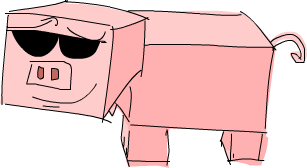

Bir Avuç Monad
==============

Functor'lardan ilk bahsettiğimizde, eşlenebilecek değerler için faydalı bir kavram olduklarını gördük. Ardından, belirli veri türlerinin değerlerini bağlamlara
sahip değerler olarak görmemize ve bu bağlamların anlamını korurken bu değerler üzerinde normal fonksiyonları kullanmamıza olanak tanıyan
applicative functor'ları tanıtarak bu kavramı bir adım öteye taşıdık.

Bu bölümde, applicative functor'ları güçlendiren monadlar hakkında bilgi edineceğiz, tıpkı applicative functor'ların yalnızca güçlendirilmiş functor'lar olduğu gibi.

`Functor`'larla başladığımızda, fonksiyonları çeşitli veri türleri üzerinden eşlemenin mümkün olduğunu gördük. Bu amaçla Functor tür sınıfının tanıtıldığını ve
bize şu soruyu sorduğunu gördük: `a -> b` türünde bir fonksiyonumuz ve `f a` veri türünde bir fonksiyonumuz olduğunda,
`f b` ile sonuçlanacak şekilde bu fonksiyonu veri türü üzerinde nasıl eşleştiririz? Bir şeyi bir `Maybe a`, bir list `[a]`, bir `IO a` vb. Üzerine nasıl eşleştireceğimizi gördük.
`r -> b` türü fonksiyonları elde etmek için `a -> b` fonksiyonunu `r -> a` türündeki diğer fonksiyonların üzerine nasıl eşleştireceğimizi bile gördük.
Bir fonksiyonu bazı veri türleri üzerinde nasıl eşleyeceğimiz sorusuna cevap vermek için tek yapmamız gereken `fmap` türüne bakmaktı:

~~~~ {.haskell: .ghci name="code"}
fmap :: (Functor f) => (a -> b) -> f a -> f b  
~~~~

Ve sonra uygun `Functor` instance'ını yazarak veri türümüz için çalışmasını sağlayın.

Sonra functor'larda olası bir iyileşme gördük ve dedik ki, ya bu `a -> b` fonksiyonu zaten bir functor değerinin içine sarılmışsa? Mesela, `Just (*3)` varsa,
bunu `Just 5`'e nasıl uygularız? Ya ona Just 5 yerine `Nothing` uygulamak istemiyorsak? Veya `[(*2), (+4)]`'e sahipsek, bunu `[1,2,3]`'e nasıl uygularız? Bu nasıl çalışır? Bunun için, aşağıdaki türe yanıt almak istediğimiz `Applicative` tür sınıfı tanıtıldı:

~~~~ {.haskell: .ghci name="code"}
(<*>) :: (Applicative f) => f (a -> b) -> f a -> f b  
~~~~

Ayrıca normal bir değer alabileceğimizi ve onu bir veri türünün içine yerleştirebileceğimizi gördük. Örneğin, `1`'i alıp `Just 1` olacak şekilde sarabiliriz.
Ya da `[1]` yapabiliriz. Veya hiçbir şey yapmayan ve sadece `1` veren bir I/O eylemi. Bunu yapan fonksiyona `pure` denir.

Söylediğimiz gibi, applicative bir değer, ek bir bağlama sahip bir değer olarak görülebilir. Teknik terimlerle ifade etmek gerekirse süslü(fancy) bir değer.
Örneğin, `'a'` karakteri sadece normal bir karakterdir, oysa `Just 'a'` bazı ek bağlamlara sahiptir. Bir `Char` yerine, bize değerinin bir karakter olabileceğini,
ancak aynı zamanda bir karakterin yokluğu da olabileceğini söyleyen bir `Maybe Char` var.

`Applicative` tür sınıfının, bu değerler üzerinde bağlamla birlikte normal fonksiyonları kullanmamıza nasıl izin verdiğini ve
bu bağlamın nasıl korunduğunu görmek güzeldi. Gözlemek:

~~~~ {.haskell: .ghci name="code"}
ghci> (*) <$> Just 2 <*> Just 8  
Just 16  
ghci> (++) <$> Just "klingon" <*> Nothing  
Nothing  
ghci> (-) <$> [3,4] <*> [1,2,3]  
[2,1,0,3,2,1]  
~~~~

Ah, harika, artık bunları applicative değerler olarak ele aldığımıza göre, `Maybe a` değerleri başarısız olabilecek hesaplamaları temsil eder,
`[a]` değerler birkaç sonucu olan hesaplamaları temsil eder (deterministik olmayan hesaplamalar), `IO a` değerleri, yan etkiler vb.

Monadlar, applicative functor'ların doğal bir uzantısıdır ve onlarla birlikte bununla ilgileniyoruz:
Bağlamlı bir değeriniz varsa, `m a`, ona normal bir `a` alan ve bağlamı olan bir değer döndüren bir fonksiyonu nasıl uygularsınız?
Yani, `a -> m b` türündeki bir fonksiyonu `m a` türündeki bir değere nasıl uygularsınız? Yani esasen şu fonksiyonu isteyeceğiz:

~~~~ {.haskell: .ghci name="code"}
(>>=) :: (Monad m) => m a -> (a -> m b) -> m b  
~~~~

**Süslü(fancy) bir değerimiz ve normal bir değer alan ancak süslü bir değer döndüren bir fonksiyona sahipsek, bu süslü değeri fonksiyona nasıl aktarabiliriz?**
Monadlarla uğraşırken kendimizle ilgileneceğimiz ana soru budur. `f a` yerine `m a` yazıyoruz çünkü `m` `Monad`'ı temsil ediyor,
ancak monadlar sadece `>>=`'yi destekleyen applicative functor'lardır. `>>=` fonksiyonu bind olarak telaffuz edilir.

Normal bir `a` değerine ve normal bir `a -> b` fonksiyonuna sahip olduğumuzda, fonksiyon değeri beslemek gerçekten kolaydır -
fonksiyonu normal olarak değere uygularsınız ve bu kadar. Ancak belirli bağlamlarla gelen değerlerle uğraşırken, bu süslü değerlerin fonksiyonları nasıl beslendiğini ve
davranışlarını nasıl hesaba katacağını görmek biraz düşünmeyi gerektirir, ama bir iki üç kadar kolay olduğunu göreceksiniz.

Maybe ile ayaklarımızı ıslatıyoruz
----------------------------------

Artık monadların ne hakkında olduğuna dair belirsiz bir fikrimiz olduğuna göre, bu fikri biraz daha az belirsiz hale getirip getiremeyeceğimize bakalım.

`Maybe` bir monad'dır, bu yüzden onu biraz daha inceleyelim ve monad'lar hakkında bildiklerimizle birleştirip birleştiremeyeceğimizi görelim.

Bu noktada [applicative'i](../tr/11-functors-applicative-functors-and-monoids.md#applicative-functorlar) anladığınızdan emin olun. Çeşitli `Applicative` instance'ların nasıl çalıştığını ve ne tür hesaplamaları temsil ettiğini anlıyorsanız iyidir, çünkü monadlar mevcut applicative bilgimizi alıp yükseltmekten başka bir şey değildir.

`Maybe a` türündeki bir değer, olası başarısızlık bağlamıyla birlikte `a` türünün bir değerini temsil eder. `Just "dharma"` değeri, `"dharma"` string'inin orada olduğu,
oysa `Nothing` değerinin onun yokluğunu temsil ettiği anlamına gelir veya string'e bir hesaplamanın sonucu olarak bakarsanız, bu, hesaplamanın başarısız olduğu anlamına gelir.

functor olarak `Maybe`'ye baktığımızda, bir fonksiyonu onun üzerinden `fmap` etmek istersek, `Just` değer ise iç kısımda eşleştirildiğini,
aksi takdirde `Nothing` tutulur çünkü üstüne eşlenecek hiçbir şey yoktur!

Bunun gibi:

~~~~ {.haskell: .ghci name="code"}
ghci> fmap (++"!") (Just "wisdom")  
Just "wisdom!"  
ghci> fmap (++"!") Nothing  
Nothing  
~~~~

Applicative functor olarak, benzer şekilde çalışır. Bununla birlikte, applicative'ler fonksiyon'u sarmamaya(wrapped) da sahiptir.
`Maybe`, `Maybe` içindeki bir fonksiyonu `Maybe` içindeki bir değere uygulamak için `<*>` kullandığımızda, applicative functor'dur,
sonucun `Just` değer olması için her ikisinin de `Just` değerleri olması gerekir, aksi takdirde sonuç `Nothing` olur.
Bu mantıklı çünkü ya fonksiyonu ya da onu uyguladığınız şeyi kaçırıyorsanız, havadan bir şey uyduramazsınız, bu yüzden hata üretmeniz gerekir:

~~~~ {.haskell: .ghci name="code"}
ghci> Just (+3) <*> Just 3  
Just 6  
ghci> Nothing <*> Just "greed"  
Nothing  
ghci> Just ord <*> Nothing  
Nothing  
~~~~

Normal fonksiyonların Maybe değerlerine göre hareket etmesini sağlamak için applicative stili kullandığımızda, benzerdir. 
Tüm değerler `Just` değerler olmalıdır, aksi takdirde hepsi `Nothing` içindir!

~~~~ {.haskell: .ghci name="code"}
ghci> max <$> Just 3 <*> Just 6  
Just 6  
ghci> max <$> Just 3 <*> Nothing  
Nothing 
~~~~

Şimdi de `Maybe` için `>>=`'ı nasıl yapacağımızı düşünelim. Söylediğimiz gibi, `>>=` monadikc bir değer alır ve normal bir değer alan ve
monadik bir değer döndüren ve bu fonksiyonu monadik değere uygulamayı başaran bir fonksiyon. Fonksiyon normal bir değer alırsa bunu nasıl yapar?
Bunu yapmak için, bu monadik değerin bağlamını hesaba katması gerekir.

Bu durumda, `>>=` bir `Maybe a` değerini ve `a -> Maybe b` türünde bir fonksiyonu alır ve bir şekilde fonksiyonu `Maybe a` öğesine uygular.
Bunu nasıl yaptığını anlamak için, `Maybe`'den gelen sezgimizi applicative functor olarak kullanabiliriz. Diyelim ki bir `\x -> Just (x+1)` fonksiyonumuz var.
Bir sayı alır, ona `1` ekler ve onu `Just` ile sarar:

~~~~ {.haskell: .ghci name="code"}
ghci> (\x -> Just (x+1)) 1  
Just 2  
ghci> (\x -> Just (x+1)) 100  
Just 101  
~~~~

`1`'le beslersek, `Just 2` olarak değerlendirilir. `100` sayısını verirsek, sonuç `Just 101` olur. Çok basit. İşte önemli nokta: Bu fonksiyona `Maybe` değerini nasıl besleriz?
`Maybe`'nin nasıl bir applicative functor gibi davrandığını düşünürsek, bunu yanıtlamak oldukça kolaydır. Onu bir `Just` değer ile beslersek,
`Just`'ın içindekini alın ve ona fonksiyonu uygulayın. Eğer ona bir `Nothing` verirseniz, hmm, o zaman bir fonksiyonla kalırız ama onu uygulamak için `Nothing` kalır.
O halde daha önce yaptığımız şeyi yapalım ve sonucun `Nothing` olduğunu söyleyelim.

Ona `>>=` demek yerine şimdilik `applyMaybe` diyelim. Bir `Maybe a` ve `Maybe b` döndüren bir fonksiyonu alır ve bu fonksiyonu `Maybe a` öğesine uygulamayı başarır. İşte kodda:

~~~~ {.haskell: .ghci name="code"}
applyMaybe :: Maybe a -> (a -> Maybe b) -> Maybe b  
applyMaybe Nothing f  = Nothing  
applyMaybe (Just x) f = f x  
~~~~

Tamam, şimdi biraz oynayalım. Bunu bir infix fonksiyonu olarak kullanacağız, böylece `Maybe` değeri sol tarafta ve fonksiyon sağ tarafta olacak:

~~~~ {.haskell: .ghci name="code"}
ghci> Just 3 `applyMaybe` \x -> Just (x+1)  
Just 4  
ghci> Just "smile" `applyMaybe` \x -> Just (x ++ " :)")  
Just "smile :)"  
ghci> Nothing `applyMaybe` \x -> Just (x+1)  
Nothing  
ghci> Nothing `applyMaybe` \x -> Just (x ++ " :)")  
Nothing 
~~~~

Yukarıdaki örnekte, `applyMaybe`'yi bir `Just` değeri ve bir fonksiyonla kullandığımızda, fonksiyonun `Just` içindeki değere basitçe uygulandığını görüyoruz.
Onu `Nothing` ile kullanmaya çalıştığımızda, tüm sonuç `Nothing` oldu. Fonksiyon bir `Nothing` döndürürse ne olur? Bakalım:

~~~~ {.haskell: .ghci name="code"}
ghci> Just 3 `applyMaybe` \x -> if x > 2 then Just x else Nothing  
Just 3  
ghci> Just 1 `applyMaybe` \x -> if x > 2 then Just x else Nothing  
Nothing  
~~~~

Tam da beklediğimiz gibi. Soldaki monadik değer bir `Nothing` ise, her şey `Nothing`'dir. Ve sağdaki fonksiyon bir `Nothing` döndürürse, sonuç yine `Nothing` olur.
Bu, applicative olarak `Maybe`'yi kullanmamıza ve içinde bir yerde `Nothing` varsa `Nothing` sonucunu almamıza çok benzer.

Öyle görünüyor ki `Maybe` için, süslü bir değeri nasıl alacağımızı ve onu normal bir değer alıp süslü bir değer döndüren bir fonksiyonu nasıl besleyeceğimizi bulduk.
Bunu, `Maybe` değerinin başarısız olmuş olabilecek bir hesaplamayı temsil ettiğini akılda tutarak yaptık.

Kendinize soruyor olabilirsiniz, bu nasıl yararlıdır? Applicative functor'lar, normal bir fonksiyonu almamıza ve bağlamlarla değerler üzerinde işlememize izin verdiğinden,
applicative functor'ları monad'lardan daha güçlü gibi görünebilir. Monad'ların da bunu yapabildiğini göreceğiz çünkü bunlar, applicative functor'ların bir yükseltmesidir ve
aynı zamanda, applicative functor'larının yapamayacağı bazı harika şeyleri de yapabilirler. 

Bir dakika sonra `Maybe` konusuna geri döneceğiz, ama önce monadlara ait tür sınıfına bakalım.

Monad tür sınıfı
----------------

Tıpkı functor'ların `Functor` tür sınıfına sahip olması ve applicative functor'ların `Applicative` tür sınıfına sahip olması gibi,
monad'lar da kendi tür sınıflarıyla gelir: `Monad`! Vay canına, kimin aklına gelirdi? tür sınıfı şuna benzer:

~~~~ {.haskell: .ghci name="code"}
class Monad m where  
    return :: a -> m a  
  
    (>>=) :: m a -> (a -> m b) -> m b  
  
    (>>) :: m a -> m b -> m b  
    x >> y = x >>= \_ -> y  
  
    fail :: String -> m a  
    fail msg = error msg  
~~~~

İlk satırdan başlayalım. `class Monad m where` yazıyor. Ama bekleyin, monad'ların sadece applicative functor'larını güçlendirdiğini söylememiş miydik?
Burada, bir türün monad yapılmadan önce applicative functor olması için `class (Applicative m) = > Monad m where` satırları boyunca bir sınıf kısıtlaması olması gerekmez mi?
Olmalıydı, ama Haskell yapıldığında, insanların aklına applicative functor'lar Haskell için uygun olduğu anlaşılmamıştı, bu yüzden orada değildiler.
Ancak `Monad` sınıf bildirimi öyle demese bile, her monad'ın applicative functor gördüğünden emin olabilirsiniz.

`Monad` tür sınıfının tanımladığı ilk fonksiyon `return`'dür. `pure` ile aynıdır, sadece farklı bir isimle. Türü `(Monad m) => a -> m a` şeklindedir.
Bir değeri alır ve onu hala bu değeri tutan minimum varsayılan bağlama yerleştirir. Başka bir deyişle, bir şeyi alır ve bir monad'la sarar.
Her zaman `Applicative` tür sınıfındaki `pure` fonksiyonla aynı şeyi yapar, bu da `return` ile zaten tanıştığımız anlamına gelir.
I/O yaparken zaten `return` kullandık. Bir değer almak ve bu değeri vermekten başka hiçbir şey yapmayan sahte bir I/O eylemi yapmak için kullandık.
`Maybe` için bir değer alır ve onu `Just` ile sarar.

Sadece bir hatırlatma: `return`, diğer dillerin çoğunda olan `return` gibi bir şey değildir. Fonksiyon yürütmeyi veya herhangi bir şeyi sona erdirmez,
sadece normal bir değer alır ve onu bir bağlama yerleştirir.

Bir sonraki fonksiyon `>>=` veya bağlanmadır. Fonksiyon uygulaması gibi, yalnızca normal bir değeri alıp normal bir fonksiyona beslemek yerine,
monadik bir değer (yani bağlam içeren bir değer) alır ve onu normal bir değer alan ancak monadik bir değer döndüren bir fonksiyona besler.

Sırada `>>` var. Şimdilik buna çok fazla dikkat etmeyeceğiz çünkü varsayılan bir uygulama ile geliyor ve
`Monad` instance'larını oluştururken hemen hemen hiçbir zaman uygulamıyoruz.

`Monad` tür sınıfının son fonksiyonu `fail`'dır. Bunu asla kodumuzda açıkça kullanmıyoruz. Bunun yerine, Haskell tarafından daha sonra tanışacağımız monadlar için
özel bir sözdizimsel yapıda başarısızlığı etkinleştirmek için kullanılır. Şimdilik kendimizi `fail` hakkında çok fazla endişelendirmemize gerek yok.

Artık `Monad` tür sınıfının neye benzediğini bildiğimize göre, `Maybe`'nin nasıl bir `Monad` instance'ı olduğuna bir bakalım!

~~~~ {.haskell: .ghci name="code"}
instance Monad Maybe where  
    return x = Just x  
    Nothing >>= f = Nothing  
    Just x >>= f  = f x  
    fail _ = Nothing  
~~~~

`return`, `pure` ile aynıdır, böylece kişi beyinsizdir. `Applicative` tür sınıfında yaptığımız şeyi yapıyoruz ve bunu bir `Just`'a sarıyoruz.

`>>=` fonksiyonu, `applyMaybe` ile aynıdır. Fonksiyonumuza `Maybe a`'yı beslerken, bağlamı aklımızda tutarız ve soldaki değer `Nothing` ise bir `Nothing` döndürürüz,
`>>` çünkü değer yoksa o zaman fonksiyonumuzu ona uygulamanın bir yolu yoktur. Eğer bir `Just` ise, içindekini alır ve ona `f` uygularız.

Bir monad olarak `Maybe` ile oynayabiliriz:

~~~~ {.haskell: .ghci name="code"}
ghci> return "WHAT" :: Maybe String  
Just "WHAT"  
ghci> Just 9 >>= \x -> return (x*10)  
Just 90  
ghci> Nothing >>= \x -> return (x*10)  
Nothing  
~~~~

`Maybe` ile `pure` kelimesini zaten kullandığımız ve `return`'ün farklı bir adla pure olduğunu bildiğimiz için ilk satırda yeni veya heyecan verici bir şey yok.
Sonraki iki satır `>>=` biraz daha fazlasını gösteriyor.

`\x -> return (x*10)` fonksiyonuna `Just 9` verdiğimizde, `x`'in fonksiyonun içindeki `9` değerini aldığına dikkat edin. 
Öyle görünüyor ki, pattern matching olmadan `Maybe`'den değeri çıkarabildik. Ve yine de `Maybe` değerimizin bağlamını kaybetmedik, çünkü `Nothing` olduğunda,
`>>=` kullanmanın sonucu da `Nothing` olacaktır.

Çizgide yürümek
---------------

Artık olası başarısızlık bağlamını hesaba katarken, `a -> Maybe b` türündeki bir fonksiyona bir `Maybe a` değerini nasıl besleyeceğimizi bildiğimize göre,
birkaç `Maybe a` değerinin hesaplamalarını işlemek için `>>=`'ı tekrar tekrar nasıl kullanabileceğimize bakalım.

Pierre, balık çiftliğindeki işine ara vermeye ve ip yürüyüşünü denemeye karar verdi. O kadar da kötü değil ama bir sorunu var: kuşlar dengeleme direğine inmeye devam ediyor!
Gelirler ve kısa bir süre dinlenirler, kuş arkadaşlarıyla sohbet ederler ve ardından ekmek kırıntıları aramak için yola çıkarlar.
Direğin sol tarafındaki kuşların sayısı her zaman sağ taraftaki kuşların sayısına eşit olsaydı bu onu çok rahatsız etmezdi.
Ancak bazen, tüm kuşlar bir tarafı daha çok sevdiklerine karar verir ve bu yüzden onu dengeden çıkarırlar, bu da Pierre için utanç verici bir takla atmasına neden olur
(bir güvenlik ağı kullanıyor).

Direğin sol tarafında ve direğin sağ tarafında bulunan kuş sayısı üçe kadar çıkarsa dengesini koruduğunu varsayalım. Yani sağ tarafta bir kuş ve sol tarafta dört kuş varsa,
sorun değil. Ancak sol tarafa beşinci bir kuş düşerse dengesini kaybeder ve dalış yapar. 

Direğe inen ve uzaklaşan kuşları simüle edeceğiz ve belirli sayıda kuş uçuşu ve gelişinden sonra Pierre'in hala orada olup olmadığını göreceğiz.
Örneğin, önce sol tarafa bir kuş gelirse, ardından dört kuş sağ tarafa gelirse ve ardından sol taraftaki kuş uçup gitmeye karar verirse Pierre'e ne olacağını görmek istiyoruz.

Direği basit bir tamsayı ile temsil edebiliriz. İlk bileşen sol taraftaki kuşların sayısını, ikinci bileşen ise sağ taraftaki kuşların sayısını gösterecektir:

~~~~ {.haskell: .ghci name="code"}
type Birds = Int  
type Pole = (Birds,Birds)  
~~~~

İlk önce `Int` ile Birds adında bir tür eşanlamlısı yaptık, çünkü kaç tane kuş olduğunu göstermek için tamsayılar kullanıyoruz.
Ve sonra bir tür eşanlamlısı yaptık `(Birds, Birds)` ve ona `Pole` adını verdik (Polonya kökenli bir kişiyle karıştırılmamalıdır).

Sırada, birkaç kuşu alan ve onları direğin bir tarafına indiren bir fonksiyona ne dersiniz? İşte fonksiyonlar:

~~~~ {.haskell: .ghci name="code"}
landLeft :: Birds -> Pole -> Pole  
landLeft n (left,right) = (left + n,right)  
  
landRight :: Birds -> Pole -> Pole  
landRight n (left,right) = (left,right + n)  
~~~~

Oldukça basit şeyler. Onları deneyelim:

~~~~ {.haskell: .ghci name="code"}
ghci> landLeft 2 (0,0)  
(2,0)  
ghci> landRight 1 (1,2)  
(1,3)  
ghci> landRight (-1) (1,2)  
(1,1)  
~~~~

Kuşların uçup gitmesini sağlamak için bir tarafa negatif sayıda kuş kondu. `Pole` üzerine bir kuş indirmek bir `Pole` döndürdüğünden,
`landLeft` ve `landRight` uygulamalarını zincirleyebiliriz:

~~~~ {.haskell: .ghci name="code"}
ghci> landLeft 2 (landRight 1 (landLeft 1 (0,0)))  
(3,1)  
~~~~

`landLeft 1` fonksiyonunu `(0,0)`'a uyguladığımızda `(1,0)` elde ederiz. Sonra, sağ tarafa bir kuş indiririz ve `(1,1)` ile sonuçlanır.
Sonunda sol tarafa iki kuş konarak `(3,1)` sonucunu verir. Bir şeye önce fonksiyonu yazıp sonra parametresini yazarak bir fonksiyon uygularız,
ancak burada önce direk sonra da iniş fonksiyonu gitse daha iyi olur. Bunun gibi bir fonksiyon yaparsak:

~~~~ {.haskell: .ghci name="code"}
x -: f = f x  
~~~~

Fonksiyonları önce parametreyi ve sonra fonksiyonu yazarak uygulayabiliriz:

~~~~ {.haskell: .ghci name="code"}
ghci> 100 -: (*3)  
300  
ghci> True -: not  
False  
ghci> (0,0) -: landLeft 2  
(2,0)  
~~~~

Bunu kullanarak, kuşları tekrar tekrar direğe daha okunaklı bir şekilde indirebiliriz:

~~~~ {.haskell: .ghci name="code"}
ghci> (0,0) -: landLeft 1 -: landRight 1 -: landLeft 2  
(3,1)  
~~~~

Oldukça havalı! Bu örnek, kuşları defalarca direğe indirdiğimiz bir öncekine denk, sadece daha düzgün görünüyor. Burada, `(0,0)` ile başlayıp sonra bir kuşu sola, 
sonra sağa ve son olarak da sola iki kuş indirdiğimiz daha açık.

Şimdiye kadar her şey yolunda, ama bir tarafa 10 kuş konarsa ne olur?

~~~~ {.haskell: .ghci name="code"}
ghci> landLeft 10 (0,3)  
(10,3)  
~~~~

Sol tarafta 10, sağda sadece 3 kuş mu? Zavallı Pierre'yi havaya fırlatacağına eminim! Bu burada oldukça açık ama ya şu şekilde bir dizi inişimiz olsaydı:

~~~~ {.haskell: .ghci name="code"}
ghci> (0,0) -: landLeft 1 -: landRight 4 -: landLeft (-1) -: landRight (-2)  
(0,2)  
~~~~

Her şey yolunda gibi görünebilir, ancak buradaki adımları takip ederseniz, bir seferde sağ tarafta 4 kuş olduğunu ve solda hiç kuş olmadığını göreceksiniz!
Bunu düzeltmek için `landLeft` ve `landRight` fonksiyonlarımıza bir kez daha bakmalıyız. Gördüğümüze göre, bu fonksiyonlarımızın başarısız olmasını istiyoruz.
Yani, denge uygunsa yeni bir direğe geri dönmelerini, ancak kuşlar orantısız bir şekilde inerse başarısız olmalarını istiyoruz.
Ve değere bir başarısızlık bağlamı eklemenin `Maybe`'yi kullanmaktan daha iyi bir yolu! Bu fonksiyonları yeniden çalışalım:

~~~~ {.haskell: .ghci name="code"}
landLeft :: Birds -> Pole -> Maybe Pole  
landLeft n (left,right)  
    | abs ((left + n) - right) < 4 = Just (left + n, right)  
    | otherwise                    = Nothing  
  
landRight :: Birds -> Pole -> Maybe Pole  
landRight n (left,right)  
    | abs (left - (right + n)) < 4 = Just (left, right + n)  
    | otherwise                    = Nothing  
~~~~

Bir `Pole` döndürmek yerine, bu fonksiyonlar artık `Maybe Pole` döndürür. Daha önce olduğu gibi yine de kuş sayısını ve eski direği alıyorlar,
ancak daha sonra direğe çok sayıda kuşun düşmesinin Pierre'nin dengesini bozup bozmayacağını kontrol ediyorlar. 
Yeni direkteki kuş sayısı arasındaki farkın 4'ten az olup olmadığını kontrol etmek için guard'ları kullanıyoruz. 
Eğer öyleyse, yeni direği bir `Just`'a sararız ve onu geri veririz. Değilse, başarısızlığı belirten bir `Nothing` döndürürüz.

Hadi şu bebeklere bir bakalım:

~~~~ {.haskell: .ghci name="code"}
ghci> landLeft 2 (0,0)  
Just (2,0)  
ghci> landLeft 10 (0,3)  
Nothing  
~~~~

Güzel! Pierre'nin dengesini bozmadan kuşları yere indirdiğimizde, `Just`'a sarılmış yeni bir direği elde ederiz. Ancak, direğin bir tarafına daha çok sayıda kuş geldiğinde,
`Nothing` elde ederiz. Bu harika, ama kuşları defalarca direğe indirme yeteneğimizi kaybettik. Artık `landLeft 1 (landRight 1 (0,0))` yapamayız,
çünkü `landRight 1`'den `(0,0)`'a uyguladığımızda, `Pole` değil, `Maybe Pole` elde ederiz. `landLeft 1`, `Maybe Pole` yerine `Pole` alır.

Bir `Maybe Pole` alıp onu `Pole` alan ve `Maybe Pole` döndüren bir fonksiyona beslemenin bir yolunu bulmalıyız.
Neyse ki, `>>=` var, ki bunu `Maybe` için yapar. Hadi bir deneyelim:

~~~~ {.haskell: .ghci name="code"}
ghci> landRight 1 (0,0) >>= landLeft 2  
Just (2,1)  
~~~~

Unutmayın, `landLeft 2` bir tür `Pole -> Maybe Pole`'a sahiptir. Onu sadece `landRight 1 (0,0)` sonucu olan `Maybe Pole` ile besleyemedik,
bu yüzden bu değeri bir bağlamla alıp `landLeft 2`'ye vermek için `>>=` kullanırız. `>>=` gerçekten de `Maybe` değerini bağlamla birlikte bir değer olarak ele almamıza izin veriyor çünkü `landLeft 2`'ye bir `Nothing`'le beslersek, sonuç `Nothing` olur ve başarısızlık yayılır:

~~~~ {.haskell: .ghci name="code"}
ghci> Nothing >>= landLeft 2  
Nothing  
~~~~

Bununla, artık başarısız olabilecek inişleri zincirleyebiliyoruz çünkü `>>=`, monadik bir değeri normal olanı alan bir fonksiyona beslememize izin veriyor.

İşte kuş inişleri dizisi:

~~~~ {.haskell: .ghci name="code"}
ghci> return (0,0) >>= landRight 2 >>= landLeft 2 >>= landRight 2  
Just (2,4)  
~~~~

Başlangıçta, bir direk almak ve onu bir `Just`'a sarmak için `return`'ü kullandık. Sadece `landRight 2`'yi `(0,0)`'a uygulayabilirdik, aynı olurdu,
ancak bu şekilde her fonksiyon için `>>=` kullanarak daha tutarlı olabiliriz. `Just (0,0)`, `landRight 2`'yle beslenir ve `Just (0,2)` ile sonuçlanır.
Bu da `landLeft 2`'yle beslenerek `Just (2,2)` ile sonuçlanır ve bu böyle devam eder.

Pierre'nin rutinine başarısızlığa girmeden önceki bu örneği hatırlayın:

~~~~ {.haskell: .ghci name="code"}
ghci> (0,0) -: landLeft 1 -: landRight 4 -: landLeft (-1) -: landRight (-2)  
(0,2)  
~~~~

Kuşlarla etkileşimini çok iyi simüle etmedi çünkü ortada dengesi bozuktu ama sonuç bunu yansıtmıyordu.
Ama şimdi normal uygulama yerine monadic uygulamayı (`>>=`) kullanarak bunu deneyelim:

~~~~ {.haskell: .ghci name="code"}
ghci> return (0,0) >>= landLeft 1 >>= landRight 4 >>= landLeft (-1) >>= landRight (-2)  
Nothing  
~~~~

Harika. Nihai sonuç, beklediğimiz gibi başarısızlığı temsil eder. Bakalım bu sonuç nasıl elde edildi. İlk olarak, `return (0,0)`'ı varsayılan bir bağlama koyar ve
onu `Just (0,0)` yapar. Ardından `Just (0,0) >>= landLeft 1` olur. `Just (0,0)`, `Just` bir değer olduğundan, `landLeft 1 (0,0)`'a uygulanır ve
`Just (1,0)` ile sonuçlanır, çünkü kuşlar hala nispeten dengelidir. Ardından, `Just (1,0) >>= landRight 4`'te yer alır ve
sonuç `Just (1,4)` olur çünkü kuşların dengesi zar zor da olsa hala sağlamdır. `Just (1,4)`, `landLeft (-1)`'le beslenir. Bu, `landLeft (-1) (1,4)`'ün yer aldığı anlamına gelir.
Şimdi `landLeft`'in nasıl çalıştığından dolayı, bu bir Nothing ile sonuçlanır, çünkü ortaya çıkan direk dengesizdir. Artık bir Nothing olduğuna göre,
`landRight (-2)` olarak besleniyor, ancak `Nothing` olduğu için sonuç otomatik olarak Nothing oluyor, çünkü `landRight (-2)` uygulayacak hiçbir şeyimiz yoktur.

Bunu sadece `Maybe`'yi applicative olarak kullanarak başaramazdık. Bunu denerseniz, takılıp kalırsınız çünkü applicative functor'lar,
applicative değerlerin birbirleriyle çok fazla etkileşime girmesine izin vermez. En iyi ihtimalle, applicative stili kullanılarak bir fonksiyonun parametreleri
olarak kullanılabilirler. Applicative operatörler sonuçlarını alacaklar ve bunları her applicative için uygun bir şekilde fonksiyonu besleyecekler ve
ardından nihai applicative değerini bir araya getirecekler, ancak aralarında çok fazla etkileşim yok. Ancak burada, her adım bir öncekinin sonucuna dayanır.
Her inişte bir öncekinden olası sonuç incelenir ve direk denge açısından kontrol edilir. Bu, inişin başarılı olup olmayacağını belirler.

Dengeleme çubuğundaki mevcut kuş sayısını göz ardı eden ve Pierre'nin kaymasını ve düşmesini sağlayan bir fonksiyon da geliştirebiliriz. Buna `banana` diyebiliriz:

~~~~ {.haskell: .ghci name="code"}
banana :: Pole -> Maybe Pole  
banana _ = Nothing  
~~~~

Şimdi onu kuş inişlerimizle birlikte zincirleyebiliriz. Her zaman yürüyüşçümüzün düşmesine neden olur, çünkü ona geçen her şeyi görmezden gelir ve
her zaman bir başarısızlık döndürür. Kontrol et:

~~~~ {.haskell: .ghci name="code"}
ghci> return (0,0) >>= landLeft 1 >>= banana >>= landRight 1  
Nothing  
~~~~

`Just (1,0)` değeri banana olarak beslenir, ancak bir `Nothing` üretir ve her şeyin bir `Nothing` ile sonuçlanmasına neden olur. Ne şanssızlık!

Girdilerini yok sayan ve önceden belirlenmiş bir monadik değer döndüren fonksiyonlar yapmak yerine, varsayılan uygulaması şu olan `>>` fonksiyonunu kullanabiliriz:

~~~~ {.haskell: .ghci name="code"}
(>>) :: (Monad m) => m a -> m b -> m b  
m >> n = m >>= \_ -> n  
~~~~

Normalde, parametresini yok sayan ve her zaman sadece önceden belirlenmiş bir değer döndüren bir fonksiyona bir değer iletmek, 
her zaman bu önceden belirlenmiş değerle sonuçlanır. Ancak monadlarda, bağlamları ve anlamları da dikkate alınmalıdır. `>>`, `Maybe` ile şu şekilde hareket eder:

~~~~ {.haskell: .ghci name="code"}
ghci> Nothing >> Just 3  
Nothing  
ghci> Just 3 >> Just 4  
Just 4  
ghci> Just 3 >> Nothing  
Nothing  
~~~~

`>>`'yi `>>= \_ ->` ile değiştirirseniz, neden böyle davrandığını anlamak kolaydır.

Zincirdeki `banana` fonksiyonumuzu `>>` ve ardından `Nothing` ile değiştirebiliriz:

~~~~ {.haskell: .ghci name="code"}
ghci> return (0,0) >>= landLeft 1 >> Nothing >>= landRight 1  
Nothing  
~~~~

İşte başlıyoruz, garantili ve bariz başarısızlık!

Ayrıca, `Maybe` değerlerine başarısızlık bağlamına sahip değerler olarak davranma ve onları bizim yaptığımız gibi fonksiyonları besleme konusunda
akıllıca bir seçim yapmasaydık, bunun nasıl görüneceğine de bir göz atmaya değer. İşte bir dizi kuş inişinin nasıl görüneceği:

~~~~ {.haskell: .ghci name="code"}
routine :: Maybe Pole  
routine = case landLeft 1 (0,0) of  
    Nothing -> Nothing  
    Just pole1 -> case landRight 4 pole1 of   
        Nothing -> Nothing  
        Just pole2 -> case landLeft 2 pole2 of  
            Nothing -> Nothing  
            Just pole3 -> landLeft 1 pole3  
~~~~

Sola bir kuş indiririz ve ardından başarısızlık olasılığını ve başarı olasılığını inceleriz. Başarısızlık durumunda `Nothing` döndürürüz.
Başarı durumunda, kuşları sağa indiririz ve sonra aynı şeyi baştan yaparız. Bu canavarlığı `>>=` ile düzgün bir monadik uygulamalar zincirine dönüştürmek,
`Maybe` monadının, başarısız olmuş olabilecek hesaplamalara dayanan hesaplamaları arka arkaya yapmak zorunda olduğumuzda bize nasıl çok fazla zaman kazandırdığının
klasik bir örneğidir.

`>>=` seçeneğinin `Maybe` uygulamasının, bir değerin `Nothing` olup olmadığını ve eğer öyleyse, hemen bir `Nothing` döndürüp dönmüyorsa,
`Just`'ın içindekiyle ilerlemenin tam olarak bu mantığını nasıl göründüğüne dikkat edin.

Bu bölümde sahip olduğumuz bazı fonksiyonları aldık ve döndürdükleri değerler başarısızlığı destekliyorsa daha iyi çalışacaklarını gördük.
Bu değerleri `Maybe` değerlerine dönüştürerek ve normal fonksiyon uygulamasını `>>=` ile değiştirerek, hatayı hemen hemen ücretsiz olarak ele almak için bir mekanizma elde ettik,
çünkü `>>=` fonksiyonunun uygulandığı değerin bağlamını koruması gerekir. Bu durumda bağlam, değerlerimizin başarısız değerler olmasıydı ve
bu nedenle bu değerlere fonksiyonlar uyguladığımızda, başarısızlık olasılığı her zaman hesaba katılıyordu.

do notasyonu
------------

Haskell'deki monad'lar o kadar kullanışlıdır ki, kendi özel sözdizimlerine `do` notasyonu adı verilir. I/O eylemiyle uğraşırken zaten `do` gösterimi ile karşılaşmıştık ve
orada birkaç I/O eylemini tek bir işlemde birleştirmek için olduğunu söyledik. Görünüşe göre, `do` gösterimi sadece `IO` için değil, herhangi bir monad için de kullanılabilir.
Prensibi hala aynıdır: Monadik değerleri sırayla birbirine yapıştırmak. `do` notasyonunun nasıl çalıştığına ve neden yararlı olduğuna bir göz atacağız.

Bu tanıdık monadik uygulama örneğini düşünün:

~~~~ {.haskell: .ghci name="code"}
ghci> Just 3 >>= (\x -> Just (show x ++ "!"))  
Just "3!"  
~~~~

Orada bulundum, bunu yaptım. Tekli bir değeri döndüren bir fonksiyonu monadik bir değerle beslemek, önemli değil. 
Bunu yaptığımızda `x`'in lambda içinde nasıl `3` olduğuna dikkat edin. Lambda'nın içine girdiğimizde, bu monadik bir değerden ziyade normal bir değerdir.
Şimdi, bu fonksiyonun içinde başka bir `>>=` olsaydı ne olurdu? Şuna bir bak:

~~~~ {.haskell: .ghci name="code"}
ghci> Just 3 >>= (\x -> Just "!" >>= (\y -> Just (show x ++ y)))  
Just "3!"
~~~~

Ah, iç içe geçmiş bir `>>=`! En dıştaki lambdada, `Just "!"` lambda için `\y -> Just (show x ++ y)`. Bu lambda içinde `y` `"!"` olur. `x` hala `3`'tür çünkü onu dış lambdadan aldık. Bütün bunlar bana şu ifadeyi hatırlatıyor:

~~~~ {.haskell: .ghci name="code"}
ghci> let x = 3; y = "!" in show x ++ y  
"3!"  
~~~~

Bu ikisi arasındaki temel fark, önceki örnekteki değerlerin monadik olmasıdır. Başarısızlık bağlamına sahip değerlerdir.
Bunlardan herhangi birini bir başarısızlıkla değiştirebiliriz:

~~~~ {.haskell: .ghci name="code"}
ghci> Nothing >>= (\x -> Just "!" >>= (\y -> Just (show x ++ y)))  
Nothing  
ghci> Just 3 >>= (\x -> Nothing >>= (\y -> Just (show x ++ y)))  
Nothing  
ghci> Just 3 >>= (\x -> Just "!" >>= (\y -> Nothing))  
Nothing  
~~~~

İlk satırda, bir fonksiyona `Nothing` eklemek doğal olarak `Nothing` ile sonuçlanır. İkinci satırda, bir fonksiyona `Just 3` besliyoruz ve `x` `3` oluyor,
ama sonra iç lambdaya bir `Nothing` besliyoruz ve bunun sonucu `Nothing` oluyor, bu da dış lambda'nın `Nothing` üretmesine neden olur.
Yani bu, `let` ifadelerindeki değişkenlere değer atamak gibidir, yalnızca söz konusu değerler monadik değerlerdir.

Bu noktayı daha fazla açıklamak için, bunu bir senaryoda yazalım ve her `Maybe` değerinin kendi satırını almasını sağlayalım:

~~~~ {.haskell: .ghci name="code"}
foo :: Maybe String  
foo = Just 3   >>= (\x -> 
      Just "!" >>= (\y -> 
      Just (show x ++ y)))  
~~~~

Bizi tüm bu can sıkıcı lambdaları yazmaktan kurtarmak için Haskell bize `do` notasyonu veriyor. Önceki kod parçasını şu şekilde yazmamızı sağlar:

~~~~ {.haskell: .ghci name="code"}
foo :: Maybe String  
foo = do  
    x <- Just 3  
    y <- Just "!"  
    Just (show x ++ y)  
~~~~

Her adımda `Maybe` değerlerinin `Just` değerler mi yoksa `Nothing` mi olduğunu kontrol etmek zorunda kalmadan `Maybe` değerlerinden bir şeyleri geçici olarak çıkarma yeteneğini
kazanmışız gibi görünüyor. Ne kadar havalı! Çıkarmaya çalıştığımız değerlerden herhangi biri `Nothing` ise, tüm `do` ifadesi `Nothing` ile sonuçlanacaktır.
Onların (muhtemelen mevcut) değerlerini çekip çıkarıyoruz ve >>= bu değerlerle gelen bağlam hakkında endişelenmenize izin veriyoruz.
`do` ifadelerinin, monadik değerleri zincirlemek için yalnızca farklı sözdizimi olduğunu hatırlamak önemlidir.

Bir `do` ifadesinde, her satır tek bir değerdir. Sonucunu incelemek için `<-` kullanıyoruz. Bir `Maybe String` varsa ve onu bir değişkene `<-` ile bağlarsak,
bu değişken, tıpkı lambdalara monadik değerleri beslemek için `>>=` kullandığımız zamanki gibi bir `String` olacaktır.
Buradaki `Just (show x ++ y)` gibi bir `do` ifadesindeki son monadik değer, sonucunu bağlamak için `<-` ile kullanılamaz, 
çünkü `do` ifadesini `>>=` uygulamalar zincirine geri çevirirsek bu mantıklı olmaz. Daha ziyade, sonucu, öncekilerden herhangi birinin olası başarısızlığını hesaba katarak,
tüm yapıştırılmış monadik değerin sonucudur.

Örneğin, aşağıdaki satırı inceleyin:

~~~~ {.haskell: .ghci name="code"}
ghci> Just 9 >>= (\x -> Just (x > 8))  
Just True  
~~~~

`>>=`'nin sol parametresi bir `Just` değer olduğundan, lambda `9`'a uygulanır ve sonuç `Just True` olur. Bunu `do` notasyonunda yeniden yazarsak, şunu elde ederiz:

~~~~ {.haskell: .ghci name="code"}
marySue :: Maybe Bool  
marySue = do   
    x <- Just 9  
    Just (x > 8)  
~~~~

Bu ikisini karşılaştırırsak, Tüm monadik değerin sonucunun, `do` ifadesindeki son monadik değerin sonucu olduğunu ve
tüm öncekilerin ona zincirlenmiş olduğunu anlamak kolaydır.

Cambazımızın rutini `do` notasyonu ile de ifade edilebilir. `landLeft` ve `landRight`, birkaç kuş ve bir direk alır ve bir `Just`'a sarılmış bir direk üretir,
ancak cambaz kaymaz, bu durumda bir `Nothing` üretilir. Ardışık adımları zincirlemek için `>>=` kullandık çünkü her biri bir öncekine dayanıyordu ve
her biri olası bir başarısızlık bağlamına sahipti. Sol tarafa inen iki kuş, sonra sağa inen iki kuş ve sol tarafa bir kuş iniyor:

~~~~ {.haskell: .ghci name="code"}
routine :: Maybe Pole  
routine = do  
    start <- return (0,0)  
    first <- landLeft 2 start  
    second <- landRight 2 first  
    landLeft 1 second  
~~~~

Bakalım başarılı mı olacak:

~~~~ {.haskell: .ghci name="code"}
ghci> routine  
Just (3,2)  
~~~~

O yapıyor! Harika. Bu rutinleri açıkça `>>=` yazarak yaptığımızda, genellikle `return (0,0) >>= landLeft 2` gibi bir şey söylemiştik,
çünkü `landLeft 2` `Maybe` değerini döndüren bir fonksiyondur. Ancak `do` ifadelerinde, her satırın tek bir değer içermesi gerekir.
Bu nedenle, önceki `Pole`'u açıkça `landLeft` `landRight` fonksiyonlarına geçiririz. Maybe değerlerimizi bağladığımız değişkenleri incelersek, `start` `(0,0)`,
`first` `(2,0)` olur vb.

Yine, `Maybe`'nin monadik yönlerini kullanmasaydık, bu kod parçasının nasıl görüneceğine bir bakalım:

~~~~ {.haskell: .ghci name="code"}
routine :: Maybe Pole  
routine =   
    case Just (0,0) of   
        Nothing -> Nothing  
        Just start -> case landLeft 2 start of  
            Nothing -> Nothing  
            Just first -> case landRight 2 first of  
                Nothing -> Nothing  
                Just second -> landLeft 1 second  
~~~~

Başarı durumunda nasıl olduğunu görelim, `Just (0,0)` içindeki demet `start` olur, `landLeft 2 start`'ın sonucu `first` olur, vb.

Pierre'nin `do` notasyonu için bir muz kabuğu atmak istiyorsak, aşağıdakileri yapabiliriz:

~~~~ {.haskell: .ghci name="code"}
routine :: Maybe Pole  
routine = do  
    start <- return (0,0)  
    first <- landLeft 2 start  
    Nothing  
    second <- landRight 2 first  
    landLeft 1 second 
~~~~

Monadik değeri `<-` ile bağlamadan `do` notasyonunda bir satır yazdığımızda, bu aynı sonucu görmezden gelmek istediğimiz monadik değerin arkasına `>>` koymak gibidir.
Monadik değeri sıralıyoruz ama sonucunu görmezden geliyoruz çünkü ne olduğu umurumuzda değil ve yukarıdakine eşdeğer olan `_ <- Nothing` yazmaktan daha güzel.

Ne zaman `do` notasyonu ve ne zaman açıkça `>>=` kullanılacağı size bağlıdır. Sanırım bu örnek açıkça `>>=` yazmak için uygun çünkü her adım özellikle
bir öncekinin sonucuna dayanıyor. `do` notasyonu ile, kuşların hangi direğe indiğini özellikle yazmamız gerekiyordu, ancak bunu her kullandığımızda doğrudan daha önce geldi.
Ama yine de, bize `do` notasyonu hakkında biraz fikir verdi.

`do` notasyonunda, monadik değerleri adlara bağladığımızda, let ifadeleri ve fonksiyon parametrelerinde olduğu gibi, pattern matching'i kullanabiliriz.
`do` ifadesindeki desen eşleştirmesinin bir instance'ını burada bulabilirsiniz:

~~~~ {.haskell: .ghci name="code"}
justH :: Maybe Char  
justH = do  
    (x:xs) <- Just "hello"  
    return x  
~~~~

`"hello"` string'inin ilk karakterini elde etmek için desen eşleştirmeyi kullanırız ve ardından bunu sonuç olarak sunarız. Yani `justH`, `Just 'h'` olarak değerlendirilir.

Ya bu desen eşleştime başarısız olursa? Bir fonksiyondaki bir desen üzerinde eşleştirme başarısız olduğunda, sonraki desen eşleştirilir.
Eşleştirme, belirli bir fonksiyon için tüm desenlere denk gelirse, bir hata atılır ve programımız çöker. Öte yandan, `let` ifadelerindeki başarısız desen eşleştime,
hemen üretilen bir hatayla sonuçlanır, çünkü desenlerden düşme mekanizması `let` ifadelerinde mevcut değildir. Bir `do` ifadesinde desen eşleştirme başarısız olduğunda,
`fail` fonksiyonu çağrılır. Bu, `Monad` tür sınıfının bir parçasıdır ve programımızı çökertmek yerine mevcut monad bağlamında başarısızlıkla sonuçlanan
başarısız desen eşleştimeyi sağlar. Varsayılan uygulaması şudur:

~~~~ {.haskell: .ghci name="code"}
fail :: (Monad m) => String -> m a  
fail msg = error msg  
~~~~

Öyleyse, varsayılan olarak programımızın çökmesine neden olur, ancak olası bir hata bağlamını (`Maybe` gibi) içeren monadlar genellikle kendi başlarına uygular.
`Maybe` için şu şekilde uygulanır:

~~~~ {.haskell: .ghci name="code"}
fail _ = Nothing  
~~~~

Hata mesajını yok sayar ve `Nothing` yapar. Dolayısıyla, desen eşleştirme `do` gösteriminde yazılmış Maybe değerinde başarısız olduğunda, tüm değer `Nothing` ile sonuçlanır.
Bu, programımızın çökmesine tercih edilir. İşte başarısız olması muhtemel bir desene sahip bir `do` ifadesi:

~~~~ {.haskell: .ghci name="code"}
wopwop :: Maybe Char  
wopwop = do  
    (x:xs) <- Just ""  
    return x  
~~~~

Desen eşleştirme başarısız olur, bu nedenle desenle birlikte tüm satırın bir `Nothing` ile değiştirilmesiyle aynı etki olur. Şunu deneyelim:

~~~~ {.haskell: .ghci name="code"}
ghci> wopwop  
Nothing  
~~~~

Başarısız olan desen eşleştirme, program genelinde bir hataya neden olmak yerine monad'ımız bağlamında bir başarısızlığa neden oldu, bu oldukça düzgün.

Liste monad
-----------

Şimdiye kadar, `Maybe` değerlerinin nasıl başarısızlık bağlamına sahip değerler olarak görülebileceğini ve bunları fonksiyonlara beslemek için `>>=` kullanarak
hata işlemeyi kodumuza nasıl dahil edebileceğimizi gördük. Bu bölümde, Belirsizliği(non-determinism) kodumuza açık ve okunabilir bir şekilde kazandırmak için
listelerin monadik yönlerini nasıl kullanacağımıza bir göz atacağız.

Listelerin, applicative olarak kullanıldıklarında kararsız(non-deterministic) değerleri nasıl temsil ettiğinden daha önce bahsetmiştik.
`5` gibi bir değer belirleyicidir(deterministic). Tek bir sonucu var ve tam olarak ne olduğunu biliyoruz. Öte yandan, `[3,8,9]` gibi bir değer birkaç sonuç içerir, 
böylece onu aynı anda birçok değer olan tek bir değer olarak görebiliriz. Listeleri applicative functor'lar olarak kullanmak,
bu belirlenimsizliği güzel bir şekilde sergiliyor:

~~~~ {.haskell: .ghci name="code"}
ghci> (*) <$> [1,2,3] <*> [10,100,1000]  
[10,100,1000,20,200,2000,30,300,3000]  
~~~~

Soldaki listedeki çarpan öğelerin tüm olası kombinasyonları, sağdaki listedeki öğelerle birlikte ortaya çıkan listeye dahil edilir.
Belirsizlikle uğraşırken, yapabileceğimiz pek çok seçim vardır, bu yüzden hepsini deneriz ve böylece sonuç da kararsız bir değerdir,
ancak çok daha fazla sonucu vardır.

Belirsizliğin bu bağlamı, monad'lara çok güzel bir şekilde tercüme edilir. Devam edelim ve listeler için `Monad` instance'ının neye benzediğini görelim:

~~~~ {.haskell: .ghci name="code"}
instance Monad [] where  
    return x = [x]  
    xs >>= f = concat (map f xs)  
    fail _ = []  
~~~~

`return`, `pure` ile aynı şeyi yapar, bu nedenle listeler için `return` konusuna zaten aşina olmalıyız. Bir değeri alır ve onu yine de bu değeri veren
minimum varsayılan bağlama yerleştirir. Diğer bir deyişle, sonucu olarak sadece o tek değeri olan bir liste yapar.
Bu, kararsız değerlerle etkileşebilmesi için normal bir değeri bir listeye sarmak istediğimizde kullanışlıdır.

`>>=`'ın listeler için nasıl çalıştığını anlamak için, önce biraz sezgi elde etmek için ona eylemde bir göz atmamız en iyisidir.
`>>=`, bir bağlam (monadik değer) içeren bir değeri alıp onu normal bir değer alan ve bağlamı olan bir fonksiyonu döndüren bir fonksiyonu beslemekle ilgilidir.
Eğer bu fonksiyon bağlamlı bir fonksiyon yerine normal bir değer ürettiyse, `>>=` o kadar kullanışlı olmaz çünkü bir kullanımdan sonra bağlam kaybolur.
Her neyse, bir fonksiyonu kararsız bir değer beslemeyi deneyelim:

~~~~ {.haskell: .ghci name="code"}
ghci> [3,4,5] >>= \x -> [x,-x]  
[3,-3,4,-4,5,-5]  
~~~~

`Maybe` ile `>>=` kullandığımızda, olası arızalarla ilgilenirken monadik değerle fonksiyonu besledi. Burada bizim için belirsizlik(non-determinism) halleder.
`[3,4,5]` kararsız bir değerdir ve biz de onu kararsız bir değer döndüren bir fonksiyonu besliyoruz. Sonuç aynı zamanda kararsızdır ve
`[3,4,5]` listesinden eleman almanın ve onları `\x -> [x,-x]` fonksiyonuna geçirmenin tüm olası sonuçlarını içerir.
Bu fonksiyon bir sayı alır ve iki sonuç üretir: biri olumsuzlanmış ve diğeri değişmemiş. Dolayısıyla, bu listeyi fonksiyonu beslemek için `>>=` kullandığımızda,
her sayı olumsuzlanır ve aynı zamanda değişmeden kalır. Lambda'dan gelen `x`, kendisine beslenen listedeki her değeri alır.

Bunun nasıl başarıldığını görmek için uygulamayı takip edebiliriz. İlk önce `[3,4,5]` listesiyle başlıyoruz. Ardından, lambdayı bunun üzerine eşleriz ve sonuç şu olur:

~~~~ {.haskell: .ghci name="code"}
[[3,-3],[4,-4],[5,-5]]  
~~~~

Lambda her elemana uygulanır ve bir liste listesi alırız. Sonunda, listeyi düzelttik ve işte! Kararsız bir değere kararsız bir fonksiyon uyguladık!

Belirsizlik aynı zamanda başarısızlığa yönelik desteği de içerir. Boş liste `[]`, `Nothing` ile hemen hemen eşdeğerdir, çünkü bir sonucun yokluğunu belirtir.
Bu yüzden başarısızlık sadece boş liste olarak tanımlanır. Hata mesajı atılır. Başarısız olan listelerle oynayalım:

~~~~ {.haskell: .ghci name="code"}
ghci> [] >>= \x -> ["bad","mad","rad"]  
[]  
ghci> [1,2,3] >>= \x -> []  
[]  
~~~~

İlk satırda, lambda'ya boş bir liste beslenir. Listede öğe bulunmadığından, bunların hiçbiri fonksiyona geçirilemez ve bu nedenle sonuç boş bir listedir.
Bu, bir fonksiyona `Nothing` göndermeye benzer. İkinci satırda, her öğe fonksiyona aktarılır, ancak öğe yok sayılır ve fonksiyon yalnızca boş bir liste döndürür.
Fonksiyon, içine giren her öğe için başarısız olduğu için, sonuç bir başarısızlıktır.

`Maybe` değerlerinde olduğu gibi, `>>=` ile birkaç listeyi zincirleyerek belirsizliği yayabiliriz:

~~~~ {.haskell: .ghci name="code"}
ghci> [1,2] >>= \n -> ['a','b'] >>= \ch -> return (n,ch)  
[(1,'a'),(1,'b'),(2,'a'),(2,'b')]  
~~~~

Liste `[1,2]` `n`'ye bağlanır ve `['a', 'b']`, `ch`'ye bağlanır. Sonra, `return (n, ch)` (veya `[(n, ch)]`) yaparız, bu bir çift `(n, ch)` alıp
onu varsayılan bir minimum bağlama koymak anlamına gelir. Bu durumda, sonuç olarak hala `(n, ch)` sunan ve mümkün olduğunca az belirsizlik sunan,
mümkün olan en küçük listeyi yapıyor. Bağlam üzerindeki etkisi minimumdur. Burada söylediğimiz şey şudur: `[1,2]`'deki her eleman için,
`['a','b']`'deki her elemanı gözden geçirin ve her listeden bir elemanın bir demetini(tuple) oluşturun.

Genel olarak konuşursak, `return` bir değer alır ve onu minimal bir bağlamda sarar, herhangi bir ekstra etkiye sahip değildir
(`Maybe` de başarısız olmak veya listeler için daha fazla belirsizlikle sonuçlanmak gibi), ancak sonuç olarak bir şey ortaya koymaktadır.

Etkileşen kararsız değerleriniz olduğunda, bunların hesaplamasını listedeki her olası sonucun ayrı bir dalı temsil ettiği bir ağaç olarak görüntüleyebilirsiniz.

İşte `do` notasyonuyla yeniden yazılmış önceki ifade:

~~~~ {.haskell: .ghci name="code"}
listOfTuples :: [(Int,Char)]  
listOfTuples = do  
    n <- [1,2]  
    ch <- ['a','b']  
    return (n,ch)  
~~~~

Bu, `n`'nin `[1,2]`'den her değeri ve `ch`'nin `['a','b']`'den her değeri almasını biraz daha açık hale getirir. Tıpkı `Maybe`'de olduğu gibi,
öğeleri monadik değerlerden çıkarıyoruz ve onlara normal değerler gibi davranıyoruz ve `>>=` bizim için bağlamla ilgileniyor. Bu durumda bağlam, belirsizdir.

Listeleri `do` notasyonu ile kullanmak bana gerçekten daha önce gördüğümüz bir şeyi hatırlatıyor. Aşağıdaki kod parçasına göz atın:

~~~~ {.haskell: .ghci name="code"}
ghci> [ (n,ch) | n <- [1,2], ch <- ['a','b'] ]  
[(1,'a'),(1,'b'),(2,'a'),(2,'b')]  
~~~~

Evet! Liste anlayışı(List comprehensions)! Bizim `do` notasyonu örneğimizde, `n` `[1,2]`'deki her sonuç oldu ve bu tür her sonuç için `ch`'ye `['a','b']`'den bir sonuç atandı ve ardından son satır `(n, ch)`'yi herhangi bir ek belirsizlik getirmeden sonuç olarak sunmak için varsayılan bir bağlama (tek(singleton) liste) koydu.
Bu liste anlayışında, aynı şey oldu, sadece sonuç olarak sondan şimdiye `(n,ch)` `return` yazmak zorunda kalmadık çünkü bir liste anlayışının çıktı kısmı bunu bizim için yaptı.

Aslında, liste anlayışları, listeleri monadlar olarak kullanmak için sadece sözdizimsel şekerdir. Sonunda, belirsizlik özelliğine sahip hesaplamalar yapmak için,
`do` gösterimindeki liste anlayışları ve listeler `>>=` kullanımına çevrilir.

Liste anlayışları, çıktımızı filtrelememize izin verir. Örneğin, yalnızca rakamları `7` içeren numaraları aramak için bir numara listesini filtreleyebiliriz:

~~~~ {.haskell: .ghci name="code"}
ghci> [ x | x <- [1..50], '7' `elem` show x ]  
[7,17,27,37,47]  
~~~~

Sayımızı bir string'e dönüştürmek için `x`'e `show` uygularız ve ardından `'7'` karakterinin bu string'in parçası olup olmadığını kontrol ederiz. Oldukça zekice.
Liste anlayışlarındaki filtrelemenin liste monad'ına nasıl dönüştüğünü görmek için, `guard` fonksiyonunu ve `MonadPlus` tür sınıfını kontrol etmeliyiz.
`MonadPlus` tür sınıfı, aynı zamanda monoid olarak da hareket edebilen monad'lar içindir. İşte tanımı:

~~~~ {.haskell: .ghci name="code"}
class Monad m => MonadPlus m where  
    mzero :: m a  
    mplus :: m a -> m a -> m a  
~~~~

`mzero`, Monoid tür sınıfından mempty ile eşanlamlıdır ve `mplus`, `mappend`'e karşılık gelir. Listeler hem monoid hem de monad olduğundan,
bu tür sınıfının bir instance'ı yapılabilir:

~~~~ {.haskell: .ghci name="code"}
instance MonadPlus [] where  
    mzero = []  
    mplus = (++)  
~~~~

Listeler için `mzero`, hiçbir sonucu olmayan kararsız bir hesaplamayı temsil eder - başarısız bir hesaplama. `mplus`, kararsız iki değeri bir araya getirir.
`guard` fonksiyonu şu şekilde tanımlanır:

~~~~ {.haskell: .ghci name="code"}
guard :: (MonadPlus m) => Bool -> m ()  
guard True = return ()  
guard False = mzero  
~~~~

Bir boole değeri alır ve eğer `True` ise, bir `()` alır ve onu hala başarılı olan minimum varsayılan bağlama yerleştirir.
Aksi takdirde, başarısız bir monadik değer oluşturur. İşte eylemde:

~~~~ {.haskell: .ghci name="code"}
ghci> guard (5 > 2) :: Maybe ()  
Just ()  
ghci> guard (1 > 2) :: Maybe ()  
Nothing  
ghci> guard (5 > 2) :: [()]  
[()]  
ghci> guard (1 > 2) :: [()]  
[]  
~~~~

İlginç görünüyor, ama nasıl faydalıdır? Listede monad, onu kararsız hesaplamaları filtrelemek için kullanırız. Gözleyin:

~~~~ {.haskell: .ghci name="code"}
ghci> [1..50] >>= (\x -> guard ('7' `elem` show x) >> return x)  
[7,17,27,37,47]  
~~~~

Buradaki sonuç, önceki liste anlayışımızın sonucuyla aynıdır. `guard` bunu nasıl başarır? Önce `guard`'ın `>>` ile birlikte nasıl çalıştığını görelim:

~~~~ {.haskell: .ghci name="code"}
ghci> guard (5 > 2) >> return "cool" :: [String]  
["cool"]  
ghci> guard (1 > 2) >> return "cool" :: [String]  
[]  
~~~~

`guard` başarılı olursa, içindeki sonuç boş bir demettir. Öyleyse, bu boş demeti yok saymak ve sonuç olarak başka bir şey sunmak için `>>` kullanırız.
Ancak, `guard` başarısız olursa, daha sonra `return` de başarısız olur, çünkü boş bir listeyi bir fonksiyona `>>=` ile beslemek her zaman boş bir liste ile sonuçlanır.
Bir `guard` temel olarak şunu söyler: eğer bu boole `False` ise, o zaman tam burada bir hata üretin,
aksi takdirde içinde `()` şeklinde bir kukla sonucu olan başarılı bir değer yaratın. Tüm bunların yaptığı hesaplamanın devam etmesine izin vermektir.

İşte `do` notasyonuyla yeniden yazılmış önceki örnek:

~~~~ {.haskell: .ghci name="code"}
sevensOnly :: [Int]  
sevensOnly = do  
    x <- [1..50]  
    guard ('7' `elem` show x)  
    return x  
~~~~

`return` kullanarak `x`'i nihai sonuç olarak sunmayı unutmuş olsaydık, ortaya çıkan liste sadece boş demetlerin bir listesi olurdu. İşte yine bir liste anlayışı biçiminde:

~~~~ {.haskell: .ghci name="code"}
ghci> [ x | x <- [1..50], '7' `elem` show x ]  
[7,17,27,37,47]  
~~~~

Bu nedenle, liste anlayışlarında filtreleme, `guard` kullanmakla aynıdır.

Bir at(knight) arayışı
----------------------

İşte gerçekten belirsizlikle(non-determinism) çözülmeye elverişli bir problem. Bir satranç tahtanız olduğunu ve üzerinde sadece bir at taşı olduğunu varsayalım.
Atın üç hamlede belirli bir konuma ulaşıp ulaşamayacağını öğrenmek istiyoruz. Satranç tahtasındaki atın konumunu temsil etmek için sadece bir çift sayı kullanacağız.
İlk sayı içinde bulunduğu sütunu belirleyecek ve ikinci sayı satırı belirleyecektir.

Atın satranç tahtasındaki mevcut konumu ile bir tür eşanlamlılarısı yapalım:

~~~~ {.haskell: .ghci name="code"}
type KnightPos = (Int,Int)  
~~~~

Öyleyse atın `(6,2)` ile başladığını varsayalım. Tam olarak üç hamlede `(6,1)`'e ulaşabilir mi? Bakalım. `(6,2)` ile başlarsak, bir sonraki yapılacak en iyi hamle nedir?
Biliyorum, hepsine ne dersin! Elimizde belirsizlik var, bu yüzden bir hamle seçmek yerine hepsini bir kerede seçelim.
İşte atın konumunu alan ve sonraki tüm hamlelerini döndüren bir fonksiyon:

~~~~ {.haskell: .ghci name="code"}
moveKnight :: KnightPos -> [KnightPos]  
moveKnight (c,r) = do  
    (c',r') <- [(c+2,r-1),(c+2,r+1),(c-2,r-1),(c-2,r+1)  
               ,(c+1,r-2),(c+1,r+2),(c-1,r-2),(c-1,r+2)  
               ]  
    guard (c' `elem` [1..8] && r' `elem` [1..8])  
    return (c',r')  
~~~~

At her zaman yatay veya dikey olarak bir adım ve yatay veya dikey olarak iki adım atabilir ancak hareketi hem yatay hem de dikey olmalıdır.
`(c', r')`, hareketler listesindeki her değeri alır ve ardından `guard`, yeni hareketin `(c', r')` hala tahtada olduğundan emin olur.
Değilse, boş bir liste oluşturur, bu da bir başarısızlığa neden olur ve bu konum için `return (c', r')` gerçekleştirilmez.

Bu fonksiyon, listeler monad olarak kullanılmadan da yazılabilir, ancak burada bunu sadece yazmak için yaptık.
İşte `filter` ile yapılan aynı fonksiyon:

~~~~ {.haskell: .ghci name="code"}
moveKnight :: KnightPos -> [KnightPos]  
moveKnight (c,r) = filter onBoard  
    [(c+2,r-1),(c+2,r+1),(c-2,r-1),(c-2,r+1)  
    ,(c+1,r-2),(c+1,r+2),(c-1,r-2),(c-1,r+2)  
    ]  
    where onBoard (c,r) = c `elem` [1..8] && r `elem` [1..8]  
~~~~

Bunların ikisi de aynı şeyi yapar, bu yüzden daha güzel göründüğünü düşündüğünüz birini seçin. Hadi bir koşuşturma yapalım:

~~~~ {.haskell: .ghci name="code"}
ghci> moveKnight (6,2)  
[(8,1),(8,3),(4,1),(4,3),(7,4),(5,4)]  
ghci> moveKnight (8,1)  
[(6,2),(7,3)]  
~~~~

Tıkır tıkır çalışıyor! Tek bir pozisyon alırız ve tabiri caizse tüm olası hareketleri bir kerede gerçekleştiririz. 
Artık kararsız bir sonraki konumumuz olduğuna göre, onu `moveKnight` olarak beslemek için sadece `>>=` kullanıyoruz.
İşte bir pozisyon alan ve ondan ulaşabileceğiniz tüm pozisyonları üç hamlede döndüren bir fonksiyon:

~~~~ {.haskell: .ghci name="code"}
in3 :: KnightPos -> [KnightPos]  
in3 start = do   
    first <- moveKnight start  
    second <- moveKnight first  
    moveKnight second  
~~~~

Eğer onu `(6,2)` geçerseniz, ortaya çıkan liste oldukça büyüktür, çünkü üç hamlede bir konuma ulaşmanın birkaç yolu varsa, listede birkaç kez kırpılır.
Yukarıdakiler `do` notasyonu olmadan:

~~~~ {.haskell: .ghci name="code"}
in3 start = return start >>= moveKnight >>= moveKnight >>= moveKnight 
~~~~

Bir kez `>>=` kullanmak bize başlangıçtan itibaren tüm olası hareketleri verir ve ardından ikinci kez `>>=` kullandığımızda, olası her ilk hareket için,
olası her sonraki hareket hesaplanır ve aynı şey son hareket için de geçerlidir.

Bir değeri varsayılan bir bağlama `return` uygulayarak ve ardından onu `>>=` ile bir fonksiyonu besleyerek koymak, normalde fonksiyonu bu değere uygulamakla aynıdır,
ancak yine de burada stil için bunu yaptık. 

Şimdi, iki pozisyon alan ve birinden diğerine tam olarak üç adımda geçip geçemeyeceğinizi söyleyen bir fonksiyon yapalım:

~~~~ {.haskell: .ghci name="code"}
canReachIn3 :: KnightPos -> KnightPos -> Bool  
canReachIn3 start end = end `elem` in3 start  
~~~~

Olası tüm pozisyonları üç adımda oluşturuyoruz ve aradığımız pozisyonun bunlar arasında olup olmadığını görüyoruz.
Öyleyse üç hamlede `(6,2)`'den `(6,1)`'e gidebilecek miyiz bir bakalım:

~~~~ {.haskell: .ghci name="code"}
ghci> (6,2) `canReachIn3` (6,1)  
True  
~~~~

Evet! `(6,2)`'den `(7,3)`'e ne dersiniz?

~~~~ {.haskell: .ghci name="code"}
ghci> (6,2) `canReachIn3` (7,3)  
False  
~~~~

Hayır! Bir egzersiz olarak, bu fonksiyonu değiştirebilir, böylece bir pozisyondan diğerine ulaştığınızda, size hangi hareketleri yapacağınızı söyleyebilirsiniz.
Daha sonra, bu fonksiyonu nasıl değiştireceğimizi göreceğiz, böylece ona şu anda olduğu gibi kodlanmış olan o sayı yerine alınacak hamle sayısını da aktaracağız.

Monad yasaları
--------------

Tıpkı applicative functor'lar ve onlardan önceki functor'lar gibi, monadlar da tüm monad instance'larının uyması gereken birkaç yasa ile birlikte gelir.
Bir şeyin `Monad` tür sınıfının bir instance'ı yapılması, bunun bir monad olduğu anlamına gelmez, yalnızca bir tür sınıfının bir instance'ı yapıldığı anlamına gelir.
Bir türün gerçekten bir monad olması için, monad yasalarının o tür için geçerli olması gerekir. Bu yasalar, tür ve davranışı hakkında makul varsayımlar yapmamıza izin verir.

Haskell, türler kontrol edildiği sürece herhangi bir türün herhangi bir tür sınıfının bir instance'ı olmasına izin verir.
Monad yasalarının bir tür için geçerli olup olmadığını kontrol edemez, bu nedenle `Monad` tür sınıfının yeni bir instance'ını oluşturuyorsak,
bu tür için monad yasalarının her şeyin yolunda olduğundan makul bir şekilde emin olmalıyız. Yasaları karşılamak için standart kitaplıkla birlikte gelen türlere güvenebiliriz,
ancak daha sonra kendi monadlarımızı yapmaya başladığımızda, yasaların geçerli olup olmadığını manuel olarak kontrol etmek zorunda kalacağız. Ama endişelenme, onlar değil

Sol kimlik
----------

İlk monad yasası, bir değeri alırsak, onu `return` ile varsayılan bir bağlama koyarsak ve sonra onu `>>=` kullanarak bir fonksiyonu beslersek,
bunun sadece değeri alıp ona fonksiyonu uygulamakla aynı şey olduğunu belirtir. Resmi olarak söylemek gerekirse:

- `return x >>= f`, `f x` ile aynı lanet olası şeydir

Monadik değerlere bağlamı olan değerler olarak bakarsanız ve `return` bir değeri alıp, sonucu olarak bu değeri hala sunan varsayılan minimum bağlama koyarsanız, mantıklıdır,
çünkü bu bağlam gerçekten minimalse, bu monadik değeri bir fonksiyona vermek, fonksiyonu normal değere uygulamaktan çok farklı olmamalıdır ve aslında hiç de farklı değildir.

`Maybe` monad'ı için `return`, `Just` olarak tanımlanır. `Maybe` monad'ı tamamen olası başarısızlıklarla ilgilidir ve eğer bir değerimiz varsa ve
bunu böyle bir bağlama oturtmak istiyorsak, onu başarılı bir hesaplama olarak ele almamız mantıklıdır çünkü değerin ne olduğunu biliyoruz. 
`Maybe` ile bazı `return` kullanımı:

~~~~ {.haskell: .ghci name="code"}
ghci> return 3 >>= (\x -> Just (x+100000))  
Just 100003  
ghci> (\x -> Just (x+100000)) 3  
Just 100003  
~~~~

Liste için monad `return`, bir şeyi tekli listeye koyar. Listeler için `>>=` uygulaması, listedeki tüm değerlerin üzerinden geçer ve
fonksiyonu onlara uygular, ancak tekli listede yalnızca bir değer olduğundan, fonksiyonu bu değere uygulamakla aynıdır:

~~~~ {.haskell: .ghci name="code"}
ghci> return "WoM" >>= (\x -> [x,x,x])  
["WoM","WoM","WoM"]  
ghci> (\x -> [x,x,x]) "WoM"  
["WoM","WoM","WoM"]  
~~~~

`IO` için `return` kullanımının yan etkisi olmayan ancak sonucu olarak bir değer sunan bir I/O eylemi yaptığını söylemiştik.
Dolayısıyla bu yasanın `IO` için de geçerli olduğu mantıklı.

Sağ kimlik
----------

İkinci yasa, monadik bir değere sahipsek ve onu `return`'ü beslemek için `>>=` kullanırsak, sonucun orijinal monadik değerimiz olduğunu belirtir. Biçimsel olarak:

- `m >>= return m`'den farklı değildir

Bu, birincisinden biraz daha az belirgin olabilir, ancak neden geçerli olması gerektiğine bir bakalım. Monadik değerleri fonksiyonlara `>>=` kullanarak beslediğimizde,
bu fonksiyonlar normal değerleri alır ve tekli olanları döndürür. Türünü düşünürseniz, `return` de böyle bir fonksiyondur. Söylediğimiz gibi,
`return` bir değeri minimum bağlama koyar ve bu değeri yine de sonucu olarak sunar. Bu, instance `Maybe` için herhangi bir başarısızlık getirmediği ve
listeler için fazladan belirsizlik getirmediği anlamına gelir. İşte birkaç monad için bir deneme çalışması:

~~~~ {.haskell: .ghci name="code"}
ghci> Just "move on up" >>= (\x -> return x)  
Just "move on up"  
ghci> [1,2,3,4] >>= (\x -> return x)  
[1,2,3,4]  
ghci> putStrLn "Wah!" >>= (\x -> return x)  
Wah!  
~~~~

Liste örneğine daha yakından bakarsak, `>>=` uygulaması:

~~~~ {.haskell: .ghci name="code"}
xs >>= f = concat (map f xs)  
~~~~

Dolayısıyla `[1,2,3,4]`'ü return olarak beslediğimizde, ilk dönüş `[1,2,3,4]` ile eşlenir ve `[[1],[2],[3],[4]]` ve sonra bu birleştirilmiş ve orijinal listemiz var.

Sol kimlik ve sağ kimlik, temelde `return` nasıl davranması gerektiğini tanımlayan yasalardır. Normal değerleri monadik olanlara dönüştürmek için
önemli bir fonksiyondur ve ürettiği monadik değer birçok başka şey yapsaydı iyi olmazdı.

İlişkisellik
------------

Son monad yasası, `>>=` ile bir monadik fonksiyon uygulamaları zincirine sahip olduğumuzda, nasıl iç içe olduklarının önemli olmaması gerektiğini söylüyor.
Sekil olarak yazılışı:

- `(m >>= f) >>= g` yapmak, `m >>= (\x -> f x >>= g)` yapmak gibidir.

Hmmm, şimdi burada neler oluyor? Bir monadik değere sahibiz, `m` ve iki monadik fonksiyon `f` ve `g`. `(m >>= f) >>= g` yaptığımızda, `m`'yi `f`'ye besliyoruz,
bu da monadik bir değerle sonuçlanıyor. Ardından, bu monadik değeri `g` olarak besliyoruz. `m >>= (\x -> f x >>= g)` ifadesinde,
bir monadik değer alıyoruz ve onu `f x`'in sonucunu `g`'ye besleyen bir fonksiyona besliyoruz. Bu ikisinin nasıl eşit olduğunu görmek kolay değil,
bu yüzden bu eşitliği biraz daha netleştiren bir örneğe bakalım.

İp cambazı Pierre'i, kuşlar dengeleme direğine inerken ipte yürüterek geçirdiğimiz zamanı hatırlıyor musunuz?
Dengeleme direğine inen kuşları simüle etmek için, başarısızlığa neden olabilecek birkaç fonksiyon zinciri yaptık:

~~~~ {.haskell: .ghci name="code"}
ghci> return (0,0) >>= landRight 2 >>= landLeft 2 >>= landRight 2  
Just (2,4)  
~~~~

`Just (0,0)` ile başladık ve sonra bu değeri bir sonraki monadic fonksiyon olan `landRight 2`'ye bağladık. Bunun sonucu, bir sonraki monadik fonksiyona bağlanan
başka bir monadik değerdi ve bu böyle devam etti. Bunu açıkça parantez içine alacak olsaydık, şunu yazardık:

~~~~ {.haskell: .ghci name="code"}
ghci> ((return (0,0) >>= landRight 2) >>= landLeft 2) >>= landRight 2  
Just (2,4)  
~~~~

Ama rutini şöyle de yazabiliriz:

~~~~ {.haskell: .ghci name="code"}
return (0,0) >>= (\x -> 
landRight 2 x >>= (\y -> 
landLeft 2 y >>= (\z -> 
landRight 2 z)))  
~~~~

`return (0,0)`, `Just (0,0)` ile aynıdır ve onu lambda'ya beslediğimizde, `x` `(0,0)` olur. landRight bir dizi kuşu ve bir direği (bir dizi sayı) alır ve geçmesi gereken şey budur. Bu bir `Just (0,2)` ile sonuçlanır ve bunu bir sonraki lambda'ya beslediğimizde, `y` `(0,2)` olur. Bu, son kuş inişi bir `Just (2,4)` üretene kadar devam eder, ki bu aslında tüm ifadenin sonucudur.

Dolayısıyla, monadik fonksiyonlara değerleri nasıl yerleştirdiğiniz önemli değil, önemli olan anlamlarıdır. İşte bu yasaya bakmanın başka bir yolu:
`f` ve `g` olmak üzere iki fonksiyonu oluşturmayı düşünün. İki fonksiyonun oluşturulması şu şekilde gerçekleştirilir:

~~~~ {.haskell: .ghci name="code"}
(.) :: (b -> c) -> (a -> b) -> (a -> c)  
f . g = (\x -> f (g x))  
~~~~

`g` türü `a -> b` ise ve `f` türü `b -> c` ise, bunları `a -> c` türüne sahip yeni bir fonksiyona yerleştiririz, böylece parametresi bu fonksiyonlar arasında aktarılır.
Peki ya bu iki fonksiyon monadik ise, yani döndürdükleri değerler monadik değerler olsaydı? Eğer `a -> m b` türünde bir fonksiyonumuz olsaydı,
sonucunu `b -> m c` türünde bir fonksiyona geçiremezdik, çünkü bu fonksiyon monadik değil normal bir `b` kabul eder. Ancak bunu gerçekleştirmek için `>>=` kullanabiliriz.
Yani >>= kullanarak iki monadik fonksiyon oluşturabiliriz:

~~~~ {.haskell: .ghci name="code"}
(<=<) :: (Monad m) => (b -> m c) -> (a -> m b) -> (a -> m c)  
f <=< g = (\x -> g x >>= f)  
~~~~

Şimdi iki monadik fonksiyon oluşturabiliriz:

~~~~ {.haskell: .ghci name="code"}
ghci> let f x = [x,-x]  
ghci> let g x = [x*3,x*2]  
ghci> let h = f <=< g  
ghci> h 3  
[9,-9,6,-6]  
~~~~

Güzel. Peki bunun birliktelik yasasıyla ne alakası var? Yasaya bir kompozisyonlar yasası olarak baktığımızda,
`f <=< (g <=< h)`'nin `(f <=< g) <=< h` ile aynı olması gerektiğini belirtir. Bu, monadlar için operasyonların iç içe geçmesinin önemli olmaması gerektiğini söylemenin
başka bir yoludur.

İlk iki yasayı `<=<` kullanacak şekilde çevirirsek, sol kimlik yasası her monadik `f` fonksiyonu için `f <=< return` ifadesinin
sadece `f` yazmakla aynı olduğunu ve sağ kimlik yasasının `return <=< f`'de `f`'den farklı değildir.

Bu, `f`'nin normal bir fonksiyon olması durumunda `(f . g) . h'nin f . (g . h)` ile aynı olması, `f . id` her zaman `f` ile aynıdır ve `id . f` de sadece `f`'dir.

Bu bölümde, monad'ların temellerine bir göz attık ve `Maybe` monad'ının ve list monad'ının nasıl çalıştığını öğrendik.
Bir sonraki bölümde, diğer harika monad'lara bir göz atacağız ve kendi başımıza nasıl yapacağımızı da öğreneceğiz.

