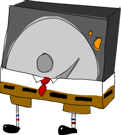

Fermuarlar
==========

Haskell'in saflığı birçok faydayla birlikte gelirken, bazı sorunları saf olmayan dillerde olduğundan farklı şekilde ele almamızı sağlıyor.
Referans şeffaflığı nedeniyle, Haskell'de bir değer, aynı şeyi temsil ediyorsa, diğeri kadar iyidir.

Öyleyse, beşli (çak bir beşlik, belki?) bir ağacımız varsa ve bunlardan birini altıya dönüştürmek istiyorsak,
ağacımızdaki tam olarak hangi beşi değiştirmek istediğimizi bilmenin bir yolunu bulmalıyız. Ağacımızın neresinde olduğunu bilmeliyiz. Saf olmayan dillerde,
hafızamızda nerede bulunduğunu not edebilir ve bunu değiştirebiliriz. Ancak Haskell'da beşinci biri diğeri kadar iyidir,
dolayısıyla hafızamızın neresinde olduklarına göre ayrımcılık yapamayız. Ayrıca hiçbir şeyi gerçekten değiştiremeyiz; 
Bir ağacı değiştirdiğimizi söylediğimizde, aslında bir ağacı alıp orijinal ağaca benzer, ancak biraz farklı olan yeni bir ağaç döndürdüğümüzü kastediyoruz.

Yapabileceğimiz bir şey, ağacın kökünden değiştirmek istediğimiz öğeye giden yolu hatırlamaktır. Bu ağacı al, sola git, sağa ve sonra tekrar sola git ve
oradaki elementi değiştir diyebiliriz. Bu işe yararken verimsiz olabilir. Daha önce değiştirdiğimiz öğeye yakın bir öğeyi daha sonra değiştirmek istersek,
ağacın kökünden öğemize kadar tüm yolu tekrarlamamız gerekir!

Bu bölümde, bazı veri yapılarını nasıl alıp, öğelerini değiştirmeyi kolaylaştıracak ve etrafta dolaşmayı verimli kılacak şekilde bir kısmına nasıl odaklanabileceğimizi
göreceğiz. Güzel!

Yürüyüş yapmak
--------------

Biyoloji dersinde öğrendiğimiz gibi, birçok farklı ağaç türü var, o yüzden bizimkini dikmek için kullanacağımız bir tohum seçelim. İşte burada:

~~~~ {.haskell: .ghci name="code"}
data Tree a = Empty | Node a (Tree a) (Tree a) deriving (Show)  
~~~~

Yani ağacımız ya boştur ya da bir elemanı ve iki alt ağacı olan bir node'dur. İşte size, okuyucuya ücretsiz olarak verdiğim böyle bir ağacın güzel bir örneği!

~~~~ {.haskell: .ghci name="code"}
freeTree :: Tree Char  
freeTree =   
    Node 'P'  
        (Node 'O'  
            (Node 'L'  
                (Node 'N' Empty Empty)  
                (Node 'T' Empty Empty)  
            )  
            (Node 'Y'  
                (Node 'S' Empty Empty)  
                (Node 'A' Empty Empty)  
            )  
        )  
        (Node 'L'  
            (Node 'W'  
                (Node 'C' Empty Empty)  
                (Node 'R' Empty Empty)  
            )  
            (Node 'A'  
                (Node 'A' Empty Empty)  
                (Node 'C' Empty Empty)  
            )  
        )  
~~~~

Ve işte bu ağaç grafik olarak gösteriliyor:

Orada ağaçta `W` olduğuna dikkat ettin mi? Onu `P`'ye dönüştürmek istediğimizi varsayalım. Bunu nasıl yapacağız? Bunun bir yolu, önce sağa,
sonra sola gidip adı geçen öğeyi değiştirerek bulunan öğeyi bulana kadar ağacımızda pattern match olabilir. İşte bunun kodu:

~~~~ {.haskell: .ghci name="code"}
changeToP :: Tree Char -> Tree Char  
changeToP (Node x l (Node y (Node _ m n) r)) = Node x l (Node y (Node 'P' m n) r)  
~~~~

Yuck! Bu sadece oldukça çirkin değil, aynı zamanda kafa karıştırıcı. Burada ne oluyor? Pekala, ağacımızda desen eşleştirme yapıyoruz ve
kök elemanını `x` (bu, kökte `'P'` oluyor) ve sol alt ağacını `l` olarak adlandırıyoruz. Sağ alt ağacına bir ad vermek yerine, üzerinde daha fazla desen eşleştiriyoruz.
Bu desen eşleştirmeye, kökü `'W'` değerimiz olan alt ağaca ulaşana kadar devam ederiz. Bunu yaptıktan sonra, ağacı yeniden oluşturuyoruz,
sadece kökünde `'W'` içeren alt ağaçta artık bir `'P'` var.

Bunu yapmanın daha iyi bir yolu var mı? Fonksiyonumuzun bir yön listesi ile birlikte bir ağaç almasını sağlamaya ne dersiniz?
Yönler, sırasıyla sol ve sağı temsil eden `L` veya `R` olacaktır ve sağlanan yönleri izlersek ulaştığımız öğeyi değiştireceğiz. İşte burada:

~~~~ {.haskell: .ghci name="code"}
data Direction = L | R deriving (Show)  
type Directions = [Direction]  
  
changeToP :: Directions-> Tree Char -> Tree Char  
changeToP (L:ds) (Node x l r) = Node x (changeToP ds l) r  
changeToP (R:ds) (Node x l r) = Node x l (changeToP ds r)  
changeToP [] (Node _ l r) = Node 'P' l r  
~~~~

Yön listemizdeki ilk eleman `L` ise, eski ağaca benzeyen yeni bir ağaç oluşturuyoruz, sadece sol alt ağacında `'P'` olarak değiştirilmiş bir eleman var.
Yinelemeli olarak `changeToP`'ı çağırdığımızda, ona sadece yönler listesinin kuyruğunu veriyoruz, çünkü zaten sola döndük. Aynı şeyi bir `R` durumunda da yapıyoruz.
Yol tarifi listesi boşsa, bu bizim hedefimizde olduğumuz anlamına gelir, bu nedenle verilene benzer bir ağaç döndürürüz, yalnızca kök öğesi `'P'`'ye sahiptir.

Ağacın tamamını yazdırmaktan kaçınmak için, bir yön listesi alan ve bize hedefteki öğenin ne olduğunu söyleyen bir fonksiyon yapalım:

~~~~ {.haskell: .ghci name="code"}
elemAt :: Directions -> Tree a -> a  
elemAt (L:ds) (Node _ l _) = elemAt ds l  
elemAt (R:ds) (Node _ _ r) = elemAt ds r  
elemAt [] (Node x _ _) = x  
~~~~

Bu fonksiyon aslında `changeToP` fonksiyonuna oldukça benzer, sadece yol boyunca bir şeyler hatırlamak ve ağacı yeniden inşa etmek yerine,
hedefi hariç her şeyi göz ardı eder. Burada `'W'` harfini `'P'` olarak değiştiriyoruz ve yeni ağacımızdaki değişikliğin kalıcı olup olmadığına bakıyoruz:

~~~~ {.haskell: .ghci name="code"}
ghci> let newTree = changeToP [R,L] freeTree  
ghci> elemAt [R,L] newTree  
'P'  
~~~~

Güzel, bu işe yarıyor gibi görünüyor. Bu fonksiyonlarda, yönlerin listesi bir tür odak görevi görür, çünkü ağacımızdan tam bir alt ağacı belirler.
Örneğin, `[R]` yön listesi kökün sağındaki alt ağaca odaklanır. Boş bir yön listesi ana ağacın kendisine odaklanır.

Bu teknik harika görünse de, özellikle öğeleri tekrar tekrar değiştirmek istiyorsak, oldukça verimsiz olabilir.
Diyelim ki gerçekten çok büyük bir ağacımız ve ağacın dibindeki bazı öğelere işaret eden uzun bir yön listesi var.
Ağaç boyunca yürüyüş yapmak ve alttaki bir öğeyi değiştirmek için yön listesini kullanırız. Az önce değiştirdiğimiz öğeye yakın olan başka bir öğeyi değiştirmek istiyorsak,
ağacın kökünden başlamalı ve tekrar dibe kadar yürümeliyiz! Ne aptalca şey.

Bir sonraki bölümde, bir alt ağaca odaklanmanın daha iyi bir yolunu bulacağız; bu, odağı yakındaki alt ağaçlara verimli bir şekilde değiştirmemizi sağlayan bir yöntem.

Breadcrumb'lardan oluşan bir iz
-------------------------------

Tamam, bir alt ağaca odaklanmak için, her zaman ağacımızın kökünden takip ettiğimiz bir yönler listesinden daha iyi bir şey istiyoruz.
Ağacın kökünden başlayıp her seferinde bir adım sola veya sağa hareket edip breadcrumb'ları bırakmamızın faydası olur mu?
Yani sola gittiğimizde sola gittiğimizi, sağa gittiğimizde sağa gittiğimizi hatırlarız. Elbette deneyebiliriz.
 
Breadcrumb'larımızı temsil etmek için, `Direction` (`L` veya `R`) listesini de kullanacağız, sadece `Directions` olarak adlandırmak yerine, `Breadcrumbs` adını vereceğiz,
çünkü ağacımızdan aşağı inerken onlardan ayrıldığımız için yönlerimiz artık tersine çevrilecek:

~~~~ {.haskell: .ghci name="code"}
type Breadcrumbs = [Direction]  
~~~~

İşte bir ağacı ve bazı breadcrumb'larını alıp sol alt ağaca hareket ederken, ebreadcrumb'larımızı temsil eden listenin başına `L` ekleyen bir fonksiyon:

~~~~ {.haskell: .ghci name="code"}
goLeft :: (Tree a, Breadcrumbs) -> (Tree a, Breadcrumbs)  
goLeft (Node _ l _, bs) = (l, L:bs)  
~~~~

Kökteki ve sağdaki alt ağaçtaki öğeyi yok sayarız ve yalnızca sol alt ağacı, baş olarak L olan eski breadcrumb'ları ile birlikte döndürürüz.
İşte sağa gitmeniz gereken bir fonksiyon:

~~~~ {.haskell: .ghci name="code"}
goRight :: (Tree a, Breadcrumbs) -> (Tree a, Breadcrumbs)  
goRight (Node _ _ r, bs) = (r, R:bs)  
~~~~

Aynı şekilde çalışır. `freeTree`'mizi alıp sağa ve sonra sola gitmek için şu fonksiyonları kullanalım:

~~~~ {.haskell: .ghci name="code"}
ghci> goLeft (goRight (freeTree, []))  
(Node 'W' (Node 'C' Empty Empty) (Node 'R' Empty Empty),[L,R])  
~~~~

Tamam, şimdi kökünde `'W'` ve sol alt ağacının kökünde `'C'` ve sağ alt ağacının kökünde `'R'` bulunan bir ağaca sahibiz.
`Breadcrumb`'lar `[L, R]`, çünkü önce sağa sonra sola gittik.

Ağacımızda yürümeyi daha net hale getirmek için, şu şekilde tanımladığımız `-:` fonksiyonunu kullanabiliriz:

~~~~ {.haskell: .ghci name="code"}
x -: f = f x  
~~~~

Bu, önce değeri yazıp ardından bir `-:` ve ardından fonksiyonu yazarak değerlere fonksiyonlar uygulamamıza olanak tanır.
Yani `goRight (freeTree, [])` yerine, `(freeTree, []) -: goRight` yazabiliriz. Bunu kullanarak, yukarıdakileri yeniden yazabiliriz,
böylece önce sağa sonra sola gittiğimizi daha belirgin hale getirebiliriz:

~~~~ {.haskell: .ghci name="code"}
ghci> (freeTree, []) -: goRight -: goLeft  
(Node 'W' (Node 'C' Empty Empty) (Node 'R' Empty Empty),[L,R])  
~~~~

Geri dönüyor
------------

Ya şimdi ağacımıza geri dönmek istersek? Breadcrumb'larımızdan, mevcut ağacın ebeveyninin sol alt ağacı olduğunu ve ebeveyninin sağ alt ağacı olduğunu biliyoruz,
ama hepsi bu. Ağaçta yukarı çıkabilmemiz için bize mevcut alt ağacın ebeveyni hakkında yeterince bilgi vermiyorlar.
Görünüşe göre, aldığımız yönün yanı sıra, tek bir içerik haritası, geri dönmemiz gereken diğer tüm verileri de içermelidir. 
Bu durumda, üst ağaçtaki öğenin sağ alt ağacı ile birlikte budur.

Genel olarak, tek bir içerik haritası, ana node'u yeniden yapılandırmak için gereken tüm verileri içermelidir.
Bu yüzden, gitmediğimiz tüm yollardan bilgi almalı ve aldığımız yönü de bilmeli, ancak şu anda odaklandığımız alt ağacı içermemelidir.
Bunun nedeni, başlığın ilk bileşeninde bu alt ağaca zaten sahip olmamızdır, bu nedenle, breadcrumb'larında da olsaydı, tekrarlanan bilgilerimiz olurdu.

Ekmek kırıntılarımızı, daha önce sola ve sağa hareket ederken göz ardı ettiğimiz her şeyle ilgili bilgileri de içerecek şekilde değiştirelim.
`Direction` yerine yeni bir veri türü oluşturacağız:

~~~~ {.haskell: .ghci name="code"}
data Crumb a = LeftCrumb a (Tree a) | RightCrumb a (Tree a) deriving (Show)  
~~~~

Şimdi, sadece `L` yerine, taşıdığımız node'daki öğeyi ve ziyaret etmediğimiz sağ ağacı da içeren bir `LeftCrumb` var.
`R` yerine, taşıdığımız node'daki öğeyi ve ziyaret etmediğimiz sol ağacı içeren `RightCrumb` var.

Bu breadcrumb'lar artık üzerinde dolaştığımız ağacı yeniden oluşturmak için gereken tüm verileri içeriyor.
Yani sadece normal breadcrumb'lar olmak yerine, artık daha çok disketlere benziyorlar, çünkü ilerledikçe bırakıyoruz, 
çünkü sadece aldığımız yönden çok daha fazla bilgi içeriyorlar.

Özünde, her breadcrumb artık içinde bir delik olan bir ağaç node'u gibidir. Bir ağacın derinliklerine indiğimizde, breadcrumb,
odaklanmayı seçtiğimiz alt ağaç hariç, uzaklaştığımız node'un taşıdığı tüm bilgileri taşır. Ayrıca deliğin nerede olduğuna da dikkat etmelidir.
`LeftCrumb` durumunda, sola hareket ettiğimizi biliyoruz, bu nedenle eksik olan alt ağaç soldaki ağaçtır.

Ayrıca `Breadcrumbs` tür eşanlamlısını da bunu yansıtacak şekilde değiştirelim:

~~~~ {.haskell: .ghci name="code"}
type Breadcrumbs a = [Crumb a]  
~~~~

Daha sonra, daha önce yaptıkları gibi bu bilgileri görmezden gelmek yerine, breadcrumb'larımızda izlemediğimiz yollar hakkında bilgi depolamak için
`goLeft` ve `goRight` fonksiyonlarını değiştirmemiz gerekiyor. İşte `goLeft`:

~~~~ {.haskell: .ghci name="code"}
goLeft :: (Tree a, Breadcrumbs a) -> (Tree a, Breadcrumbs a)  
goLeft (Node x l r, bs) = (l, LeftCrumb x r:bs)  
~~~~

Önceki `goLeft`'imize çok benzediğini görebilirsiniz, yalnızca breadcrumb'ları listemizin başına bir `L` eklemek yerine,
sola gittiğimizi belirtmek için bir `LeftCrumb` ekliyoruz ve `LeftCrumb`'ımızı, taşındığımız node'daki öğe (bu `x`) ve ziyaret etmemeyi seçtiğimiz sağ alt ağaçla donatıyoruz.

Bu fonksiyonun, odaklanılan geçerli ağacın `Empty` olmadığını varsaydığını unutmayın. Boş bir ağacın alt ağaçları yoktur, bu nedenle boş bir ağaçtan sola gitmeye çalışırsak,
`Node` üzerindeki model eşleşmesi başarılı olmayacağından ve `Empty` ile ilgilenen bir model olmadığından bir hata meydana gelecektir.

`goRight` benzer:

~~~~ {.haskell: .ghci name="code"}
goRight :: (Tree a, Breadcrumbs a) -> (Tree a, Breadcrumbs a)  
goRight (Node x l r, bs) = (r, RightCrumb x l:bs)  
~~~~

Daha önce sola ve sağa gidebiliyorduk. Şimdi elde ettiğimiz şey, ana node'lar ve ziyaret etmediğimiz yollar hakkında bazı şeyleri hatırlayarak
gerçekten geri dönme yeteneğidir. İşte `goUp` fonksiyonu:

~~~~ {.haskell: .ghci name="code"}
goUp :: (Tree a, Breadcrumbs a) -> (Tree a, Breadcrumbs a)  
goUp (t, LeftCrumb x r:bs) = (Node x t r, bs)  
goUp (t, RightCrumb x l:bs) = (Node x l t, bs)  
~~~~

`t` ağacına odaklanıyoruz ve en son `Crumb`'ın ne olduğunu kontrol ediyoruz. Bu bir `LeftCrumb` ise, o zaman ağacımızın `t` sol alt ağaç olduğu yeni bir ağaç oluştururuz ve 
ziyaret etmediğimiz sağ alt ağaç hakkındaki bilgileri ve `Node`'un geri kalanını doldurmak için öğe ile ilgili bilgileri kullanırız.
Konuşmak için geri döndüğümüz ve onunla ana ağaç olarak yeniden oluşturmak için son breadcrumb'ı aldığımız için, yeni breadcrumb'lar listesi bunu içermiyor.

Zaten bir ağacın tepesindeysek ve yukarı çıkmak istiyorsak, bu fonksiyonun bir hataya neden olduğunu unutmayın. Daha sonra, odağı hareket ettirirken olası
başarısızlığı temsil etmek için `Maybe` monad'ını kullanacağız.

Bir çift `Tree a` ve `Breadcrumbs a` ile, tüm ağacı yeniden inşa etmek için tüm bilgilere sahibiz ve ayrıca bir alt ağaca odaklanıyoruz.
Bu şema aynı zamanda kolayca yukarı, sola ve sağa hareket etmemizi sağlar. Bir veri yapısının ve çevresinin odaklanmış bir bölümünü içeren
böyle bir çifte fermuar(zipper) denir, çünkü odak noktamızı veri yapısında yukarı ve aşağı hareket ettirmek, normal bir pantolon üzerinde bir fermuarın işleyişine benzer.
Bu yüzden bir tür eşanlamlısı yapmak harika:

~~~~ {.haskell: .ghci name="code"}
type Zipper a = (Tree a, Breadcrumbs a)  
~~~~

Tür eşanlamlısı olarak Focus olarak adlandırmayı tercih ederim çünkü bu, bir veri yapısının bir kısmına odaklandığımızı daha açık hale getirir,
ancak fermuar terimi daha yaygın olarak böyle bir kurulumu tanımlamak için kullanılır, bu nedenle `Zipper`'a bağlı kalacağız.

Odak altındaki ağaçları manipüle etmek
--------------------------------------

Şimdi yukarı ve aşağı hareket edebildiğimize göre, fermuarın odaklandığı alt ağacın kökündeki öğeyi değiştiren bir fonksiyon yapalım:

~~~~ {.haskell: .ghci name="code"}
modify :: (a -> a) -> Zipper a -> Zipper a  
modify f (Node x l r, bs) = (Node (f x) l r, bs)  
modify f (Empty, bs) = (Empty, bs)  
~~~~

Bir node'a odaklanıyorsak, kök elemanını `f` fonksiyonuyla değiştiririz. Boş bir ağaca odaklanıyorsak, onu olduğu gibi bırakıyoruz.
Artık bir ağaçla başlayabilir, istediğimiz yere gidebilir ve bir öğeyi değiştirebiliriz, bu arada o öğeye odaklanarak kolayca yukarı veya aşağı hareket edebiliriz.
Bir örnek:

~~~~ {.haskell: .ghci name="code"}
ghci> let newFocus = modify (\_ -> 'P') (goRight (goLeft (freeTree,[])))  
~~~~

Sola, sonra sağa gideriz ve ardından kök öğeyi bir `'P'` ile değiştiririz. `-:` kullanırsak daha da iyi okuyabiliriz:

~~~~ {.haskell: .ghci name="code"}
ghci> let newFocus = (freeTree,[]) -: goLeft -: goRight -: modify (\_ -> 'P')  
~~~~

Daha sonra, bir öğeyi istersek ve gizemli bir `'X'` ile değiştirirsek yukarı çıkabiliriz:

~~~~ {.haskell: .ghci name="code"}
ghci> let newFocus2 = modify (\_ -> 'X') (goUp newFocus) 
~~~~

Veya `-:` ile yazarsak:

~~~~ {.haskell: .ghci name="code"}
ghci> let newFocus2 = newFocus -: goUp -: modify (\_ -> 'X')  
~~~~

Yukarı çıkmak kolaydır, çünkü bıraktığımız breadcrumb'lar veri yapısının odaklanmadığımız bir parçasını oluşturur, ancak tersine çevrilmiştir, bir çorabı tersyüz etmek gibi.
Bu yüzden yukarı çıkmak istediğimizde, kökten başlayıp aşağıya doğru ilerlemek zorunda değiliz, ancak sadece ters çevrilmiş ağacımızın
tepesini alıp bir kısmını ters çevirip odak noktamıza ekliyoruz.

Her node'un iki alt ağacı vardır, bu alt ağaçlar boş ağaçlar olsa bile. Yani boş bir alt ağaca odaklanıyorsak, yapabileceğimiz bir şey
onu boş olmayan bir alt ağaçla değiştirmek ve böylece bir yaprak node'una bir ağaç eklemektir. Bunun kodu basit:

~~~~ {.haskell: .ghci name="code"}
attach :: Tree a -> Zipper a -> Zipper a  
attach t (_, bs) = (t, bs)  
~~~~

Bir ağaç ve bir fermuar alıyoruz ve odağı verilen ağaçla değiştirilen yeni bir fermuar getiriyoruz. Sadece boş alt ağaçları yeni ağaçlarla değiştirerek ağaçları
bu şekilde genişletmekle kalmaz, aynı zamanda mevcut tüm alt ağaçları da değiştirebiliriz. `freeTree`'mizin en soluna bir ağaç ekleyelim:

~~~~ {.haskell: .ghci name="code"}
ghci> let farLeft = (freeTree,[]) -: goLeft -: goLeft -: goLeft -: goLeft  
ghci> let newFocus = farLeft -: attach (Node 'Z' Empty Empty)  
~~~~

`newFocus` artık az önce eklediğimiz ağaca odaklanıyor ve ağacın geri kalanı breadcrumbs'larında ters çevrilmiş durumda.
`goUp`'ı ağacın tepesine kadar yürümek için kullanacak olsaydık, bu `freeTree` ile aynı ağaç olurdu, ancak en solunda ek bir `'Z'` olacaktı.

Doğruca zirveye gidiyorum, oh evet, havanın taze ve temiz olduğu yere!
----------------------------------------------------------------------

Neye odaklandığımızdan bağımsız olarak, ağacın tepesine kadar yürüyen bir fonksiyon yapmak gerçekten çok kolay. İşte burada:

~~~~ {.haskell: .ghci name="code"}
topMost :: Zipper a -> Zipper a  
topMost (t,[]) = (t,[])  
topMost z = topMost (goUp z)  
~~~~

Güçlendirilmiş breadcrumb'larıımız izimiz boşsa, bu zaten ağacımızın kökünde olduğumuz anlamına gelir, bu yüzden sadece mevcut odağa geri dönüyoruz.
Aksi takdirde, üst node'un odağını elde etmek için yukarı gideriz ve ardından buna `topMost`'u özyinelemeli olarak uygularız.
Böylece artık ağacımızın etrafında yürüyebiliriz, sola, sağa ve yukarı gidebiliriz, ilerledikçe `modify` ve `attach`'i uygulayabiliriz ve sonra değişikliklerimizi bitirdiğimizde,
ağacımızın köküne odaklanmak ve yaptığımız değişiklikleri uygun bir bakış açısıyla görmek için `topMost`'u kullanırız.

Listelere odaklanmak
--------------------

Fermuarlar hemen hemen her veri yapısıyla kullanılabilir, bu nedenle listelerin alt listelerine odaklanmak için kullanılabilmeleri şaşırtıcı değildir.
Sonuçta, listeler hemen hemen ağaçlara benzer, yalnızca bir ağaçtaki bir node'un bir öğesi (veya olmadığı) ve birkaç alt ağacı olduğu, 
bir listedeki bir node'un bir öğesi ve yalnızca bir alt listesi olduğu durumlarda.
[Kendi listelerimizi oluştururken ](../tr/08-making-our-own-types-and-typeclasses.md#özyinelemeli-veri-yapıları) veri türümüzü şöyle tanımladık:

~~~~ {.haskell: .ghci name="code"}
data List a = Empty | Cons a (List a) deriving (Show, Read, Eq, Ord)  
~~~~

Bunu binary ağaç tanımımızla karşılaştırın ve listelerin her node'un yalnızca bir alt ağaca sahip olduğu ağaçlar olarak nasıl görülebileceğini görmek kolaydır.

`[1,2,3]` gibi bir liste `1: 2: 3: []` olarak yazılabilir. `1` olan listenin başı ve ardından `2: 3: []` olan listenin kuyruğundan oluşur. 
Buna karşılık, `2: 3: []` de `2` olan bir kafaya ve `3: []` olan bir kuyruğa sahiptir. `3` ile: `[]`, `3` baş ve kuyruk boş listedir `[]`.

Listeler için bir fermuar yapalım. Bir listenin alt listelerine odaklanmayı değiştirmek için, ya ileri ya da geri hareket ederiz 
(oysa ağaçlarda yukarı ya da sola ya da sağa hareket ettik). Odaklanılan kısım bir alt ağaç olacak ve bununla birlikte ilerledikçe breadcrumb'ları bırakacağız.
Şimdi bir liste için tek bir breadcrumb nelerden oluşur? Binary ağaçlarla uğraşırken, bir breadcrumb öğesinin ana node'un kökündeki öğeyi
seçmediğimiz tüm alt ağaçlarla birlikte tutması gerektiğini söyledik. Ayrıca sağa mı sola mı gittiğimizi de hatırlamak zorundaydı.
Dolayısıyla, odaklanmayı seçtiğimiz alt ağaç dışında bir node'un sahip olduğu tüm bilgilere sahip olması gerekiyordu.

Listeler ağaçlardan daha basittir, bu yüzden sola mı sağa mı gittiğimizi hatırlamak zorunda değiliz çünkü bir listenin daha derine inmenin tek bir yolu var.
Her node için yalnızca bir alt ağaç olduğu için, bizim de izlemediğimiz yolları hatırlamak zorunda değiliz. Görünüşe göre tek hatırlamamız gereken önceki unsur.
`[3,4,5]` gibi bir listemiz varsa ve önceki öğenin `2` olduğunu biliyorsak, o öğeyi listemizin başına koyarak `[2,3,4,5]` sonucunu alarak geri dönebiliriz.

Buradaki tek bir breadcrumb sadece öğe olduğu için, ağaç fermuarları için `Crumb` veri türünü oluşturduğumuzda yaptığımız gibi, onu bir veri türünün içine koymamız gerekmez:

~~~~ {.haskell: .ghci name="code"}
type ListZipper a = ([a],[a])  
~~~~

İlk liste, odaklandığımız listeyi temsil eder ve ikinci liste, breadcrumbs'larının listesidir. Listeler halinde ileri ve geri giden fonksiyonlar yapalım:

~~~~ {.haskell: .ghci name="code"}
goForward :: ListZipper a -> ListZipper a  
goForward (x:xs, bs) = (xs, x:bs)  
  
goBack :: ListZipper a -> ListZipper a  
goBack (xs, b:bs) = (b:xs, bs)  
~~~~

İlerlerken, mevcut listenin kuyruğuna odaklanıyoruz ve baş öğesini bir breadcrumb olarak bırakıyoruz. Geriye doğru giderken, en son kırıntıyı alır ve listenin başına koyarız.

İşte bu iki fonksiyon iş başında:

~~~~ {.haskell: .ghci name="code"}
ghci> let xs = [1,2,3,4]  
ghci> goForward (xs,[])  
([2,3,4],[1])  
ghci> goForward ([2,3,4],[1])  
([3,4],[2,1])  
ghci> goForward ([3,4],[2,1])  
([4],[3,2,1])  
ghci> goBack ([4],[3,2,1])  
([3,4],[2,1])  
~~~~

Listeler söz konusu olduğunda breadcrumb'larının listemizin tersine çevrilmiş bir parçası olduğunu görüyoruz.
Uzaklaştığımız öğe her zaman breadcrumb'larının başına gider, bu nedenle o öğeyi breadcrumb'larının başından alıp odak noktamız haline getirerek geri dönmek kolaydır.

Bu aynı zamanda neden buna fermuar dediğimizi anlamayı da kolaylaştırıyor, çünkü bu gerçekten yukarı ve aşağı hareket eden bir fermuarın kaydırıcısına benziyor.

Bir metin editörü yapıyorsanız, o anda açık olan metin satırlarını temsil etmek için bir string'ler listesi kullanabilir ve
ardından imlecin o anda hangi satıra odaklandığını bilmek için bir fermuar kullanabilirsiniz. 
Bir fermuar kullanarak, metnin herhangi bir yerine yeni satırlar eklemeyi veya mevcut satırları silmeyi de kolaylaştırır.

Çok basit bir dosya sistemi
---------------------------

Artık fermuarların nasıl çalıştığını bildiğimize göre, çok basit bir dosya sistemini temsil etmek için ağaçları kullanalım ve
sonra bu dosya sistemi için bir fermuar yapalım, bu da tıpkı dosya sistemimizde genellikle atlarken yaptığımız gibi klasörler arasında hareket etmemize izin verecek.

Ortalama hiyerarşik dosya sisteminin basit bir görünümünü alırsak, çoğunlukla dosya ve klasörlerden oluştuğunu görürüz. Dosyalar veri birimleridir ve
bir adla birlikte gelir, oysa klasörler bu dosyaları düzenlemek için kullanılır ve dosyalar veya başka klasörler içerebilir.
Öyleyse, bir dosya sistemindeki bir öğenin ya bir ad ve bazı verilerle gelen bir dosya ya da bir adı ve ardından dosya ya da klasörlerin kendisi olan bir grup öğe
olduğunu varsayalım. İşte bunun için bir veri türü ve bazı tür eşanlamlılar, böylece ne olduğunu biliyoruz:

~~~~ {.haskell: .ghci name="code"}
type Name = String  
type Data = String  
data FSItem = File Name Data | Folder Name [FSItem] deriving (Show) 
~~~~

Bir dosya, adını ve tuttuğu verileri temsil eden iki stringle birlikte gelir. Bir klasör, adı ve bir öğe listesi olan bir dizeyle birlikte gelir.
Bu liste boşsa, boş bir klasörümüz var.

İşte bazı dosyaların ve alt klasörlerin bulunduğu bir klasör:

~~~~ {.haskell: .ghci name="code"}
myDisk :: FSItem  
myDisk = 
    Folder "root"   
        [ File "goat_yelling_like_man.wmv" "baaaaaa"  
        , File "pope_time.avi" "god bless"  
        , Folder "pics"  
            [ File "ape_throwing_up.jpg" "bleargh"  
            , File "watermelon_smash.gif" "smash!!"  
            , File "skull_man(scary).bmp" "Yikes!"  
            ]  
        , File "dijon_poupon.doc" "best mustard"  
        , Folder "programs"  
            [ File "fartwizard.exe" "10gotofart"  
            , File "owl_bandit.dmg" "mov eax, h00t"  
            , File "not_a_virus.exe" "really not a virus"  
            , Folder "source code"  
                [ File "best_hs_prog.hs" "main = print (fix error)"  
                , File "random.hs" "main = print 4"  
                ]  
            ]  
        ]  
~~~~

Aslında şu anda diskimin içerdiği şey bu.

Dosya sistemimiz için bir fermuar
---------------------------------

Artık bir dosya sistemimiz olduğuna göre, tek ihtiyacımız olan bir fermuar, böylece onu sıkıştırıp yakınlaştırabilir ve klasörlerin yanı sıra dosyaları ekleyebilir,
değiştirebilir ve kaldırabiliriz. Binary ağaçlarda ve listelerde olduğu gibi, ziyaret etmemeyi seçtiğimiz tüm şeyler hakkında bilgi içeren breadcrumb'lar bırakacağız.
Söylediğimiz gibi, tek bir breadcrumb bir tür node gibi olmalıdır, yalnızca şu anda odaklandığımız alt ağaç dışındaki her şeyi içermelidir.
Ayrıca deliğin nerede olduğunu da not etmelidir, böylece bir kez yukarı çıktığımızda, önceki odağımızı deliğe yerleştirebiliriz.

Bu durumda, bir breadcrumb bir klasör gibi olmalı, yalnızca şu anda seçtiğimiz klasör eksik olmalıdır. Neden bir dosya gibi değil diye soruyorsun?
Eh, çünkü bir dosyaya odaklandığımızda, dosya sisteminde daha derine inemeyiz, bu yüzden bir dosyadan geldiğimizi söyleyen bir breadcrumb bırakmak mantıklı değil.
Dosya, boş bir ağaç gibidir.

`"root"` klasörüne odaklanırsak ve sonra `"dijon_poupon.doc"` dosyasına odaklanırsak, bıraktığımız içerik haritası neye benzemeli?
Odaklandığımız dosyadan önce gelen öğelerle birlikte üst klasörünün adını ve ondan sonra gelen öğeleri içermelidir. Yani tek ihtiyacımız olan bir `Name` ve iki öğe listesi.
Odaklandığımız öğeden önce gelen öğeler ve ondan sonra gelen öğeler için ayrı listeler tutarak, geri döndüğümüzde onu tam olarak nereye yerleştireceğimizi biliyoruz.
Böylece bu şekilde deliğin nerede olduğunu biliyoruz.

Dosya sistemi için içerik haritası türümüz:

~~~~ {.haskell: .ghci name="code"}
data FSCrumb = FSCrumb Name [FSItem] [FSItem] deriving (Show)  
~~~~

Ve işte fermuarımızın bir tür eşanlamlı:

~~~~ {.haskell: .ghci name="code"}
type FSZipper = (FSItem, [FSCrumb])  
~~~~

Hiyerarşide geri dönmek çok basittir. Biz sadece en son breadcrumb'ı alıyoruz ve mevcut odak ve içerik haritasından yeni bir odak oluşturuyoruz. Şöyle:

~~~~ {.haskell: .ghci name="code"}
fsUp :: FSZipper -> FSZipper  
fsUp (item, FSCrumb name ls rs:bs) = (Folder name (ls ++ [item] ++ rs), bs) 
~~~~

Breadcrumb'ımız ana klasörün adının ne olduğunu ve klasördeki odaklanmış öğemizden önce gelen öğelerin (bu `ls`) ve daha sonra gelen öğelerin (bu `rs`) 
yukarı taşınmasını bildiğinden, kolaydı.

Dosya sisteminde daha derine inmeye ne dersiniz? `"root"`'dayız ve `"dijon_poupon.doc"` üzerine odaklanmak istiyoruz,
bıraktığımız içerik haritası `"root"` adını ve `"dijon_poupon.doc"` öncesindeki öğeleri içerecek ve ondan sonra gelenler. 

İşte, bir ad verilen, geçerli odaklanmış klasörde bulunan bir klasör dosyasına odaklanan bir fonksiyon:

~~~~ {.haskell: .ghci name="code"}
import Data.List (break)  
  
fsTo :: Name -> FSZipper -> FSZipper  
fsTo name (Folder folderName items, bs) =   
    let (ls, item:rs) = break (nameIs name) items  
    in  (item, FSCrumb folderName ls rs:bs)  
  
nameIs :: Name -> FSItem -> Bool  
nameIs name (Folder folderName _) = name == folderName  
nameIs name (File fileName _) = name == fileName  
~~~~

`fsTo` bir `Name` ve bir `FSZipper` alır ve verilen adla dosyaya odaklanan yeni bir `FSZipper` döndürür. Bu dosyanın o anki odaklanmış klasörde olması gerekir.
Bu fonksiyon her yerde arama yapmaz, sadece geçerli klasöre bakar.

Önce, bir klasördeki öğelerin listesini aradığımız dosyadan önce gelenler ve ondan sonra gelenler olarak ayırmak için `break` kullanırız.
Hatırlarsanız, `break` bir predicate ve bir liste alır ve bir çift liste döndürür. Çiftteki ilk liste, predicate'in `False` döndürdüğü öğeleri içerir.
Ardından, predicate bir öğe için `True` döndürdüğünde, o öğeyi ve listenin geri kalanını çiftin ikinci öğesine yerleştirir.
Bir isim ve bir dosya sistemi öğesi alan ve isimler eşleşirse `True` döndüren `nameIs` adında bir yardımcı fonksiyon yaptık.

Şimdi, `ls` aradığımız öğenin önündeki öğeleri içeren bir listedir, `item` tam da bu öğedir ve `rs`, klasöründe ondan sonra gelen öğelerin listesidir.
Artık buna sahip olduğumuza göre, odak noktası olarak `break`'den aldığımız öğeyi sunuyoruz ve ihtiyaç duyduğu tüm verileri içeren bir breadcrumb oluşturuyoruz.

Aradığımız ad klasörde yoksa, `item:rs` kalıbının boş bir listede eşleşmeye çalışacağını ve bir hata alacağımızı unutmayın.
Ayrıca, şu anki odak noktamız bir klasörden başka bir dosya değilse, biz de bir hata alıyoruz ve program çöküyor.

Artık dosya sistemimizde yukarı ve aşağı hareket edebiliriz. Kökten başlayalım ve `"skull_man(scary).bmp"` dosyasına gidelim:

~~~~ {.haskell: .ghci name="code"}
ghci> let newFocus = (myDisk,[]) -: fsTo "pics" -: fsTo "skull_man(scary).bmp"  
~~~~

`newFocus` artık `"skull_man(scary).bmp"` dosyasına odaklanan bir fermuar. Fermuarın ilk bileşenini (odak noktasının kendisi) alalım ve
bunun gerçekten doğru olup olmadığını görelim:

~~~~ {.haskell: .ghci name="code"}
ghci> fst newFocus  
File "skull_man(scary).bmp" "Yikes!"  
~~~~

Yukarı çıkalım ve ardından bitişiğindeki `"watermelon_smash.gif"` dosyasına odaklanalım:

~~~~ {.haskell: .ghci name="code"}
ghci> let newFocus2 = newFocus -: fsUp -: fsTo "watermelon_smash.gif"  
ghci> fst newFocus2  
File "watermelon_smash.gif" "smash!!"  
~~~~

Dosya sistemimizi manipüle etmek
--------------------------------

Artık dosya sisteminizde nasıl gezineceğinizi bildiğimize göre, manipülasyon çok kolay. Şu anda odaklanılan dosya veya klasörü yeniden adlandıran bir fonksiyon:

~~~~ {.haskell: .ghci name="code"}
fsRename :: Name -> FSZipper -> FSZipper  
fsRename newName (Folder name items, bs) = (Folder newName items, bs)  
fsRename newName (File name dat, bs) = (File newName dat, bs)  
~~~~

Artık `"pics"` klasörümüzü `"cspi"` olarak yeniden adlandırabiliriz:

~~~~ {.haskell: .ghci name="code"}
ghci> let newFocus = (myDisk,[]) -: fsTo "pics" -: fsRename "cspi" -: fsUp  
~~~~

`"pics"` klasörüne indik, yeniden adlandırdık ve sonra tekrar yukarı çıktık.

Mevcut klasörde yeni bir öğe oluşturan bir fonksiyona ne dersiniz? Seyretmek:

~~~~ {.haskell: .ghci name="code"}
fsNewFile :: FSItem -> FSZipper -> FSZipper  
fsNewFile item (Folder folderName items, bs) =   
    (Folder folderName (item:items), bs)  
~~~~

Turta kadar kolay. Bir öğe eklemeye çalıştığımızda, ancak bir klasöre odaklanmadığımız, bunun yerine bir dosyaya odaklandığımızda bunun çökeceğini unutmayın.

`"pics"` klasörümüze bir dosya ekleyelim ve ardından köke geri dönelim:

~~~~ {.haskell: .ghci name="code"}
ghci> let newFocus = (myDisk,[]) -: fsTo "pics" -: fsNewFile (File "heh.jpg" "lol") -: fsUp  
~~~~

Adımına dikkat et
-----------------

Şimdiye kadar, binary ağaçlar, listeler veya dosya sistemleri olsun, veri yapılarımızda dolaşırken, çok uzağa gidip düşmemizi gerçekten umursamadık.
Örneğin, `goLeft` fonksiyonumuz bir binary ağacın bir fermuarını alır ve odağı sol alt ağacına taşır:

~~~~ {.haskell: .ghci name="code"}
goLeft :: Zipper a -> Zipper a  
goLeft (Node x l r, bs) = (l, LeftCrumb x r:bs)  
~~~~

Peki ya adım attığımız ağaç boş bir ağaçsa? Yani ya `Node` değilse de `Empty` ise? Bu durumda, bir çalışma zamanı hatası(runtime error) alırız
çünkü desen eşleştirme başarısız olur ve hiç alt ağacı olmayan boş bir ağacı işlemek için herhangi bir model oluşturmadık.
Şimdiye kadar, boş bir ağacın sol alt ağacına asla odaklanmaya çalışmayacağımızı varsaydık çünkü sol alt ağacı hiç mevcut değil.
Ancak boş bir ağacın sol alt ağacına gitmek pek bir anlam ifade etmiyor ve şimdiye kadar bunu uygun bir şekilde görmezden geldik.

Ya da zaten bir ağacın kökündeysek ve breadcrumb'larımız olmasa da yine de yukarı çıkmaya çalışsaydık? Aynı şey olacaktı.
Görünüşe göre fermuar kullanırken, herhangi bir adım son adımımız olabilir (uğursuz müziği işaretlemek).
Başka bir deyişle, herhangi bir hareket başarılı olabilir, ancak aynı zamanda başarısızlıkla da sonuçlanabilir.
Bu sana bir şey hatırlatıyor mu? Elbette, monad'lar! Daha spesifik olarak, normal değerlere olası başarısızlık bağlamını ekleyen `Maybe` monad'ı.

Öyleyse, hareketlerimize olası bir başarısızlık bağlamı eklemek için `Maybe` monad'ını kullanalım.
Binary ağaç fermuarımızda çalışan fonksiyonları alacağız ve onları monadik fonksiyonlara dönüştüreceğiz.
İlk olarak, `goLeft` ve `goRight`'daki olası arızalarla ilgilenelim. Şimdiye kadar, başarısız olabilecek fonksiyonların başarısızlığı her zaman sonuçlarına yansıdı ve
bu sefer de farklı değil. İşte `goLeft` ve `goRight`, ek bir başarısızlık olasılığı ile birlikte:

~~~~ {.haskell: .ghci name="code"}
goLeft :: Zipper a -> Maybe (Zipper a)  
goLeft (Node x l r, bs) = Just (l, LeftCrumb x r:bs)  
goLeft (Empty, _) = Nothing  
  
goRight :: Zipper a -> Maybe (Zipper a)  
goRight (Node x l r, bs) = Just (r, RightCrumb x l:bs)  
goRight (Empty, _) = Nothing  
~~~~

Harika, şimdi boş bir ağacın soluna bir adım atmaya çalışırsak, bir `Nothing` elde ederiz!

~~~~ {.haskell: .ghci name="code"}
ghci> goLeft (Empty, [])  
Nothing  
ghci> goLeft (Node 'A' Empty Empty, [])  
Just (Empty,[LeftCrumb 'A' Empty])  
~~~~

İyi görünüyor! Yukarı çıkmaya ne dersin? Daha önceki sorunumuz, yukarı çıkmaya çalışırsak, ancak daha fazla breadcrumb olmadığında meydana geldi,
bu da bizim zaten ağacın kökünde olduğumuz anlamına geliyordu. Bu, ağacımızın sınırları içinde kalmazsak hata veren `goUp` fonksiyonudur:

~~~~ {.haskell: .ghci name="code"}
goUp :: Zipper a -> Zipper a  
goUp (t, LeftCrumb x r:bs) = (Node x t r, bs)  
goUp (t, RightCrumb x l:bs) = (Node x l t, bs)  
~~~~

Şimdi onu incelikle başarısız olacak şekilde değiştirelim:

~~~~ {.haskell: .ghci name="code"}
goUp :: Zipper a -> Maybe (Zipper a)  
goUp (t, LeftCrumb x r:bs) = Just (Node x t r, bs)  
goUp (t, RightCrumb x l:bs) = Just (Node x l t, bs)  
goUp (_, []) = Nothing  
~~~~

Breadcrumbs'larımız varsa, her şey yolundadır ve başarılı bir yeni odak noktasına geri döneriz, ancak yoksa, o zaman başarısız oluruz.

Daha önce, bu fonksiyonlar Zipper'ları aldı ve Zipper'ları iade etti, bu da onları dolaşmak için şu şekilde zincirleyebileceğimiz anlamına geliyordu:

~~~~ {.haskell: .ghci name="code"}
gchi> let newFocus = (freeTree,[]) -: goLeft -: goRight  
~~~~

Ama şimdi, `Zipper a`'yı döndürmek yerine `Maybe (Zipper a)` döndürüyorlar, bu nedenle bu gibi zincirleme fonksiyonlar çalışmayacak.
Monadlarla ilgili bölümde [ip cambazı ile uğraşırken](../tr/12-a-fistful-of-monads.md#çizgide-yürümek) benzer bir problem yaşadık. Ayrıca her seferinde bir adım yürüdü ve
her bir adımı başarısızlıkla sonuçlanabilirdi çünkü bir grup kuş dengeleme çubuğunun bir tarafına düşebilir ve düşmesine neden olabilirdi.

Şimdi, şaka bizden kaynaklanıyor çünkü yürüyüşü biz yapıyoruz ve kendi tasarladığımız bir labirentten geçiyoruz. Şans eseri, ip cambazından öğrenebiliriz ve
onun yaptığı şeyi yapabiliriz, yani normal fonksiyon uygulamasını, bağlamla bir değer alan `>>=` kullanmakla değiştirebiliriz (bizim durumumuzda, `Maybe (Zipper a)`,
olası bir başarısızlık bağlamına sahiptir) ve bağlamın sağlandığından emin olurken onu bir fonksiyona besler. 
Tıpkı ip cambazı gibi, tüm `-:` operatörlerimizi `>>=` için takas edeceğiz. Pekala, fonksiyonlarımızı tekrar zincirleyebiliriz! İzleyin:

~~~~ {.haskell: .ghci name="code"}
ghci> let coolTree = Node 1 Empty (Node 3 Empty Empty)  
ghci> return (coolTree,[]) >>= goRight  
Just (Node 3 Empty Empty,[RightCrumb 1 Empty])  
ghci> return (coolTree,[]) >>= goRight >>= goRight  
Just (Empty,[RightCrumb 3 Empty,RightCrumb 1 Empty])  
ghci> return (coolTree,[]) >>= goRight >>= goRight >>= goRight  
Nothing  
~~~~

Bir fermuarı `Just`'a koymak için `return` kullandık ve sonra bunu `goRight` fonksiyonumuza beslemek için `>>=` kullandık. 
İlk olarak, solunda boş bir alt ağaç ve sağında iki boş alt ağacı olan bir node olan bir ağaç yaptık. Bir kez sağa gitmeye çalıştığımızda,
sonuç başarılıdır çünkü operasyon mantıklıdır. İki kez sağa gitmek de sorun değil; boş bir alt ağaca odaklanırız.
Ancak üç kez sağa gitmek bir anlam ifade etmeyecektir, çünkü boş bir alt ağacın sağına gidemeyiz, bu yüzden sonuç `Nothing`'dir.

Şimdi ağaçlarımızı, düşmemiz durumunda bizi yakalayacak bir güvenlik ağıyla donattık. Vay canına, bu metaforu yakaladım.

Dosya sistemimizde, var olmayan bir dosya veya klasöre odaklanmaya çalışmak gibi bir işlemin başarısız olabileceği birçok durum vardır.
Alıştırma olarak, `Maybe` monad kullanarak dosya sistemimizi incelikle başarısız olan fonksiyonlarımızla donatabilirsiniz.

